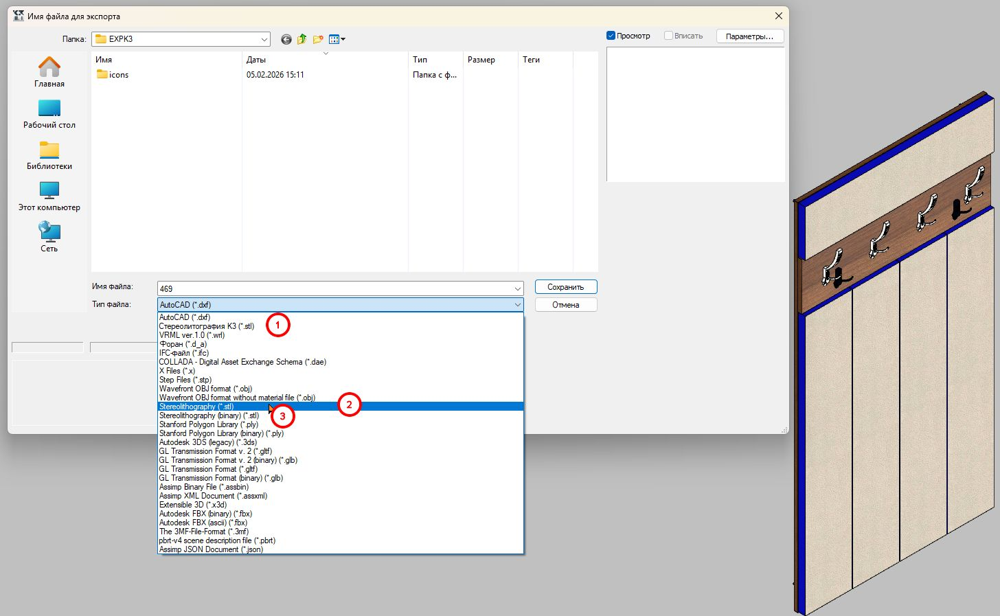

# Порядок создания объекта К3-МЕБЕЛЬ O3D_OUTLINE

*Автор:* Александр Драгункин
*Ссылка на этот документ:* [Этот документ](https://alexandrdragunkin.github.io/notes_ai_ollama/3-o3d/)

Этот документ предназначен для разработчиков, которые работают с платформой К3-МЕБЕЛЬ в связке с продуктом Outline_3d.
*Задача:* создать файл **vrml** из среды **к3мебель** на основе уже существующего прототипа с минимальными ручными манипуляциями. 

Дабы:
 - сократить время разработки.
 - упростить процесс поддержки параметров.

Этот документ не описывает процесс создания прототипа в к3мебель. Просто разбираем процесс в виде ручных манипуляций создания **vrml** на основе того что существует в к3мебель.

Всё про VRML можно почитать в [VRML_ORG_RU](https://vrml.org.ru/first/).

## Экспорт в VRML (WRL) из к3мебель

1. Создать шкаф на основе прототипа в к3мебель.
2. Выбираем меню **Экспорт 3D** -> **STL**
3. Выбираем путь к файлу.
4. Жмём кнопку **Сохранить**.

:::{tip}

Существует три варианта экспорта в stl. Можно выбрать любой. 

:::

Вторым шагом, запускаем процедуру конвертации файла из **STL** в **VRML** формат.
Для этого используем `convert\stl2wrl.py` Если его у вас нет можете взять здесь и положить в папку *convert* в вашем *userproto*