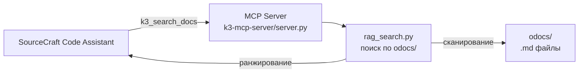
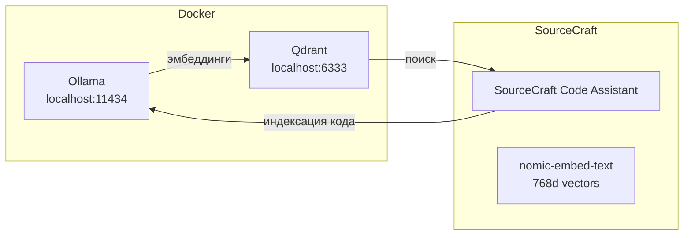

# Реализация RAG для MCP-сервера k3-cad

> **Контекст:** MCP-сервер [`k3-mcp-server/server.py`](../../ARLINE/k3-mcp-server/server.py) предоставляет SourceCraft Code Assistant доступ к CAD K3-Мебель через инструменты `k3_execute`, `k3_get_material`, `k3_get_order_info`. Однако SourceCraft не видит автоматически документацию из `odocs/` и примеры кода из `Proto/`. RAG решает эту проблему.

---

## Содержание

1. [Часть 1: Анализ и архитектура](#часть-1-анализ-и-архитектура)
2. [Часть 2: Реализация grep-like поиска (Вариант 2)](#часть-2-реализация-grep-like-поиска-вариант-2)
3. [Часть 3: Перспективы — семантический поиск через Ollama + Qdrant (Вариант 3)](#часть-3-перспективы--семантический-поиск-через-ollama--qdrant-вариант-3)

---

## Часть 1: Анализ и архитектура

### Проблема

SourceCraft Code Assistant при работе с MCP-сервером k3-cad знает только то, что описано в `description` полях tools. Он **не видит**:

- 20+ markdown-документов в [`odocs/`](../../ARLINE/odocs/) — полный API-справочник модуля `k3`
- Сотни `.py` файлов в [`Proto/`](../../ARLINE/Proto/) — реальные примеры использования API
- Промпты в [`odocs/prompts/`](../../ARLINE/odocs/prompts/) — типовые задачи
- Уроки в [`odocs/lessons/`](../../ARLINE/odocs/lessons/) — опыт создания 3D-примитивов

### Что такое RAG в данном контексте

RAG (Retrieval-Augmented Generation) — это подход, при котором AI-ассистент перед ответом находит релевантную информацию в базе знаний и использует её как контекст. В нашем случае база знаний — это документация и исходный код K3 CAD.

### Три варианта архитектуры

| Вариант | Суть | Сложность | Зависимости |
|---------|------|-----------|-------------|
| **A: MCP Resources** | Зарегистрировать `odocs/*.md` как MCP-ресурсы. SourceCraft сам читает их когда нужно. | Низкая | Нет |
| **B: Vector RAG (ChromaDB)** | Индексация документации в векторную БД, семантический поиск через эмбеддинги. | Средняя | chromadb, sentence-transformers |
| **C: Prompt Injection** | Расширить `description` у tools ссылками на конкретные документы. | Минимальная | Нет |

### Выбранный подход

У пользователя уже настроена инфраструктура:

- **Ollama** (Docker, `localhost:11434`) — с моделью `nomic-embed-text` (768d вектора)
- **Qdrant** (Docker, `localhost:6333`) — векторная БД
- **SourceCraft Code Assistant** — со встроенной индексацией кодовой базы через Ollama + Qdrant

Поэтому было решено начать с **Варианта 2 (grep-like поиск)** — как самого быстрого и не требующего зависимостей, а в перспективе перейти к **Варианту 3 (семантический поиск через Ollama + Qdrant)**.

---

## Часть 2: Реализация grep-like поиска (Вариант 2)

### Архитектура



### Созданные файлы

#### 1. [`k3-mcp-server/rag_search.py`](../../ARLINE/k3-mcp-server/rag_search.py)

Модуль поиска по документации. Не требует внешних зависимостей — только стандартная библиотека Python.

**Ключевые функции:**

| Функция | Назначение |
|---------|------------|
| `search_docs(query, max_results, min_score)` | Поиск по всем `.md` файлам в `odocs/`. Возвращает список релевантных блоков с оценкой. |
| `format_results(results)` | Форматирует результаты в читаемый текст для MCP-ответа. |

**Алгоритм поиска:**

1. Сканирование всех `.md` файлов в `odocs/` рекурсивно (игнорируются картинки, `__pycache__`, `.git`)
2. Разбивка каждого документа на блоки по заголовкам (`#`, `##`, `###`, `####`)
3. Оценка релевантности каждого блока:
   - Точное совпадение фразы — вес 10.0
   - Совпадение отдельных слов — вес 2.0 за каждое вхождение
   - Совпадение в заголовках (первые 5 строк) — вес 3.0
   - Штраф за длинный текст (нормализация на длину)
4. Нормализация оценки к диапазону 0.0–1.0
5. Сортировка по убыванию и возврат top-N результатов

**Пример работы:**

```python
from rag_search import search_docs, format_results

results = search_docs("создание панели", max_results=3)
print(format_results(results))
# 📚 Найдено результатов: 3
#
# [1] create-panel.md — Промт: Создание панели с обработками (engine.Panel)
#     📄 `odocs\prompts\create-panel.md:1`
#     Релевантность: ██████████ (1.00)
# ...
```

#### 2. Доработка [`k3-mcp-server/server.py`](../../ARLINE/k3-mcp-server/server.py)

Добавлен новый MCP tool:

```python
{
    "name": "k3_search_docs",
    "description": "Поиск по документации K3 CAD (odocs/). Принимает поисковый запрос на русском или английском, возвращает релевантные разделы документации с указанием файла и строки.",
    "inputSchema": {
        "type": "object",
        "properties": {
            "query": {
                "type": "string",
                "description": "Поисковый запрос. Например: 'как создать панель', 'k3.box параметры', 'работа с профилями mProfile'"
            },
            "max_results": {
                "type": "number",
                "description": "Количество результатов (1-20, по умолчанию 5)"
            }
        },
        "required": ["query"]
    }
}
```

### Результаты тестирования

**Запрос:** "создание панели"

| # | Файл | Раздел | Релевантность |
|---|------|--------|:-------------:|
| 1 | `odocs/prompts/create-panel.md` | Промт: Создание панели с обработками | 1.00 |
| 2 | `odocs/engine-panel.md` | Создание панели | 0.67 |
| 3 | `odocs/K3-API-Reference.md` | Создание панели-стойки 1000x600 | 0.67 |

**Запрос:** "k3.box k3.cylinder примитивы"

| # | Файл | Раздел | Релевантность |
|---|------|--------|:-------------:|
| 1 | `odocs/lessons/chess-primitives-experience.md` | 5. Структура шахматных фигур | 0.62 |
| 2 | `odocs/K3-API-Reference.md` | Цилиндр из проекта | 0.50 |
| 3 | `odocs/K3-API-Reference.md` | `k3.box(x1, y1, z1, x2, y2, z2)` | 0.47 |

### Запуск

```bash
cd k3-mcp-server
python server.py
# MCP-сервер запущен. Tool k3_search_docs доступен.
```

---

## Часть 3: Перспективы — семантический поиск через Ollama + Qdrant (Вариант 3)

### Что уже есть

У пользователя настроена инфраструктура для полноценного семантического поиска:



**Настройки SourceCraft:**
- Провайдер эмбеддера: Ollama
- Базовый URL: `http://localhost:11434`
- Модель: `nomic-embed-text`
- Размерность: 768
- URL Qdrant: `http://localhost:6333`
- Порог оценки поиска: 0.50
- Максимум результатов: 50

### Что даёт семантический поиск

В отличие от grep-like поиска (точное совпадение слов), семантический поиск понимает **смысл** запроса:

| Запрос | grep-like найдёт | Семантический найдёт |
|--------|-----------------|---------------------|
| "как сделать ящик" | Только где есть слово "ящик" | `Box.py`, `Box_user.py`, `based_build/Box.py` |
| "крепление фасада" | Только где есть оба слова | `Fasad.py`, `Door.py`, `FurnFuncs.py` |
| "обработка кромок" | Только точное совпадение | `Panel.py`, `wrapper_bands.py`, `mPanel_utilites/` |

### План реализации семантического поиска

#### Шаг 1: Индексатор (`rag_index_qdrant.py`)

```python
"""
Индексатор документации K3 CAD в Qdrant через Ollama.
"""
import requests
from qdrant_client import QdrantClient
from qdrant_client.models import VectorParams, Distance, PointStruct
from pathlib import Path

OLLAMA_URL = "http://localhost:11434/api/embeddings"
EMBED_MODEL = "nomic-embed-text"
QDRANT_URL = "http://localhost:6333"
COLLECTION_NAME = "k3_cad_docs"

def get_embedding(text: str) -> list[float]:
    resp = requests.post(OLLAMA_URL, json={
        "model": EMBED_MODEL,
        "prompt": text
    })
    return resp.json()["embedding"]

def index_all():
    client = QdrantClient(url=QDRANT_URL)
    
    # Создаём коллекцию (если нет)
    client.recreate_collection(
        collection_name=COLLECTION_NAME,
        vectors_config=VectorParams(size=768, distance=Distance.COSINE)
    )
    
    # Сканируем odocs/ и Proto/, чанкуем, получаем эмбеддинги, загружаем
    points = []
    for fpath in Path("odocs").rglob("*.md"):
        text = fpath.read_text(encoding="utf-8")
        chunks = chunk_markdown(text, str(fpath))
        for chunk in chunks:
            vector = get_embedding(chunk["text"])
            points.append(PointStruct(
                id=hash(chunk["id"]),
                vector=vector,
                payload=chunk["metadata"]
            ))
    
    client.upsert(collection_name=COLLECTION_NAME, points=points)
```

#### Шаг 2: Поисковик (`rag_search_qdrant.py`)

```python
def search(query: str, n_results: int = 5) -> list[dict]:
    vector = get_embedding(query)
    results = client.search(
        collection_name=COLLECTION_NAME,
        query_vector=vector,
        limit=n_results,
        score_threshold=0.5
    )
    return [{
        "text": r.payload["text"],
        "source": r.payload["source"],
        "score": r.score
    } for r in results]
```

#### Шаг 3: Интеграция в MCP

Добавить новый tool `k3_semantic_search` (или заменить `k3_search_docs` на семантическую версию).

### Сравнение подходов

| Характеристика | grep-like (Вариант 2) | Семантический (Вариант 3) |
|----------------|:---------------------:|:-------------------------:|
| **Зависимости** | Нет | qdrant_client, requests |
| **Скорость** | Мгновенно | ~0.5-1 сек (запрос к Ollama) |
| **Понимание смысла** | ❌ | ✅ |
| **Русский язык** | Частично | ✅ (nomic-embed-text) |
| **Индексация** | Не нужна | Однократно, ~5-10 мин |
| **Точность** | Средняя | Высокая |
| **Обновление знаний** | Автоматически | Нужно переиндексировать |

### Рекомендация

1. **Сейчас:** Использовать `k3_search_docs` (grep-like) — уже работает, не требует настроек
2. **При необходимости:** Реализовать семантический поиск через Qdrant — когда понадобится более глубокое понимание запросов

---

## Итог

Реализован MCP tool `k3_search_docs` для поиска по документации K3 CAD. Инструмент:

- Не требует внешних зависимостей
- Работает через grep-like поиск с ранжированием
- Поддерживает русский и английский язык
- Показывает файл, строку и оценку релевантности
- Готов к использованию сразу после запуска MCP-сервера

В перспективе — переход на семантический поиск через уже настроенную инфраструктуру Ollama + Qdrant.

---

**Связанные файлы:**
- [`k3-mcp-server/server.py`](../../ARLINE/k3-mcp-server/server.py) — MCP-сервер с новым tool
- [`k3-mcp-server/rag_search.py`](../../ARLINE/k3-mcp-server/rag_search.py) — модуль поиска
- [`odocs/MCP-Server-K3-CAD.md`](../../ARLINE/odocs/MCP-Server-K3-CAD.md) — документация MCP-сервера
- [`odocs/K3-API-Reference.md`](../../ARLINE/odocs/K3-API-Reference.md) — API-справочник K3