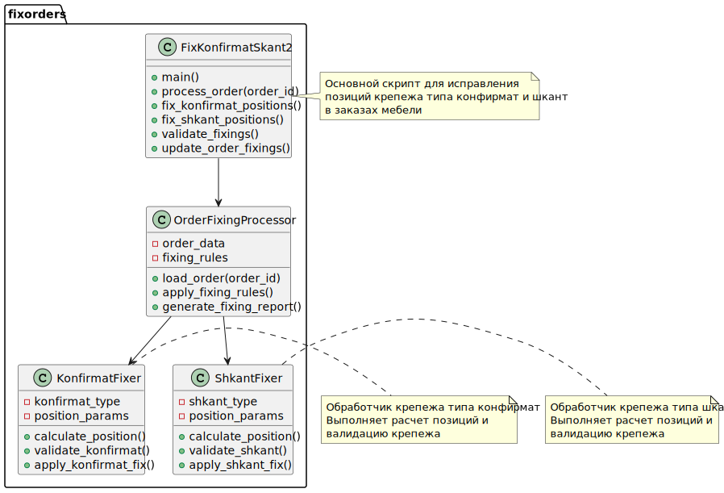
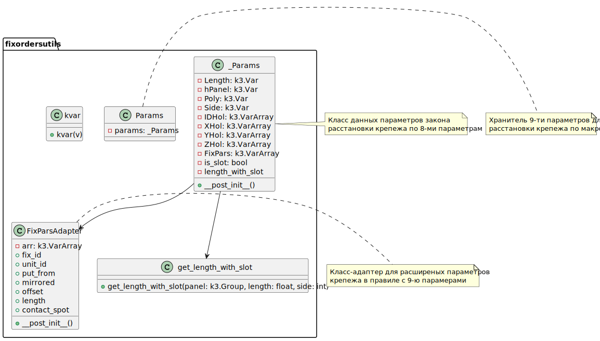
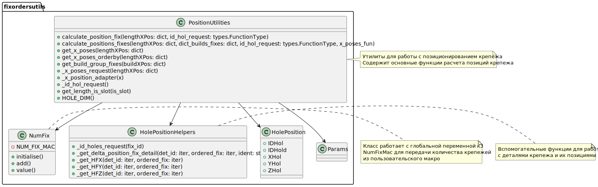
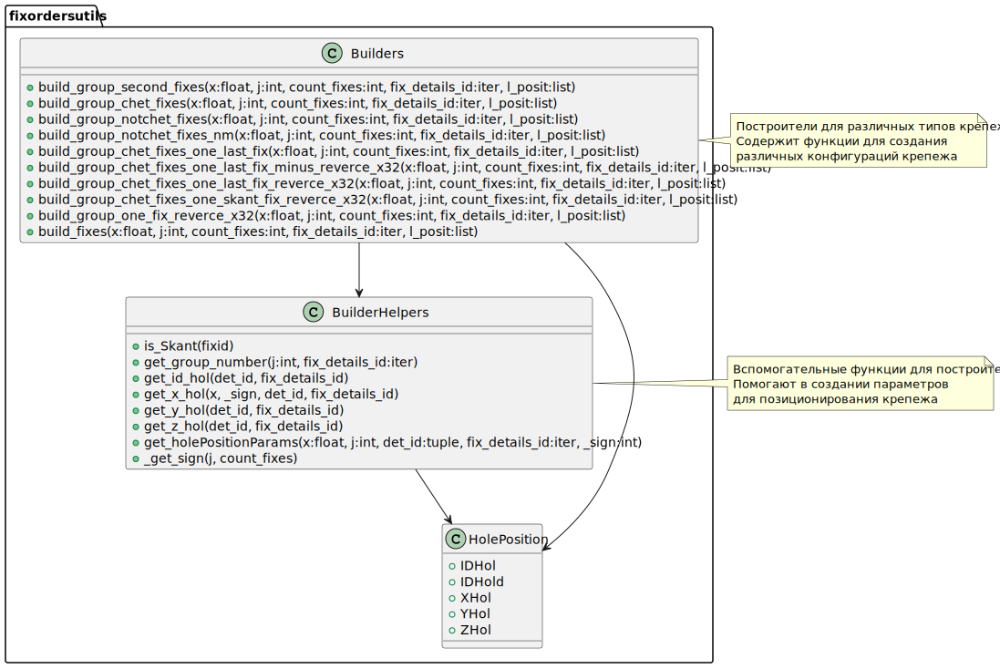
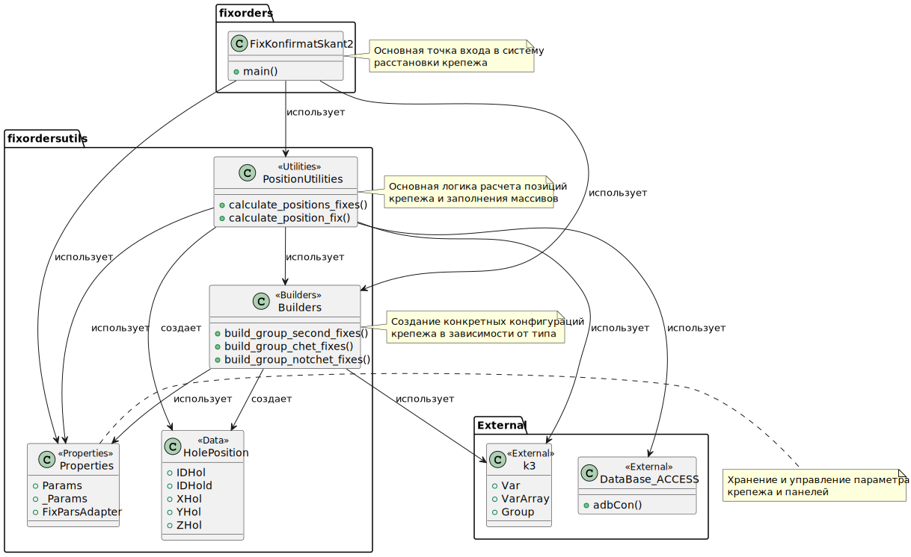

# Описание работы файлов системы крепежа

Ниже приведён пример закона расстановки крепежа по макро `fix_konfirmat_skant2.py`. Он сложный. И для простого пользователя написать нечто подобное трудно.

То же самое можно повторить если использовать в крепеже множественный закон крепежа кортеж которого состоял бы из таблицы:

| Size (Int) | FixID (GUIDSID) |
| ---------- | --------------- |
| 0          | 0               |
| 74         | 1091              |
| 107        | 1142              |
| 170        | 1131             |
| 427        | 2268             |
| 634        | 11031            |

Допустим назовём это свойство ListFixID
Надо придумать вилку для обычного крепежа и такого с множественным типом.

В интервале таком то мм используется  крепёж с ID из справочника сборочных изделий и области применения "Типы крепежа".

В интервале 0-73 мм нет крепежа.
В интервале 74-106 мм используется  крепёж с ID  1091.
В интервале 107-169 мм используется крепёж с ID  1142.
В интервале 170-426 мм используется крепёж с ID  1131.
В интервале 427-633 мм используется крепёж с ID  2268.
В интервале 634-... мм используется крепёж с ID 11031.

## 1. Пример закона расстановки крепежа по макро fix_konfirmat_skant2.py

Этот файл является основным скриптом для расстановки крепежа по макро с 8-ю (или точнее 9-ю) параметрами. Он координирует работу всех компонентов системы крепежа. Крепёж состоит из двух деталей и изначально это конфирмат и шкант. Могут быть случаи когда число конфирматов и шкантов отличается или шкантов нет совсем. Смысл заключается в том, что пврвметры различаются в зависимости от длины линии крепежа. И на каждом таком участке отступы от краёв, число групп крепежа и выравнивание различается. Этот скрипт вызывается в макросе 
Он небольшой и его текст можно привести полностью.
<details>
  <summary>Файл: Proto\FixKonfirmatSkant_2.mac</summary>

  ``` 
  getpar
  Lengh   // Длина пятна контакта
  hPanel	// закрепляемая панель
  Poly   // ID полилайна 1 - главный
  Side	// закрепляемая сторона   SIDE_D = 1, SIDE_C = 3, SIDE_E = 5, SIDE_B = 7
  IDHol   //  ID отверстия
  XHol    //  положение вдоль длины от начала
  YHol    //  положение поперек длины
  ZHol    //  положение внуть панели ? может и не надо
  FixPars // входной массив размерности 7 с параметрами текущего крепежа
  ;

  Lengh=round(Lengh,0.1);
  if (Lengh<74) { exit; }

  <?python
  import k3
  from pimp import reload
  from fixorders import fix_konfirmat_skant2
  #reload(fix_konfirmat_skant2)
  Lengh =k3.Var('Lengh')
  hPanel=k3.Var('hPanel')
  Poly  =k3.Var('Poly')
  Side  =k3.Var('Side')
  IDHol =k3.VarArray(0,'IDHol')
  XHol  =k3.VarArray(0,'XHol')
  YHol  =k3.VarArray(0,'YHol')
  ZHol  =k3.VarArray(0,'ZHol')
  FixPars=k3.VarArray(0,'FixPars')
  fix_konfirmat_skant2.Params.params=fix_konfirmat_skant2._Params(Lengh,hPanel,Poly,Side,IDHol,XHol,YHol,ZHol,FixPars,is_slot=False)
  fix_konfirmat_skant2.main()
  ?>
  exit;
  ```
</details>

Итак, видно, что на участках меньше 74 мм крепёж не устанавливается вовсе, а в остальных случаях действуют какие то правила реализованные в `fix_konfirmat_skant2.py`.

ТЗ было графическим где показаны детали крепежа и правила их позиционирования. Первые участки задавали фиксированные значения от конца линии, а начиная с 634 группы отверстий должны были центроваться и размещаться с шагом кратным 32 мм.

<details>
   <summary>Файл: fix_konfirmat_skant2</summary>
 
   ``` 
from loguru import logger
from .fixordersutils import builders

if logger._core.min_level <= 10: # проверка, что уровень DEBUG включен
    from pimp import reload
    from .fixordersutils import position_utilites as pu
    reload(pu)
    reload(builders)


from .fixordersutils.properties import (Params, _Params)
from .fixordersutils.position_utilites import (calculate_position_fix,
                                               calculate_positions_fixes)

from . import orders

# координаты установки крепежа и расстановщики
LENGTH_X_POS = {
       0: (),
      74: (53, ),
     107: (53, ),
     170: (69, orders.order_second_hole_with_raster_32, -53),
     427: (69, orders.order_second_hole_with_raster_32, -53),
     634: (-61, orders.order_threeholes_centering_raster_32, -61),
    1117: (-53, orders.order_fourholes_centering_raster_32, -53),
    1642: (-53, orders.order_fiveholes_centering_raster_32, -53),
    2780: (),
}

BUILD_X_POS = {
       0: None,
      74: builders.build_group_chet_fixes,
     107: builders.build_group_notchet_fixes,
     170: builders.build_group_second_fixes,
     427: builders.build_group_chet_fixes,
     634: builders.build_group_notchet_fixes,
    1117: builders.build_group_chet_fixes,
    1642: builders.build_group_notchet_fixes,
    2780: None,
}

def main():
    """"""
    calculate_positions_fixes(LENGTH_X_POS, BUILD_X_POS)

if __name__ == '__main__':
    main()
   
   ```
</details>

### Основные функции:
- Определяет словари `LENGTH_X_POS` и `BUILD_X_POS` для координат установки крепежа
- Импортирует необходимые модули из `fixordersutils`
- Вызывает функцию `calculate_positions_fixes` для выполнения основной логики расстановки крепежа

### Взаимодействие:
- Использует `properties.Params` для получения параметров крепежа
- Использует `position_utilites.calculate_positions_fixes` для расчета позиций крепежа
- Использует `builders` для построения групп крепежа

### Словари:

#### LENGTH_X_POS
Словарь определяет координаты установки крепежа в зависимости от длины панели:
- Ключи: длина панели в мм
- Значения: кортежи с координатами крепежа и функциями для дополнительных отверстий

Подробное описание всех ключей:

- `0: ()` - для панелей длиной 0 мм крепеж не устанавливается

- `74: (53, )` - для панелей длиной 74+ мм крепеж устанавливается на координате 53 мм от начала для первой детали (конфирмат)


  ```{image} pictures/LENGTH_X_POS_74.png
  :alt: LENGTH_X_POS_74
  :width: 500px
  :align: center
  ```

- `107: (53, )` - для панелей длиной 107+ мм крепеж устанавливается на координате 53 мм от начала

```{image} pictures/LENGTH_X_POS_107.png
:alt: LENGTH_X_POS_107
:width: 500px
:align: center
```

- `170: (69, orders.order_second_hole_with_raster_32, -53)` - для панелей длиной 170 мм крепеж устанавливается на координатах 69 мм и -53 мм (от конца), а также вызывается функция для дополнительных отверстий

```{image} pictures/LENGTH_X_POS_170.png
:alt: LENGTH_X_POS_170
:width: 500px
:align: center
```

- `427: (69, orders.order_second_hole_with_raster_32, -53)` - для панелей длиной 427 мм крепеж устанавливается на координатах 69 мм и -53 мм (от конца), а также вызывается функция для дополнительных отверстий
```{image} pictures/LENGTH_X_POS_427.png
:alt: LENGTH_X_POS_427
:width: 500px
:align: center
```

- `634: (-61, orders.order_threeholes_centering_raster_32, -61)` - для панелей длиной 634 мм крепеж устанавливается на координатах -61 мм (от конца) и -61 мм (от конца), а также вызывается функция для дополнительных отверстий

```{image} pictures/LENGTH_X_POS_634.png
:alt: LENGTH_X_POS_634
:width: 500px
:align: center
```

- `1117: (-53, orders.order_fourholes_centering_raster_32, -53)` - для панелей длиной 1117 мм крепеж устанавливается на координатах -53 мм (от конца) и -53 мм (от конца), а также вызывается функция для дополнительных отверстий

- `1642: (-53, orders.order_fiveholes_centering_raster_32, -53)` - для панелей длиной 1642 мм крепеж устанавливается на координатах -53 мм (от конца) и -53 мм (от конца), а также вызывается функция для дополнительных отверстий

- `2780: ()` - для панелей длиной 2780 мм крепеж не устанавливается

#### BUILD_X_POS
Словарь определяет построители крепежа в зависимости от длины панели:
- Ключи: длина панели в мм
- Значения: функции-построители для создания групп крепежа

Подробное описание всех ключей:

- `0: None` - для панелей длиной 0 мм построитель не используется

- `74: builders.build_group_chet_fixes` - для панелей длиной 74 мм используется построитель одной группы крепежа


- `107: builders.build_group_notchet_fixes` - для панелей длиной 107 мм используется построитель крепежа где шкантов два. Шкант дублируется на другую сторону относительно конфирмата.


- `170: builders.build_group_second_fixes` - для панелей длиной 170 мм используется построитель двух групп крепежа с разворотом второй зеркально


- `427: builders.build_group_chet_fixes` - для панелей длиной 427 мм используется построитель четного количества крепежа


- `634: builders.build_group_notchet_fixes` - для панелей длиной 634 мм используется построитель нечетного количества крепежа


- `1117: builders.build_group_chet_fixes` - для панелей длиной 1117 мм используется построитель четного количества крепежа


- `1642: builders.build_group_notchet_fixes` - для панелей длиной 1642 мм используется построитель нечетного количества крепежа


- `2780: None` - для панелей длиной 2780 мм построитель не используется


## 2. fixordersutils/properties.py

Этот файл содержит классы для работы с параметрами крепежа.

### Основные компоненты:
- `FixParsAdapter` - класс-адаптер для расширенных параметров крепежа в правиле с 9-ю параметрами
- `_Params` - класс данных параметров закона расстановки крепежа по 8-ми параметрам
- `Params` - хранитель 9-ти параметров для расстановки крепежа по макро
- `get_length_with_slot` - функция для расчета длины стороны с учетом пропила

### Назначение:
Предоставляет структурированный доступ к параметрам крепежа и панелей, используемым в системе расстановки крепежа.

## 3. fixordersutils/position_utilites.py

Этот файл содержит утилиты для работы с позиционированием крепежа.

### Основные функции:
- `calculate_position_fix` - калькулятор позиций одиночного крепежа
- `calculate_positions_fixes` - калькулятор позиций множественного крепежа
- Вспомогательные функции для работы с координатами, ID деталей крепежа и т.д.
- Класс `NumFix` для работы с глобальной переменной к3 NumFixMac

### Назначение:
Выполняет основные вычисления для определения позиций крепежа на панелях, учитывая различные параметры и конфигурации.

## 4. fixordersutils/builders.py

Этот файл содержит построители (builders) для различных типов крепежа.

### Основные компоненты:
- `build_group_second_fixes` - построитель группы крепежа для второго крепежа
- `build_group_chet_fixes` - построитель группы крепежа с четным количеством
- `build_group_notchet_fixes` - построитель группы крепежа с нечетным количеством
- И другие специализированные построители для различных случаев

### Назначение:
Создает конкретные конфигурации крепежа в зависимости от типа и количества деталей.

## Общая архитектура системы

1. **Входная точка**: `fix_konfirmat_skant2.py` запускает процесс расстановки крепежа
2. **Параметризация**: `properties.py` предоставляет структуры данных для параметров крепежа
3. **Расчет позиций**: `position_utilites.py` выполняет основные вычисления позиций крепежа
4. **Построение конфигураций**: `builders.py` создает конкретные конфигурации крепежа
5. **Интеграция с K3**: Все компоненты взаимодействуют с API K3 для работы с панелями и крепежом

Система спроектирована как модульная, где каждый компонент отвечает за определенную часть процесса расстановки крепежа, что обеспечивает гибкость и расширяемость решения.

## UML Диаграммы

### Диаграмма основного скрипта


### Диаграмма свойств крепежа


### Диаграмма утилит позиционирования


### Диаграмма построителей крепежа


### Общая диаграмма взаимодействия


<details>
  <summary>Example</summary>

  ```
  long console output here
  ```
</details>