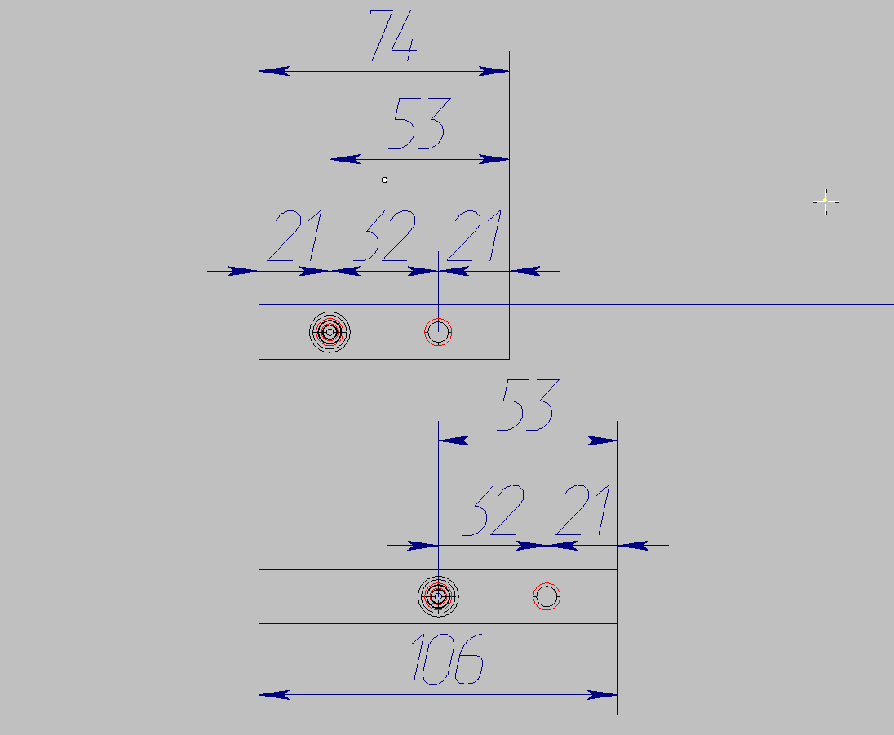
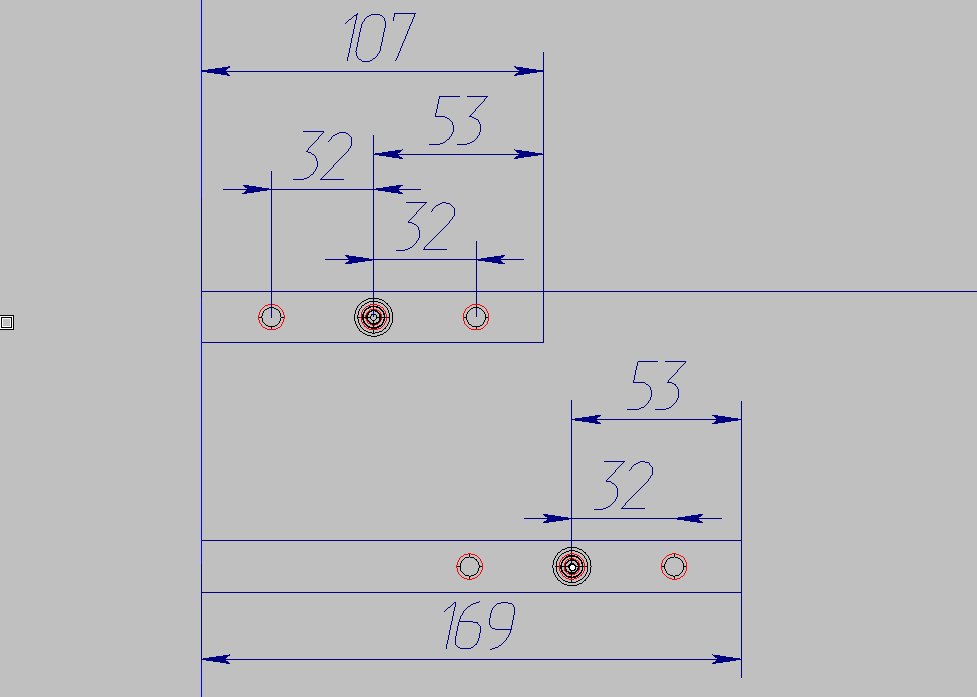
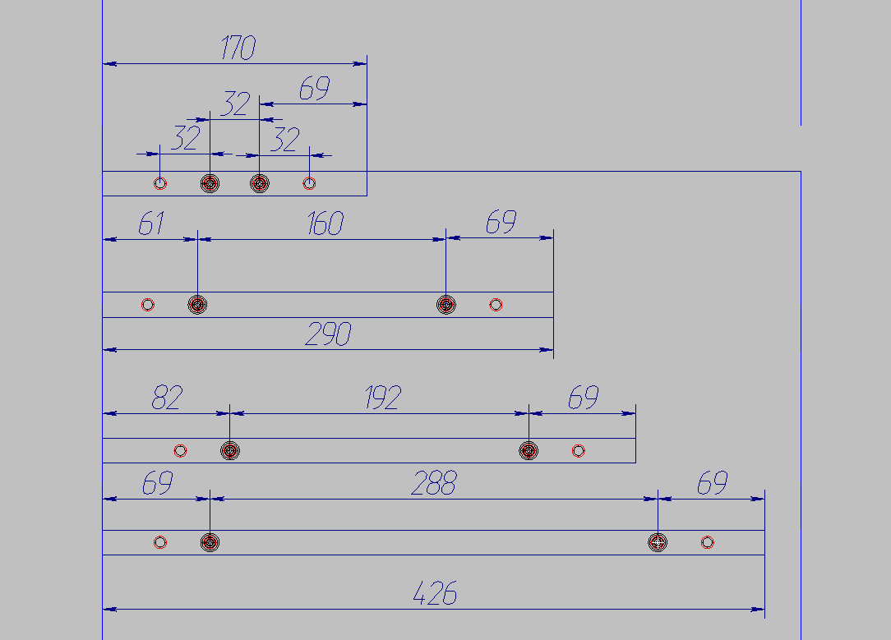
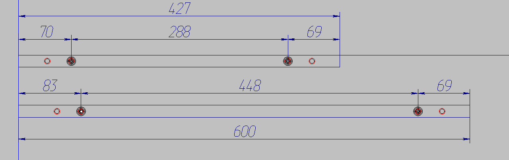
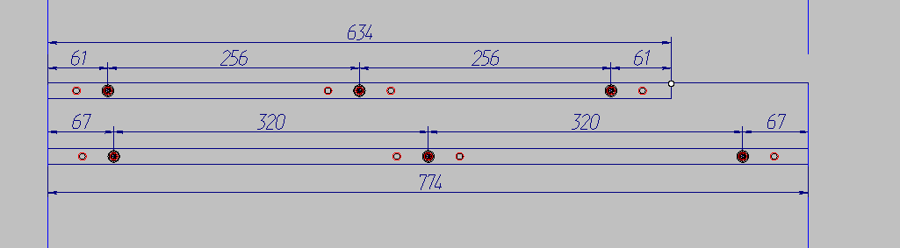

# Описание работы файлов системы крепежа

## 1. fix_konfirmat_skant2.py

Этот файл является основным скриптом для расстановки крепежа по макро с 8-ю параметрами. Он координирует работу всех компонентов системы крепежа.

### Основные функции:
- Определяет словари `LENGTH_X_POS` и `BUILD_X_POS` для координат установки крепежа
- Импортирует необходимые модули из `fixordersutils`
- Вызывает функцию `calculate_positions_fixes` для выполнения основной логики расстановки крепежа

### Взаимодействие:
- Использует `properties.Params` для получения параметров крепежа
- Использует `position_utilites.calculate_positions_fixes` для расчета позиций крепежа
- Использует `builders` для построения групп крепежа

### Словари:

#### LENGTH_X_POS
Словарь определяет координаты установки крепежа в зависимости от длины панели:
- Ключи: длина панели в мм
- Значения: кортежи с координатами крепежа и функциями для дополнительных отверстий

Подробное описание всех ключей:

- `0: ()` - для панелей длиной 0 мм крепеж не устанавливается
  

- `74: (53, )` - для панелей длиной 74 мм крепеж устанавливается на координате 53 мм от начала
  

- `107: (53, )` - для панелей длиной 107 мм крепеж устанавливается на координате 53 мм от начала
  

- `170: (69, orders.order_second_hole_with_raster_32, -53)` - для панелей длиной 170 мм крепеж устанавливается на координатах 69 мм и -53 мм (от конца), а также вызывается функция для дополнительных отверстий
  

- `427: (69, orders.order_second_hole_with_raster_32, -53)` - для панелей длиной 427 мм крепеж устанавливается на координатах 69 мм и -53 мм (от конца), а также вызывается функция для дополнительных отверстий
  

- `634: (-61, orders.order_threeholes_centering_raster_32, -61)` - для панелей длиной 634 мм крепеж устанавливается на координатах -61 мм (от конца) и -61 мм (от конца), а также вызывается функция для дополнительных отверстий
  

- `1117: (-53, orders.order_fourholes_centering_raster_32, -53)` - для панелей длиной 1117 мм крепеж устанавливается на координатах -53 мм (от конца) и -53 мм (от конца), а также вызывается функция для дополнительных отверстий
  

- `1642: (-53, orders.order_fiveholes_centering_raster_32, -53)` - для панелей длиной 1642 мм крепеж устанавливается на координатах -53 мм (от конца) и -53 мм (от конца), а также вызывается функция для дополнительных отверстий
  

- `2780: ()` - для панелей длиной 2780 мм крепеж не устанавливается
  

#### BUILD_X_POS
Словарь определяет построители крепежа в зависимости от длины панели:
- Ключи: длина панели в мм
- Значения: функции-построители для создания групп крепежа

Подробное описание всех ключей:

- `0: None` - для панелей длиной 0 мм построитель не используется
  

- `74: builders.build_group_chet_fixes` - для панелей длиной 74 мм используется построитель четного количества крепежа
  

- `107: builders.build_group_notchet_fixes` - для панелей длиной 107 мм используется построитель нечетного количества крепежа
  

- `170: builders.build_group_second_fixes` - для панелей длиной 170 мм используется построитель второй группы крепежа
  

- `427: builders.build_group_chet_fixes` - для панелей длиной 427 мм используется построитель четного количества крепежа
  

- `634: builders.build_group_notchet_fixes` - для панелей длиной 634 мм используется построитель нечетного количества крепежа
  

- `1117: builders.build_group_chet_fixes` - для панелей длиной 1117 мм используется построитель четного количества крепежа
  

- `1642: builders.build_group_notchet_fixes` - для панелей длиной 1642 мм используется построитель нечетного количества крепежа
  

- `2780: None` - для панелей длиной 2780 мм построитель не используется
  

## 2. fixordersutils/properties.py

Этот файл содержит классы для работы с параметрами крепежа.

### Основные компоненты:
- `FixParsAdapter` - класс-адаптер для расширенных параметров крепежа в правиле с 9-ю параметрами
- `_Params` - класс данных параметров закона расстановки крепежа по 8-ми параметрам
- `Params` - хранитель 9-ти параметров для расстановки крепежа по макро
- `get_length_with_slot` - функция для расчета длины стороны с учетом пропила

### Назначение:
Предоставляет структурированный доступ к параметрам крепежа и панелей, используемым в системе расстановки крепежа.

## 3. fixordersutils/position_utilites.py

Этот файл содержит утилиты для работы с позиционированием крепежа.

### Основные функции:
- `calculate_position_fix` - калькулятор позиций одиночного крепежа
- `calculate_positions_fixes` - калькулятор позиций множественного крепежа
- Вспомогательные функции для работы с координатами, ID деталей крепежа и т.д.
- Класс `NumFix` для работы с глобальной переменной к3 NumFixMac

### Назначение:
Выполняет основные вычисления для определения позиций крепежа на панелях, учитывая различные параметры и конфигурации.

## 4. fixordersutils/builders.py

Этот файл содержит построители (builders) для различных типов крепежа.

### Основные компоненты:
- `build_group_second_fixes` - построитель группы крепежа для второго крепежа
- `build_group_chet_fixes` - построитель группы крепежа с четным количеством
- `build_group_notchet_fixes` - построитель группы крепежа с нечетным количеством
- И другие специализированные построители для различных случаев

### Назначение:
Создает конкретные конфигурации крепежа в зависимости от типа и количества деталей.

## Общая архитектура системы

1. **Входная точка**: `fix_konfirmat_skant2.py` запускает процесс расстановки крепежа
2. **Параметризация**: `properties.py` предоставляет структуры данных для параметров крепежа
3. **Расчет позиций**: `position_utilites.py` выполняет основные вычисления позиций крепежа
4. **Построение конфигураций**: `builders.py` создает конкретные конфигурации крепежа
5. **Интеграция с K3**: Все компоненты взаимодействуют с API K3 для работы с панелями и крепежом

Система спроектирована как модульная, где каждый компонент отвечает за определенную часть процесса расстановки крепежа, что обеспечивает гибкость и расширяемость решения.

## UML Диаграммы

### Диаграмма основного скрипта

### Диаграмма свойств крепежа

### Диаграмма утилит позиционирования

### Диаграмма построителей крепежа

### Общая диаграмма взаимодействия
