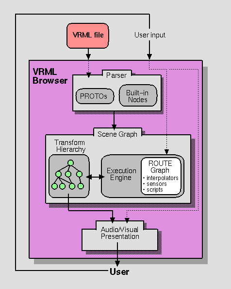
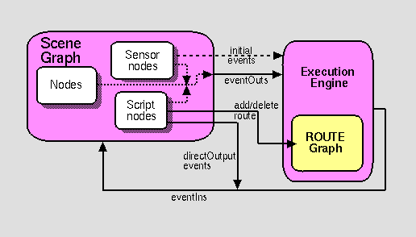

# The Virtual Reality Modeling Language

# 4\. Concepts

### ISO/IEC DIS 14772-1

#### 4 April 1997


## 4.1 Introduction and table  of contents

<a id="4.1.1"></a>
### 4.1.1 Обзор

В этом разделе описываются ключевые понятия определения и использования стандарта VRML. Сюда входит то, как узлы(Nodes) объединяются в графы сцены, как узлы получают и генерируют события, как создавать типы узлов с использованием прототипов, как добавлять типы узлов в VRML и экспортировать их для использования другими, как включать сценарии в файл VRML и различные общие темы об узлах.

<a id="4.1.2"></a>
### 4.1.2 Оглавление

См. таблицу 4.1 для содержания этого раздела.

#### Таблица 4.1: Содержание, понятия

[**4.1 Введение и содержание**](#4.1)

[4.1.1 Обзор](#4.1.1)

[4.1.2 Содержание](#4.1.2)

[4.1.3 Условные обозначения, используемые в этом документе](#4.1.3)

[**4.2 Обзор**](#4.2)

[4.2.1 Структура VRML файла](#4.2.1)

[4.2.2 Заголовок](#4.2.2)

[4.2.3 График сцены](#4.2.3)

[4.2.4 Прототипы](#4.2.4)

[4.2.5 Маршрутизация событий](#4.2.5)

[4.2.6 Генерация файлов VRML](#4.2.6)

[4.2.7 Представление и взаимодействие](#4.2.7)

[4.2.8 Профили](#4.2.8)

[**4.3 Синтаксис файла UTF-8**](#4.3)
[4.3.1 Открытое кодирование текста](#4.3.1)

[4.3.2 Заявления](#4.3.2)

[4.3.3 Синтаксис оператора узла](#4.3.3)

[4.3.4 Синтаксис оператора поля](#4.3.4)

[4.3.5 Синтаксис оператора PROTO](#4.3.5)

[4.3.6 Синтаксис оператора IS](#4.3.6)

[4.3.7 Оператор EXTERNPROTO \
синтаксис](#4.3.7)

[4.3.8 Синтаксис оператора USE](#4.3.8)

[4.3.9 Синтаксис оператора ROUTE](#4.3.9)

[**4.4 Структура графа сцены**](#4.4)

[4.4.1 Корневые узлы](#4.4.1)

[4.4.2 Иерархия графа сцены](#4.4.2)

[4.4.3 Потомок и предок\
узлы](#4.4.3)
[4.4.4 Иерархия преобразований](#4.4.4)

[4.4.5 Стандартные единицы измерения и система координат](#4.4.5)

[**4.5 VRML и Всемирная паутина**](#4.5)

[4.5.1 Расширение файла и MIME\
тип](#4.5.1)

[4.5.2 URL-адреса](#4.5.2)

[4.5.3 Относительные URL-адреса](#4.5.3)

[4.5.4 Протокол данных](#4.5.4)

[4.5.5 Язык сценариев протоколы](#4.5.5)

[4.5.6 URN](#4.5.6)

[**4.6 Семантика узла**](#4.6)

[4.6.1 Введение](#4.6.1)

[4.6.2 Семантика DEF/USE](#4.6.2)

[4.6.3 Формы и геометрия](#4.6.3)

[4.6.4 Ограничительные рамки](#4.6.4)

[4.6.5 Группировка и дети узлы](#4.6.5)

[4.6.6 Источники света](#4.6.6)

[4.6.7 Узлы датчиков](#4.6.7)

[4.6.8 Интерполяторы](#4.6.8)

[4.6.9 Узлы, зависящие от времени](#4.6.9)

[4.6.10 Привязываемые дочерние элементы \
 узлы](#4.6.10)

[4.6.11 Карты текстур](#4.6.11)

[**4.7 Семантика поля, eventIn и eventOut**](#4.7)

[**4.8 Семантика прототипа**](#4.8)

[4.8.1 ПРОТО-интерфейс семантика объявления](#4.8.1)

[4.8.2 Определение PROTO семантика](#4.8.2)

[4.8.3 Правила области действия прототипа](#4.8.3)

[**4.9 Семантика внешнего прототипа**](#4.9)

[4.9.1 Интерфейс EXTERNPROTO семантика](#4.9.1)

[4.9.2 URL-адрес EXTERNPROTO семантика](#4.9.2)

[4.9.3 Расширения браузера](#4.9.3)

[**4.10 Обработка событий**](#4.10)

[4.10.1 Введение](#4.10.1)

[4.10.2 Семантика маршрута](#4.10.2)

[4.10.3 Модель выполнения](#4.10.3)

[4.10.4 Циклы](#4.10.4)

[4.10.5 Входное и выходное разветвление](#4.10.5)

[**4.11 Время**](#4.11)

[4.11.1 Введение](#4.11.1)

[4.11.2 Начало времени](#4.11.2)

[4.11.3 Дискретный и постоянные изменения](#4.11.3)

[**4.12 Создание сценариев**](#4.12)

[4.12.1 Введение](#4.12.1)

[4.12.2 Выполнение скрипта](#4.12.2)

[4.12.3 __Initialize()_ и  _hutdown()_](#4.12.3)

[4.12.4 _eventsProcessed()_](#4.12.4)

[4.12.5 Скрипты с прямым выходом](#4.12.5)

[4.12.6 Асинхронные скрипты](#4.12.6)

[4.12.7 Языки сценариев](#4.12.7)

[4.12.8 Обработка EventIn](#4.12.8)

[4.12.9 Доступ к полям и событиям](#4.12.9)

[4.12.10 Скрипт браузера интерфейс](#4.12.10)

[**4.13 Навигация**](#4.13)

[4.13.1 Введение](#4.13.1)

[4.13.2 Парадигмы навигации](#4.13.2)

[4.13.3 Просмотр модели](#4.13.3)

[4.13.4 Обнаружение столкновений и рельеф местности](#4.13.4)

 [**4.14 Модель освещения**](#4.14)

[4.14.1 Введение](#4.14.1)

[4.14.2 Освещение выключено](#4.14.2)

[4.14.3 Включение освещения](#4.14.3)

[4.14.4 Уравнения освещения](#4.14.4)

[4.14.5 Ссылки](#4.14.5)

<a id="4.1.3"></a>
### 4.1.3 Условные обозначения, используемые в этом документе

В настоящем стандарте используются следующие соглашения:

_Курсив_ используется для названий событий и полей, а также при введении новых терминов и ссылок на переменные уравнения.

A `fixed-space` шрифт используется для URL-адресов и примеров исходного кода. VRML file examples appear in `bold,` **`fixed-space`**font.

Имена типов узлов пишутся с заглавной буквы (например, «Node Billboard — это узел группировки...»). Однако понятие узла часто упоминается в нижнем регистре, чтобы указать на семантику узла, а не на сам узел (например, "Чтобы повернуть billboard...", "Особым случаем billboard является...").

В этом документе ссылки обозначаются с использованием обозначения «x.\[ABCD\]», где «x» обозначает, в каком пункте или приложении описана ссылка, а «\[ABCD\]» — это сокращение названия ссылки. Например, 2.\[ABCD\] относится к ссылке, описанной в разделе 2, а E.\[ABCD\] относится к ссылке, описанной в Приложении E.

#### 

## 4.2 Обзор

<a id="4.2.1"></a>
### 4.2.1 Структура файла VRML

Файл _VRML_ состоит из следующих основных функциональных компонентов: header-заголовка, scene graph-графа сцены, prototypes-прототипов и event routing-маршрутизации событий. Содержимое этого файла обрабатывается для представления и взаимодействия с помощью механизма, известного как browser-браузер.

<a id="4.2.2"></a>
### 4.2.2 Заголовок

Для облегчения идентификации файлов VRML каждый файл VRML должен начинаться с:

```
#VRML V2.0 <encoding type> [optional comment] <line terminator>

```

Заголовок представляет собой одну строку текста UTF-8, идентифицирующую файл как файл VRML и определяющую тип кодировки файла. Он также может содержать дополнительную смысловую информацию. Должен быть ровно один пробел, отделяющий " **`#VRML`**" от " **`V2.0`**", " **`V2.0`**" от "< `encoding type` >" и "< `encoding type` >" от " `[необязательный комментарий]`".


< `encoding type` \> — это либо «**`utf8`**», либо любые другие разрешенные значения, определенные в других частях ISO/IEC 14772. Идентификатор «**`utf8`**» указывает на кодировку открытого текста, которая позволяет отображать международные символы в VRML с использованием кодировки UTF-8, определенной в ISO 10646-1 (также известной как Unicode); см. [2.\[UTF8\]](references.html#[UTF8]). Использование UTF-8 подробно описано в спецификации узла [Text](nodesRef.md#Text). Заголовок файла VRML в кодировке UTF-8:

```
#VRML V2.0 utf8 [optional comment] <line terminator>

```

Любые символы после `<encoding type>` в первой строке могут быть проигнорированы браузером. Строка заголовка заканчивается при появлении `<line terminator>`. `<line terminator>` — это символ перевода строки (0x0A) или символ возврата каретки (0x0D).

<a id="4.2.3"></a>
### 4.2.3 Scene graph

Граф сцены содержит узлы, описывающие объекты и их свойства. Он содержит иерархически сгруппированную геометрию для обеспечения аудиовизуального представления объектов, а также узлы, которые участвуют в механизме генерации и маршрутизации событий.

<a id="4.2.4"></a>
### 4.2.4 Prototypes

Прототипы позволяют пользователю расширять набор типов узлов VRML. Определения прототипов могут быть включены в файл, в котором они используются, или определены извне. Прототипы могут быть определены в терминах других узлов VRML или могут быть определены с использованием механизма расширения, специфичного для браузера. Хотя VRML имеет стандартный формат для идентификации таких расширений, их реализация зависит от браузера.

<a id="4.2.5"></a>
### 4.2.5 Event routing

Некоторые узлы VRML генерируют события в ответ на изменения окружающей среды или взаимодействие с пользователем. Маршрутизация событий дает авторам механизм, отдельный от иерархии графа сцены, посредством которого эти события могут распространяться для воздействия на изменения в других узлах. После генерации события отправляются в назначенные пункты назначения в порядке времени и обрабатываются принимающим узлом. Эта обработка может изменить состояние узла, сгенерировать дополнительные события или изменить структуру графа сцены.

Узлы сценариев допускают произвольную обработку событий, определяемую автором. Событие, полученное узлом Script, вызывает выполнение функции сценария, которая имеет возможность отправлять события через обычный механизм маршрутизации событий или обходить этот механизм и отправлять события непосредственно на любой узел, на который узел Script имеет ссылку. Скрипты также могут динамически добавлять или удалять маршруты и тем самым изменять топологию маршрутизации событий.

Идеальная модель событий мгновенно обрабатывает все события в том порядке, в котором они генерируются. Временная метка, время доставки события на узел, служит двум целям. Во-первых, это концептуальный прием, используемый для описания хронологического потока механизма событий. Это гарантирует, что детерминированные результаты могут быть достигнуты с помощью реальных реализаций, которые должны учитывать задержки обработки и асинхронное взаимодействие с внешними устройствами. Во-вторых, метки времени также доступны узлам сценариев, что позволяет обрабатывать события на основе порядка действий пользователя или прошедшего времени между событиями.

<a id="4.2.6"></a>
### 4.2.6 Создание файлов VRML

_generator_ является человеком или компьютерным создателем файлов VRML. Генератор несет ответственность за обеспечение правильности файла VRML и доступности вспомогательных ресурсов (например, изображений, аудиоклипов, других файлов VRML), упомянутых в нем.

<a id="4.2.7"></a>
### 4.2.7 Презентация и взаимодействие

The interpretation, execution, and presentation of VRML files will typically be undertaken by a mechanism known as a _browser_, which displays the shapes and sounds in the scene graph. This presentation is known as a _virtual world_ and is navigated in the browser by a human or mechanical entity, known as a _user_. The world is displayed as if experienced from a particular location; that position and orientation in the world is known as the _viewer_. The browser may define navigation paradigms (such as walking or flying) that enables the user to move the viewer through the virtual world.


Интерпретация, выполнение и представление файлов VRML обычно выполняются с помощью механизма, известного как _browser_, который отображает формы и звуки в графе сцены. Эта презентация известна как _virtual world_, и навигация по ней в браузере осуществляется человеком или механическим объектом, известным как _user_. Мир отображается так, как будто он происходит из определенного места; эта позиция и ориентация в мире известны как _viewer_. Браузер может определять парадигмы навигации (например, walking-ходьба или flying-полет), которые позволяют user-пользователю перемещать viewer-зрителя по виртуальному миру.

Помимо навигации, браузер может предоставлять механизм, позволяющий пользователю взаимодействовать с миром через узлы датчиков в иерархии графа сцены. Датчики реагируют на взаимодействие пользователя с геометрическими объектами в мире, движение пользователя по миру или течение времени.

Визуальное представление геометрических объектов в мире VRML следует концептуальной модели, напоминающей физические характеристики света. Модель освещения VRML описывает, как свойства внешнего вида и источники света в мире объединяются для создания отображаемых цветов.

Рисунок 4.1 иллюстрирует концептуальную модель браузера VRML. Эта диаграмма предназначена только для иллюстрации и не предназначена для буквальной реализации. Браузер изображается как презентационное приложение, которое принимает вводимые пользователем данные в форме выбора файла (явного и неявного) и жестов пользовательского интерфейса (например, манипулирования и навигации с помощью устройства ввода). Тремя основными компонентами браузера являются: Parser, Scene Graph, и Audio/Visual Presentation. Компонент Parser считывает файл VRML и создает граф сцены. Компонент «Граф сцены» состоит из Transform Hierarchy (узлы) и ROUTE Graph (связи между узлами). Граф сцены также включает в себя механизм выполнения, который обрабатывает события, считывает и редактирует ROUTE Graph, а также вносит изменения в иерархию преобразования (узлы). Пользовательский ввод обычно влияет на датчики и навигацию и, таким образом, подключается к компоненту ROUTE Graph (датчики) и компоненту аудио/визуальной презентации (навигация). Компонент аудио/визуальной презентации выполняет графическую и звуковую визуализацию иерархии преобразования, которая возвращается пользователю.



#### Рисунок 4.1: Концептуальная модель браузера VRML

<a id="4.2.8"></a>
### 4.2.8 Профили

VRML концептуально поддерживает концепцию профилей. Профиль — это именованный набор функций, который должен поддерживаться, чтобы реализация соответствовала этому профилю. В этом стандарте определен только один профиль. Функциональность и минимальные требования к поддержке, описанные в ISO/IEC 14772-1, образуют базовый профиль для VRML. Дополнительные профили могут быть определены в других частях ISO/IEC 14772\. Такие профили должны включать в себя весь Базовый профиль.


## 4.3 Синтаксис файла UTF-8

<a id="4.3.1"></a>
### 4.3.1 Clear text encoding

В этом разделе описывается синтаксис удобочитаемых файлов VRML в кодировке UTF-8. Более формальное описание синтаксиса можно найти в [Приложении A, «Справочник по грамматике](grammar.md)». Семантика VRML представлена ​​в этой части ISO/IEC 14772 в терминах кодировки UTF-8. Другие кодировки могут быть определены в других частях ISO/IEC 14772. Такие кодировки должны описывать, как отображать описания UTF-8 в соответствующие элементы кодирования и обратно.

В кодировке UTF-8 символ # начинает комментарий. Только первый комментарий (заголовок файла) имеет смысловое значение. В противном случае все символы после # до следующего признака конца строки игнорируются. Единственным исключением являются поля SFString и MFString, заключенные в двойные кавычки, где символ # определен как часть строки.

Запятые, пробелы, табуляции, переводы строк и возврат каретки являются символами-разделителями везде, где они появляются за пределами строковых полей. При необходимости один или несколько символов-разделителей разделяют синтаксические объекты в файлах VRML. Символы-разделители вместе называются _пробелами_.

Комментарии и разделители сохранять не обязательно. В частности, сервер документов VRML может удалять комментарии и дополнительные разделители из файла VRML перед его передачей. Узлы [WorldInfo](nodesRef.md#WorldInfo) следует использовать для постоянной информации, такой как авторские права или информация об авторе.

:::{tip}
Примечание. В следующем абзаце форма «0xhh» обозначает байт как шестнадцатеричное число, представляющее битовую конфигурацию этого байта.

Имена полей, событий, PROTO, EXTERNPROTO и узлов не должны содержать управляющие символы (0x0–0x1f, 0x7f), пробел (0x20), двойные или одинарные кавычки (0x22: ", 0x27: '), диез (0x23: #), запятую (0x2c: ,), точку (0x2e: .), квадратные скобки (0x5b, 0x5d: \[\]), обратная косая черта (0x5c: \\) или фигурные скобки (0x7b, 0x7d: {}). Кроме того, их первый символ не должен быть цифрой (0x30–0x39), символом плюс (0x2b: +) или минусом (0x2d: -). В противном случае имена могут содержать любой символ ISO 10646, закодированный с использованием VRML, с учетом регистра;"Sphere" отличаются от "sphere" и "BEGIN" отличаются от "begin".

Следующие зарезервированные ключевые слова не должны использоваться для имен полей, событий, PROTO, EXTERNPROTO или имён узлов:


- DEF

- EXTERNPROTO

- FALSE

- IS

- NULL

- PROTO

- ROUTE

- TO

- TRUE

- USE

- eventIn

- eventOut

- exposedField

- field

:::

<a id="4.3.2"></a>
### 4.3.2 Заявления


После обязательного заголовка файл VRML может содержать любую комбинацию следующих элементов:

1. Любое количество операторов PROTO или EXTERNPROTO (см. "[4.8 Prototype semantics](#48-prototype-semantics)")

2. Любое количество операторов корневых дочерних узлов (см. " [4.4.1 Root nodes](#441-root-nodes)" для описания корневых узлов и " [4.6.5 Grouping and children nodes](#465-grouping-and-children-nodes)" для описания дочерних узлов),

3. Any number of USE statements (see " [4.6.2 \
    DEF/USE semantics](#4.6.2)")

4. Any number of ROUTE statements (see " [4.10.2 \
    Route semantics](#4.10.2)")


<a id="4.3.3"></a>
### 4.3.3 Node statement syntax

A node statement consists of an optional name for the node followed by
the node's type and then the body of the node. A node is given a name
using the keyword DEF followed by the name of the node. The node's body
is enclosed in matching curly braces (" **`{` `}`**").
Whitespace shall separate the DEF, name of the node, and node type, but
is not required before or after the curly braces that enclose the
node's body. See " [A.3 Nodes](grammar.md#Nodes)"
for details on node grammar rules.

```
    [DEF <name>] <nodeType> { <body> }

```

A node's body consists of any number of field statements, IS
statements, ROUTE statements, PROTO statements or EXTERNPROTO
statements, in any order.

See " [4.3.4 Field statement syntax](#4.3.4)"
for a description of field statement syntax and " [4.7 Field, eventIn, and eventOut semantics](#4.7)"
for a description of field statement semantics. See " [4.6 Node semantics](#4.6)" for a description
of node statement semantics.

### **4.3.4 Field statement syntax**

A field statement consists of the name of the field followed by the
field's value(s). The following ilustrates the syntax for a
single-valued field:

```
    <fieldName> <fieldValue>

```

The following illustrates the syntax for a multiple-valued field:

```
    <fieldName> [ <fieldValues> ]

```

See " [A.4 Fields](grammar.md#Fields)" for
details on field statement grammar rules.

Each node type defines the names and types of the fields that each node
of that type contains. The same field name may be used by multiple node
types. See " [5\. Field and Event Reference](fieldsRef.html)"
for the definition and syntax of specific field types.

See " [4.7 Field, eventIn, and eventOut semantics](#4.7)"
for a description of field statement semantics.

### **4.3.5 PROTO statement syntax**

A PROTO statement consists of the PROTO keyword, followed in order by
the prototype name, prototype interface declaration, and prototype
definition:

```
    PROTO <name> [ <declaration> ] { <definition> }

```

See " [A.2 General](grammar.md#General)" for
details on prototype statement grammar rules.

A prototype interface declaration consists of eventIn, eventOut, field,
and exposedField declarations (see " [4.7 Field, \
eventIn, and eventOut semantics](#4.7)") enclosed in square brackets.
Whitespace is not required before or after the brackets.

EventIn declarations consist of the keyword "eventIn"
followed by an event type and a name:

```
    eventIn <eventType> <name>

```

EventOut declarations consist of the keyword "eventOut"
followed by an event type and a name:

```
    eventOut <eventType> <name>

```

Field and exposedField declarations consist of either the keyword
"field" or "exposedField" followed by a field type,
a name, and an initial field value of the given field type.

```
    field <fieldType> <name> <initial field value>

    exposedField <fieldType> <name> <initial field value>

```

Field, eventIn, eventOut, and exposedField names must be unique in each
PROTO statement, but are not required to be unique between different
PROTO statements. If a PROTO statement contains an exposedField with a
given name (e.g., _zzz_), it must not contain eventIns or
eventOuts with the prefix _set\__ or the suffix _\_changed_ and
the given name (e.g., _set\_zzz_ or _zzz\_changed_).

A prototype definition consists of at least one node statement and any
number of ROUTE statements, PROTO statements, and EXTERNPROTO
statements in any order.

See "[4.8 Prototype semantics](#48-prototype-semantics)" for a
description of prototype semantics.

<a id="4.3.6"></a>
### 4.3.6 IS statement syntax

The body of a node statement that is inside a prototype definition may
contain IS statements. An IS statement consists of the name of a field,
exposedField, eventIn or eventOut from the node's public interface
followed by the keyword IS followed by the name of a field,
exposedField, eventIn or eventOut from the prototype's interface
declaration:

```
    <field/eventName> IS <field/eventName>

```

See " [A.3 Nodes](grammar.md#Nodes)" for details
on prototype node body grammar rules. See "[4.8 Prototype semantics](#48-prototype-semantics)" for a description of IS statement
semantics.

<a id="4.3.7"></a>
### 4.3.7 EXTERNPROTO statement syntax

An EXTERNPROTO statement consists of the EXTERNPROTO keyword followed
in order by the prototype's name, its interface declaration, and either
one double-quoted string or zero or more double-quoted strings enclosed
in square brackets:

```
    EXTERNPROTO <name> [ <external declaration> ] URL or [ URLs ]

```

See " [A.2 General](grammar.md#General)" for
details on external prototype statement grammar rules.

An EXTERNPROTO interface declaration is the same as a PROTO interface
declaration, with the exception that field and exposedField intitial
values are not specified and the prototype definition is specified in a
separate file referred to by the URL(s).

<a id="4.3.8"></a>
### 4.3.8 USE statement syntax

A USE statement consists of the USE keyword followed by a node name:

```
    USE <name>

```

See " [A.2 General](grammar.md#General)" for
details on USE statement grammar rules.

<a id="4.3.9"></a>
### 4.3.9 ROUTE statement syntax

A ROUTE statement consists of the ROUTE keyword followed in order by a
node name, a period character, a field name, the TO keyword, a node
name, a period character, and a field name. Whitespace is allowed but
not required before or after the period characters:

```
    ROUTE <name>.<field/eventName> TO <name>.<field/eventName>

```

See " [A.2 General](grammar.md#General)" for
details on ROUTE statement grammar rules.


## 4.4 Scene graph structure

<!-- Якорь для перехода -->
<a id="441-root-nodes"></a>

<a id="4.4.1"></a>
### 4.4.1 Root nodes

A VRML file contains zero or more root nodes. The root nodes for a file
are those nodes defined by the node statements or USE statements that
are not contained in other node or PROTO statements. Root nodes must be
children nodes (see " [4.6.5 Grouping and children nodes](#4.6.5)").

<a id="4.4.2"></a>
### 4.4.2 Scene graph hierarchy

A VRML file is hierarchical; node statements can contain SFNode or
MFNode field statements that, in turn, contain node (or USE)
statements. This hierarchy of nodes is called the _scene graph_.
Each arc in the graph from A to B means that node A has an SFNode or
MFNode field whose value directly contains node B. See [E.\[FOLE\]](bibliography.md#[FOLE]) for details on
hierarchical scene graphs.

<a id="4.4.3"></a>
### 4.4.3 Descendant and ancestor nodes

The descendants of a node are all of the nodes in its SFNode or MFNode
fields, as well as all of those nodes' descendants. The ancestors of a
node are all of the nodes that have the node as a descendant.

<a id="4.4.4"></a>
### 4.4.4 Transformation hierarchy

The transformation hierarchy includes all of the root nodes and root
node descendants that are considered to have one or more particular
locations in the virtual world. VRML includes the notion of _local_
_coordinate systems_, defined in terms of transformations from
ancestor coordinate systems (using Transform or Billboard nodes). The
coordinate system in which the root nodes are displayed is called the _world_
_coordinate system_.

A VRML browser's task is to present a VRML file to the user; it does
this by presenting the transformation hierarchy to the user. The
transformation hierarchy describes the directly perceptible parts of
the virtual world.

The following node types are in the scene graph but not affected by the
transformation hierarchy: ColorInterpolator, CoordinateInterpolator,
NavigationInfo, NormalInterpolator, OrientationInterpolator,
PositionInterpolator, Script, ScalarInterpolator, TimeSensor, and
WorldInfo. Of these, only Script nodes may have descendants. A
descendant of a Script node is not part of the transformation hierarchy
unless it is also the descendant of another node that is part of the
transformation hierarchy or is a root node.

Nodes that are descendants of LOD or Switch nodes are affected by the
transformation hierarchy, even if the settings of a Switch node's _whichChoice_
field or the position of the viewer with respect to a LOD node makes
them imperceptible.

The transformation hierarchy shall be a directed acyclic graph; results
are undefined if a node in the transformation hierarchy is its own
ancestor.

<a id="4.4.5"></a>
### 4.4.5 Standard units and coordinate system

VRML defines the unit of measure of the world coordinate system to be
metres. All other coordinate systems are built from transformations
based from the world coordinate system. Table 4.2 lists standard
units for VRML.

#### **Table 4.2: Standard units**

**Category****Unit**Linear distanceMetresAnglesRadiansTimeSecondsColour spaceRGB (\[0.,1.\], \[0.,1.\], \[0. 1.\])

VRML uses a Cartesian, right-handed, three-dimensional coordinate
system. By default, the viewer is positioned along the positive Z-axis
so as to look along the -Z direction with +Y-axis up. A modelling
transformation (see " [6.6 \
Transform](nodesRef.md#Transform)" and " [6.52 \
Billboard](nodesRef.md#Billboard)") or viewing transformation (see " [6.53 Viewpoint](nodesRef.md#Viewpoint)") can be used
to alter this default projection.


## 4.5 VRML and the World Wide  Web

<a id="4.5.1"></a>
### 4.5.1 File extension and MIME types

The file extension for VRML files is `.wrl` (for _world_).

The official MIME type for VRML files is defined as:

```
    model/vrml

```

where the MIME major type for 3D data descriptions is `model,`
and the minor type for VRML documents is `vrml`.

For compatibility with earlier versions of VRML, the following MIME
type shall also be supported:

```
    x-world/x-vrml

```

where the MIME major type is `x-world,` and the minor type for
VRML documents is `x-vrml`.

See [2.\[MIME\]](bibliography#[MIME]) for details.

<a id="4.5.2"></a>
### 4.5.2 URLs

A _URL_ (Uniform Resource Locator), described in [2.\[URL\]](references.html#[URL]), specifies a file located on
a particular server and accessed through a specified protocol (e.g., http).
The upper-case term URL refers to a Uniform Resource Locator,
while the italicized lower-case version _url_ refers to a field
which may contain URLs, URNs, or in-line encoded data.

All _url_ fields are of type MFString. The strings in these fields
indicate multiple locations to look for data in decreasing order of
preference. If the browser cannot locate the data specified by the
first location, it shall try the second and subsequent locations in
order. The _url_ field entries are delimited by double quotation
marks " ". Due to the " [4.5.4 Data Protocol](#4.5.4)"
and the" [4.5.5 Scripting Language Protocols](#4.5.5)" _url_
fields use a superset of the standard URL syntax (IETF RFC 1738).
Details on the string field are located in " [5.9 SFString and MFString](fieldsRef.html#SFString)."

More general information on URLs is described in [2.\[URL\]](references.html#[URL]).

<a id="4.5.3"></a>
### 4.5.3 Relative URLs

Relative URLs are handled as described in [2.\[RURL\]](references.html#[RURL]). The base document for
EXTERNPROTO statements or Anchor, AudioClip, ImageTexture, Inline,
MovieTexture, and Script node statements is:

1. The file in which the prototype is instantiated, if the statement is
    part of a prototype definition.

2. The file containing the script code, if the statement is part of a
    string passed to the createVrmlFromURL() or createVrmlFromString()
    browser calls in a Script node.

3. Otherwise, the file from which the statement is read, in which case the
    RURL information provides the data itself.


<a id="4.5.4"></a>
### 4.5.4 Data protocol

The IETF is in the process of standardizing a "Data:" URL to
be used for in-line inclusion of base64 encoded data, such as JPEG
images. This capability shall be supported as specified in [E.\[DATA\]](bibliography.md#[DATA]).

<a id="4.5.5"></a>
### 4.5.5 Scripting language protocols

The Script node's _url_ field may also support custom protocols
for the various scripting languages. For example, a script _url_ prefixed
with _javascript:_ shall contain JavaScript source, with line
terminators allowed in the string. A script prefixed with _javabc:_
shall contain Java bytecodes using a base64 encoding. The details of
each language protocol are defined in the appendix for each language.
Browsers are not required to support any specific scripting language.
However, browsers shall adhere to the protocol for any scripting
language which is supported. The following example illustrates the use
of mixing custom protocols and standard protocols in a single url
(order of precedence determines priority):

```
    #VRML V2.0 utf8
    Script {
        url [ "javascript: ...",           # custom protocol JavaScript
              "http://bar.com/foo.js",     # std protocol JavaScript
              "http://bar.com/foo.class" ] # std protocol Java byte
    }

```

In the example above, the "..." represents in-line JavaScript
source code.

<a id="4.5.6"></a>
### 4.5.6 URNs

URNs are location-independent pointers to a file or to different
representations of the same content. In most ways, URNs can be used
like URLs except that, when fetched, a smart browser should fetch them
from the closest source. URN resolution over the Internet has not yet
been standardized. However, URNs may be used now as persistent unique
identifiers for referenced entities such as files, EXTERNPROTOs, and
textures. General information on URNs is available at [2.\[URN\]](bibliography.md#[URN]).

URNs may be assigned by anyone with a domain name. For example, if the
company Foo owns foo.com, it may allocate URNs that begin with
"urn:inet:foo.com:". An example of such usage is
"urn:inet:foo.com:texture:wood001". See the draft
specification referenced in [2.\[URN\]](bibliograph.html#[URN])
for a description of the legal URN syntax.

To reference a texture, EXTERNPROTO, or other file by a URN, the URN is
included in the _url_ field of another node. For example:

```
    ImageTexture {
        url [ "http://www.foo.com/textures/woodblock_floor.gif",
              "urn:inet:foo.com:textures:wood001" ]
    }

```

specifies a URL file as the first choice and a URN as the second choice.


## 4.6 Node semantics

<a id="4.6.1"></a>
### 4.6.1 Introduction

Each node may have the following characteristics:

1. **A type name.** Examples include Box, Color, Group, Sphere,
    Sound, or SpotLight.

2. **Zero or more fields that define how each node differs from other**
   **nodes of the same type.** Field values are stored in the VRML
    file along with the nodes, and encode the state of the virtual world.

3. **A set of events that it can receive and send.** Each node may
    receive zero or more different kinds of events which will result in
    some change to the node's state. Each node may also generate zero or
    more different kinds of events to report changes in the node's state.

4. **An implementation.** The implementation of each node defines
    how it reacts to events it can receive, when it generates events, and
    its visual or auditory appearance in the virtual world (if any). The
    VRML standard defines the semantics of built-in nodes (i.e., nodes
    with implementations that are provided by the VRML browser). The PROTO
    statement may be used to define new types of nodes, with behaviours
    defined in terms of the behaviours of other nodes.

5. **A name.** Nodes can be named. This is used by other statements
    to referencing a specific instantiation of a node.

<a id="4.6.2"></a>

<a id="4.6.2"></a>
### 4.6.2 DEF/USE semantics

A node given a name using the DEF keyword may later be referenced by
name with USE or ROUTE statements. The USE statement does not create a
copy of the node. Instead, the same node is inserted into the scene
graph a second time, resulting in the node having multiple parents.
Using an instance of a node multiple times is called _instantiation_.

Node names are limited in scope to a single file or prototype
definition. A DEF name goes into scope immediately. Given a node named
"NewNode" (i.e., `DEF NewNode`), any " `USE NewNode`"
statements in SFNode or MFNode fields inside NewNode's scope refer to
NewNode (see " [4.4.4 Transformation hierarchy](#4.4.4)"
for restrictions on self-referential nodes). PROTO statements define a
node name scope separate from the rest of the file in which the
prototype definition appears.

If multiple nodes are given the same name, each USE statement refers to
the closest node with the given name preceding it in either the file or
prototype definition.

<a id="4.6.3"></a>
### 4.6.3 Shapes and geometry

<a id="4.6.3.1"></a>
#### 4.6.3.1 Introduction

The [Shape](nodesRef.md#Shape) node associates a geometry
node with nodes that define that geometry's appearance. Shape nodes
must be part of the transformation hierarchy to have any visible
result, and the transformation hierarchy must contain Shape nodes for
any geometry to be visible (the only nodes that render visible results
are Shape nodes and the [Background](nodesRef.md#Background)
node). A Shape node contains exactly one geometry node in its _geometry_
field. This following node types are valid _geometry_ nodes:

- [Box](nodesRef.md#Box)
- [Cone](nodesRef.md#Cone)
- [Cylinder](nodesRef.md#Cylinder)
- [ElevationGrid](nodesRef.md#ElevationGrid)
- [Extrusion](nodesRef.md#Extrusion)
- [IndexedFaceSet](nodesRef.md#IndexedFaceSet)
- [IndexedLineSet](nodesRef.md#IndexedLineSet)
- [PointSet](nodesRef.md#PointSet)
- [Sphere](nodesRef.md#Sphere)
- [Text](nodesRef.md#Text)
- [Geometry nodes created from PROTOs or EXTERNPROTOs](#4.8)

<a id="4.6.3.2"></a>
#### 4.6.3.2 Geometric property nodes

Several geometry nodes contain [Coordinate](nodesRef.md#Coordinate), [Color](nodesRef.md#Color), [Normal](nodesRef.md#Normal),
and [TextureCoordinate](nodesRef.md#TextureCoordinate) as
geometric property nodes. The geometric property nodes are defined as
individual nodes so that instancing and sharing is possible between
different geometry nodes.

<a id="4.6.3.3"></a>
#### 4.6.3.3 Appearance nodes

Shape nodes may specify an [Appearance](nodesRef.md#Appearance)
node that describes the appearance properties (material and texture)
to be applied to the Shape's geometry. The following node type may be
specified in the material field of the Appearance node:

- [M](nodesRef.md#material) [aterial](nodesRef.md#Material)

The following nodes may be specified by the _texture_ field of the
Appearance node:

- [ImageTexture](nodesRef.md#ImageTexture)
- [PixelTexture](nodesRef.md#PixelTexture)
- [MovieTexture](nodesRef.md#MovieTexture)

The following node may be specified in the _textureTranform_ field
of the Appearance node:

- [TextureTransform](nodesRef.md#TextureTransform)

The interaction between such appearance nodes and the Color node is
described in " [4.14 Lighting Model](#4.14)".

<a id="4.6.3.4"></a>
#### 4.6.3.4 Shape hint fields

The ElevationGrid, Extrusion, and IndexedFaceSet nodes each have three
SFBool fields that provide hints about the shape such as whether the
shape contains ordered vertices, whether the shape is solid, and
whether the shape contains convex faces. These fields are _ccw_, _solid_,
and _convex_, respectively.

The _ccw_ field defines the ordering of the vertex coordinates of
the geometry with respect to user-given or automatically generated
normal vectors used in the lighting model equations. If _ccw_ is
TRUE, the normals shall follow the right hand rule; the orientation of
each normal with respect to the vertices (taken in order) shall be such
that the vertices appear to be oriented in a counterclockwise order
when the vertices are viewed (in the local coordinate system of the
Shape) from the opposite direction as the normal. If _ccw_ is
FALSE, the normals shall be oriented in the opposite direction. If
normals are not generated but are supplied using a Normal node, and the
orientation of the normals does not match the setting of the _ccw_
field, results are undefined.

The _solid_ field determines whether one or both sides of each
polygon shall be displayed. If _solid_ is FALSE, each polygon
shall be visible regardless of the viewing direction (i.e., no
backface culling shall be done, and two-sided lighting shall be
performed to illuminate both sides of lit surfaces). If _solid_ is
TRUE, the visibility of each polygon shall be determined as follows:
Let **_V_** be the position of the viewer in the local
coordinate system of the geometry. Let **_N_** be the geometric
normal vector of the polygon, and let **_P_** be any point
(besides the local origin) in the plane defined by the polygon's
vertices. Then if ( **_V_** dot **_N_**) \- ( **_N_**
dot **_P_**) is greater than zero, the polygon shall be
visible; if it is less than or equal to zero, the polygon shall be
invisible (backface culled).

The _convex_ field indicates whether all polygons in the shape are
convex (TRUE). A polygon is convex if it is planar, does not intersect
itself, and all of the interior angles at its vertices are less than
180 degrees. Non-planar and self-intersecting polygons may produce
undefined results even if the _convex_ field is FALSE.

<a id="4.6.3.5"></a>
#### 4.6.3.5 Crease angle field

The _creaseAngle_ field, used by the ElevationGrid, Extrusion, and
IndexedFaceSet nodes, affects how default normals are generated. If the
angle between the geometric normals of two adjacent faces is less than
the crease angle, normals shall be calculated so that the faces are
smooth-shaded across the edge; otherwise, normals shall be calculated
so that a lighting discontinuity across the edge is produced. For
example, a crease angle of .5 radians means that an edge between two
adjacent polygonal faces will be smooth shaded if the geometric normals
of the two faces form an angle that is less than .5 radians. Otherwise,
the faces will appear faceted. Crease angles must be greater than or
equal to 0.0.

<a id="4.6.4"></a>
### 4.6.4 Bounding boxes

Several of the nodes include a bounding box specification comprised of
two fields, _bboxSize_ and _bboxCenter_. A bounding box is a
rectangular parallelepiped of dimension _bboxSize_ centred on the
location _bboxCenter_ in the local coordinate system. This is
typically used by grouping nodes to provide a hint to the browser on
the group's approximate size for culling optimizations. The default
size for bounding boxes (-1, -1, -1) indicates that the user
did not specify the bounding box and the browser is to compute it or
assume the most conservative case. A _bboxSize_ value of (0, 0, 0)
is valid and represents a point in space (i.e., aninfinitely
small box). Specified _bboxSize_ field values shall be >= 0.0
or equal to (-1, -1, -1). The _bboxCenter_ fields
specify a position offset from the local coordinate system.

The _bboxCenter_ and _bboxSize_ fields may be used to specify
a maximum possible bounding box for the objects inside a grouping node
(e.g., Transform). These are used as hints to optimize certain
operations such as determining whether or not the group needs to be
drawn. If the specified bounding box is smaller than the true bounding
box of the group, results are undefined. The bounding box shall be
large enough to completely contain the effects of all sound and light
nodes that are children of this group. If the size of this group
changes over time due to animating children or due to the addition of
children nodes, the bounding box shall also be large enough to contain
all possible changes. The bounding box shall be large enough to contain
the union of the group's children's bounding boxes; it shall not
include any transformations performed by the group itself (i.e., the
bounding box is defined in the local coordinate system of the group).

<!-- Якорь для перехода -->
<a id="465-grouping-and-children-nodes nodes"></a>

<a id="4.6.5"></a>
### 4.6.5 Grouping and children nodes

Grouping nodes have a _children_ field that contains a list of
nodes (exceptions to this rule are [Inline](nodesRef.md#Inline), [LOD](nodesRef.md#LOD), and [Switch](nodesRef.md#Switch)).
Each grouping node defines a coordinate space for its children. This
coordinate space is relative to the coordinate space of the node of
which the group node is a child. Such a node is called a _parent_
node. This means that transformations accumulate down the scene graph
hierarchy.

The following node types are grouping nodes:

- [Anchor](nodesRef.md#Anchor)
- [Billboard](nodesRef.md#Billboard)
- [Collision](nodesRef.md#Collision)
- [Group](nodesRef.md#Group)
- [Inline](nodesRef.md#Inline)
- [LOD](nodesRef.md#LOD)
- [Switch](nodesRef.md#Switch)
- [Transform](nodesRef.md#Transform)
- [PROTO'd grouping nodes](#4.8)

The following node types are children nodes:

- [Anchor](nodesRef.md#Anchor)
- [Background](nodesRef.md#Background)
- [Billboard](nodesRef.md#Billboard)
- [Collision](nodesRef.md#Collision)
- [ColorInterpolator](nodesRef.md#ColorInterpolator)
- [CoordinateInterpolator](nodesRef.md#CoordinateInterpolator)
- [CylinderSensor](nodesRef.md#CylinderSensor)
- [DirectionalLight](nodesRef.md#DirectionalLight)
- [Fog](nodesRef.md#Fog)
- [Group](nodesRef.md#Group)
- [Inline](nodesRef.md#Inline)

[LOD](nodesRef.md#LOD)
[NavigationInfo](nodesRef.md#NavigationInfo)
[NormalInterpolator](nodesRef.md#NormalInterpolator)
[OrientationInterpolator](nodesRef.md#OrientationInterpolator)
[PlaneSensor](nodesRef.md#PlaneSensor)
[PointLight](nodesRef.md#PointLight)
[PositionInterpolator](nodesRef.md#PositionInterpolator)
[ProximitySensor](nodesRef.md#ProximitySensor)
[ScalarInterpolator](nodesRef.md#ScalarInterpolator)
[Script](nodesRef.md#Script)
[Shape](nodesRef.md#Shape)
[Sound](nodesRef.md#Sound)
[SpotLight](nodesRef.md#SpotLight)
[SphereSensor](nodesRef.md#SphereSensor)
[Switch](nodesRef.md#Switch)
[TimeSensor](nodesRef.md#TimeSensor)
[TouchSensor](nodesRef.md#TouchSensor)
[Transform](nodesRef.md#Transform)
[Viewpoint](nodesRef.md#Viewpoint)
[VisibilitySensor](nodesRef.md#VisibilitySensor)
[WorldInfo](nodesRef.md#WorldInfo)
[PROTO'd children nodes](#4.8)

The following node types are not valid as children nodes:

- [Appearance](nodesRef.md#Appearance)
- [AudioClip](nodesRef.md#AudioClip)
- [Box](nodesRef.md#Box)
- [Color](nodesRef.md#Color)
- [Cone](nodesRef.md#Cone)
- [Coordinate](nodesRef.md#Coordinate)
- [Cylinder](nodesRef.md#Cylinder)

[ElevationGrid](nodesRef.md#ElevationGrid)
[Extrusion](nodesRef.md#Extrusion)
[ImageTexture](nodesRef.md#ImageTexture)
[IndexedFaceSet](nodesRef.md#IndexedFaceSet)
[IndexedLineSet](nodesRef.md#IndexedLineSet)
[Material](nodesRef.md#Material)
[MovieTexture](nodesRef.md#MovieTexture)
[Normal](nodesRef.md#Normal)
[PointSet](nodesRef.md#Normal)
[Sphere](nodesRef.md#Sphere)
[Text](nodesRef.md#Text)
[TextureCoordinate](nodesRef.md#TextureCoordinate)
[TextureTransform](nodesRef.md#TextureTransform)

All grouping nodes also have _addChildren_ and _removeChildren_
eventIn definitions. The _addChildren_ event appends nodes to the
grouping node's _children_ field. Any nodes passed to the _addChildren_
event that are already in the group's children list are ignored. For
example, if the _children_ field contains the nodes Q, L and S (in
order) and the group receives an _addChildren_ eventIn containing
(in order) nodes A, L, and Z, the result is a _children_ field
containing (in order) nodes Q, L, S, A, and Z.

The _removeChildren_ event removes nodes from the grouping node's _children_
field. Any nodes in the _removeChildren_ event that are not in
the grouping node's _children_ list are ignored. If the _children_
field contains the nodes Q, L, S, A and Z and it receives a _removeChildren_
eventIn containing nodes A, L, and Z, the result is Q, S.

The Inline, Switch and LOD nodes are special group nodes that do not
have all of the semantics of the regular grouping nodes (see " [6.25 Inline](nodesRef.md#Inline)", " [6.26 LOD](nodesRef.md#LOD)", and " [6.46 Switch](nodesRef.md#Switch)" for specifics).

Note that a variety of node types reference other node types through
fields. Some of these are parent-child relationships, while others are
not (there are node-specific semantics). Table 4.3 lists all node types
that reference other nodes through fields.

#### Table 4.3: Nodes with SFNode or MFNode fields

**Node Type****Field****Valid Node Types for Field**Anchor_children_Valid children nodesAppearance_material_Material_texture_ImageTexture, MovieTexture, Pixel TextureBillboard_children_Valid children nodesCollision_children_Valid children nodesElevationGrid_color_Color_normal_Normal_texCoord_TextureCoordinateGroup_children_Valid children nodesIndexedFaceSet_color_Color_coord_Coordinate_normal_Normal_texCoord_TextureCoordinateIndexedLineSet_color_Color_coord_CoordinateLOD_level_Valid children nodesShape_appearance_Appearance_geometry_Box, Cone, Cylinder, ElevationGrid, Extrusion,
 IndexedFaceSet, IndexedLineSet, PointSet, Sphere, TextSound_source_AudioClip, MovieTextureSwitch_choice_Valid children nodesText_fontStyle_FontStyleTransform_children_Valid children nodes

<a id="4.6.6"></a>
### 4.6.6 Light sources

Shape nodes are illuminated by the sum of all of the lights in the
world that affect them. This includes the contribution of both the
direct and ambient illumination from light sources. Ambient
illumination results from the scattering and reflection of light
originally emitted directly by light sources. The amount of ambient
light is associated with the individual lights in the scene. This is a
gross approximation to how ambient reflection actually occurs in nature.

The following node types are light source nodes:

- [DirectionalLight](nodesRef.md#DirectionalLight)
- [PointLight](nodesRef.md#PointLight)
- [SpotLight](nodesRef.md#SpotLight)

All light source nodes contain an _intensity_, a _color_, and
an _ambientIntensity_ field. The _intensity_ field specifies
the brightness of the direct emission from the light, and the _ambientIntensity_
specifies the intensity of the ambient emission from the light. Light
intensity may range from 0.0 (no light emission) to 1.0 (full
intensity). The _color_ field specifies the spectral colour
properties of the both direct and ambient light emission, as an RGB
value.

PointLight and SpotLight illuminate all objects in the world that fall
within their volume of lighting influence regardless of location within
the file. PointLight defines this volume of influence as a sphere
centred at the light (defined by a radius). SpotLight defines the
volume of influence as a solid angle defined by a radius and a cutoff
angle. DirectionalLights illuminate only the objects descended from the
light's parent grouping node, including any descendent children of the
parent grouping nodes.

<a id="4.6.7"></a>
### 4.6.7 Sensor nodes

<a id="4.6.7.1"></a>
#### 4.6.7.1 Introduction to sensors

There following nodes types are sensor nodes:

- [Anchor](nodesRef.md#Anchor)
- [Collision](nodesRef.md#Collision)
- [CylinderSensor](nodesRef.md#CylinderSensor)
- [PlaneSensor](nodesRef.md#PlaneSensor)
- [ProximitySensor](nodesRef.md#ProximitySensor)
- [SphereSensor](nodesRef.md#SphereSensor)
- [TimeSensor](nodesRef.md#TimeSensor)
- [TouchSensor](nodesRef.md#TouchSensor)
- [VisibilitySensor](nodesRef.md#VisibilitySensor)

Sensors are children nodes in the hierarchy and therefore may be
parented by grouping nodes as described in " [4.6.5 Grouping and children \
nodes](#4.6.5)."

Each type of sensor defines when an event is generated. The state of
the scene graph after several sensors have generated events shall be as
if each event is processed separately, in order. If sensors generate
events at the same time, the state of the scene graph will be undefined
if the results depend on the ordering of the events.

It is possible to create dependencies between various types of sensors.
For example, a TouchSensor may result in a change to a VisibilitySensor
node's transformation, which in turn may cause the VisibilitySensor
node's visibility status to change.

The following two sections classify sensors into two categories: _environmental_
_sensors_ and _pointing-device sensors_.

<a id="4.6.7.2"></a>
#### 4.6.7.2 Environmental sensors

The [ProximitySensor](nodesRef.md#ProximitySensor) detects
when the user navigates into a specified region in the world. The
ProximitySensor itself is not visible. The [TimeSensor](nodesRef.md#TimeSensor) is a clock that has no
geometry or location associated with it; it is used to start and stop
time-based nodes such as interpolators. The [VisibilitySensor](nodesRef.md#VisibilitySensor) detects
when a specific part of the world becomes visible to the user. The [Collision](nodesRef.md#Collision) grouping node detects
when the user collides with objects in the virtual world.
Pointing-device sensors detect user pointing events such as the user
clicking on a piece of geometry (i.e., TouchSensor). Proximity,
time, collision, and visibility sensors are each processed
independently of whether others exist or overlap.

<a id="4.6.7.3"></a>
#### 4.6.7.3 Pointing-device sensors

The following node types are pointing-device sensors:

- [Anchor](nodesRef.md#Anchor)
- [CylinderSensor](nodesRef.md#CylinderSensor)
- [PlaneSensor](nodesRef.md#PlaneSensor)
- [SphereSensor](nodesRef.md#SphereSensor)
- [TouchSensor](nodesRef.md#TouchSensor)

A pointing-device sensor is activated when the user locates the
pointing device over geometry that is influenced by that specific
pointing-device sensor. Pointing-device sensors have influence over all
geometry that is descended from the sensor's parent groups. In the case
of the Anchor node, the Anchor node itself is considered to be the
parent group. Typically, the pointing-device sensor is a sibling to the
geometry that it influences. In other cases, the sensor is a sibling to
groups which contain geometry (i.e., are influenced by the
pointing-device sensor).

The appearance properties of the geometry do not affect activation of
the sensor. In particular, transparent materials or textures shall be
treated as opaque with respect to activation of pointing-device sensors.

For a given user activation, the lowest, enabled pointing-device sensor
in the hierarchy is activated. All other pointing-device sensors above
the lowest, enabled pointing-device sensor are ignored. The hierarchy
is defined by the geometry node over which the pointing-device sensor
is located and the entire hierarchy upward. If there are multiple
pointing-device sensors tied for lowest, each of these is activated
simultaneously and independently, possibly resulting in multiple
sensors activating and generating output simultaneously. This feature
allows combinations of pointing-device sensors (e.g., TouchSensor
and PlaneSensor). If a pointing-device sensor appears in the
transformation hierarchy multiple times (DEF/USE), it must be tested
for activation in all of the coordinate systems in which it appears.

If a pointing-device sensor is not enabled when the pointing-device
button is activated, it will not generate events related to the
pointing device until after the pointing device is deactivated and the
sensor is enabled (i.e., enabling a sensor in the middle of
dragging does not result in the sensor activating immediately). Note
that some pointing devices may be constantly activated and thus do not
require a user to activate.

The [Anchor](nodesRef.md#Anchor) node is considered to be
a pointing-device sensor when trying to determine which sensor (or
Anchor node) to activate. For example, in the following file a click on _Shape3_
is handled by _SensorD_, a click on _Shape2_ is handled by _SensorC_
and the _AnchorA_, and a click on _Shape1_ is handled by _SensorA_
and _SensorB_:

```
    Group {
      children [
        DEF Shape1  Shape       { ... }
        DEF SensorA TouchSensor { ... }
        DEF SensorB PlaneSensor { ... }
        DEF AnchorA Anchor {
          url "..."
          children [
            DEF Shape2  Shape { ... }
            DEF SensorC TouchSensor { ... }
            Group {
              children [
                DEF Shape3  Shape { ... }
                DEF SensorD TouchSensor { ... }
              ]
            }
          ]
        }
      ]
    }

```

<a id="4.6.7.4"></a>
#### 4.6.7.4 Drag sensors

_Drag sensors_ are a subset of pointing-device sensors. There are
three types of drag sensors: [CylinderSensor](nodesRef.md#CylinderSensor), [PlaneSensor](nodesRef.md#PlaneSensor), and [SphereSensor](nodesRef.md#SphereSensor). Drag sensors have
two eventOuts in comon, _trackPoint\_changed_ and _<value>\_changed_.
These eventOuts send events for each movement of the activated pointing
device according to their "virtual geometry" (e.g., cylinder
for CylinderSensor). The _trackPoint\_changed_ eventOut sends the
unclamped intersection point of the bearing with the drag sensor's
virtual geometry. The _<value>\_changed_ eventOut sends the
sum of the relative change since activation plus the sensor's _offset_
field. The type and name of _<value>\_changed_ depends on
the drag sensor type: _rotation\_changed_ for CylinderSensor, _translation\_changed_
for PlaneSensor, and _rotation\_changed_ for SphereSensor.

To simplify the application of these sensors, each node has an _offset_
and an _autoOffset_ exposed field. When the sensor generates
events as a response to the activated pointing device motion, _<value>\_changed_
sends the sum of the relative change since the initial activation plus
the _offset_ field value. If _autoOffset_ is TRUE when the
pointing-device is deactivated, the _offset_ field is set to the
sensor's last _<value>\_changed_ value and _offset_
sends an _offset\_changed_ eventOut. This enables subsequent
grabbing operations to accumulate the changes. If _autoOffset_ is
FALSE, the sensor does not set the _offset_ field value at
deactivation (or any other time).

<a id="4.6.7.5"></a>
#### 4.6.7.5 Activating and manipulating sensors

The pointing device controls a pointer in the virtual world. While
activated by the pointing device, a sensor will generate events as the
pointer moves. Typically the pointing device may be categorized as
either 2D (e.g., conventional mouse) or 3D (e.g., wand). It is
suggested that the pointer controlled by a 2D device is mapped onto a
plane a fixed distance from the viewer and perpendicular to the line of
sight. The mapping of a 3D device may describe a 1:1 relationship
between movement of the pointing device and movement of the pointer.

The position of the pointer defines a bearing which is used to
determine which geometry is being indicated. When implementing a 2D
pointing device it is suggested that the bearing is defined by the
vector from the viewer position through the location of the pointer.
When implementing a 3D pointing device it is suggested that the bearing
is defined by extending a vector from the current position of the
pointer in the direction indicated by the pointer.

In all cases the pointer is considered to be indicating a specific
geometry when that geometry is intersected by the bearing. If the
bearing intersects multiple sensors' geometries, only the sensor
nearest to the pointer will be eligible for activation.

<a id="4.6.8"></a>
### 4.6.8 Interpolators

Interpolator nodes are designed for linear keyframed animation. An
interpolator node defines a piecewise-linear function, _f(t)_, on
the interval ( _-infinity, +infinity)._ The piecewise-linear
function is defined by _n_ values of _t,_ called _key `,`_
and the _n_ corresponding values of _f(t)_, called _keyValue_.
The keys shall be monotonic nondecreasing and are not restricted to any
interval. Results are undefined if the keys are nonmonotonic or
nondecreasing.

An interpolator node evaluates _f(t)_ given any value of _t_
(via the _set\_fraction_  ` ` eventIn) as follows: Let the _n_
keys _k_ _0_ _, k_ _1_ _, k_ _2_ _,_
_..., k_ _n-1_ partition the domain ( _-infinity,_
_+infinity_) into the _n+1_ subintervals given by (- _infinity_, _k_ _0_ _),_
_\[k_ _0_ _, k_ _1_ _), \[k_ _1_ _,_
_k_ _2_ _), ... , \[k_ _n-1_ _, +infinity)_.
Also, let the n values _v_ _0_ _, v_ _1_ _,_
_v_ _2_ _, ..., v_ _n-1_ be the
values of an unknown function, _F(t),_ at the associated key
values. That is, _v_ _j_ _= F(k_ _j_ _)._ The
piecewise-linear interpolating function, _f(t)_, is defined to be

```
     f(t) = v0, if t < k0,
          = vn-1, if t > kn-1,
          = vi, if t = ki for some value of i, where -1 < i < n,
          = linterp(t, vj, vj+1), if kj < t < kj+1

     where linterp(t,x,y) is the linear interpolant, and -1 < j < n-1.

```

The third conditional value of _f(t)_ allows the defining of
multiple values for a single key, (i.e., limits from both the left
and right at a discontinuity in _f(t))_. The first specified value
is used as the limit of _f(t)_ from the left, and the last
specified value is used as the limit of _f(t)_ from the right. The
value of _f(t)_ at a multiply defined key is indeterminate, but
should be one of the associated limit values.

The following node types are interpolator nodes, each based on the type
of value that is interpolated:

- [ColorInterpolator](nodesRef.md#ColorInterpolator)
- [CoordinateInterpolator](nodesRef.md#CoordinateInterpolator)
- [NormalInterpolator](nodesRef.md#NormalInterpolator)
- [OrientationInterpolator](nodesRef.md#OrientationInterpolator)
- [PositionInterpolator](nodesRef.md#PositionInterpolator)
- [ScalarInterpolator](nodesRef.md#ScalarInterpolator)

All interpolator nodes share a common set of fields and semantics:

```
    eventIn      SFFloat      set_fraction
    exposedField MFFloat      key           [...]
    exposedField MF<type>     keyValue      [...]
    eventOut     [S|M]F<type> value_changed

```

The type of the _keyValue_ field is dependent on the type of the
interpolator (e.g., the ColorInterpolator's _keyValue_ field
is of type MFColor).

The _set\_fraction_ eventIn receives an SFFloat event and causes
the interpolator function to evaluate, resulting in a _value\_changed_
eventOut with the same timestamp as the _set\_fraction_ event.

Four of the six interpolators output a single-value field to _value\_changed_.
Each value in the _keyValue_ field corresponds in order to the
parameter value in the _key_ field. Results are undefined if the
number of values in the _key_ field of an interpolator is not the
same as the number of values in the _keyValue_ field.

CoordinateInterpolator and NormalInterpolator send multiple-value
results to _value\_changed_. In this case, the _keyValue_
field is an _n_ x _m_ array of values, where _n_
is the number of values in the key field and _m_ is the number of
values at each keyframe. Each _m_ values in the _keyValue_
field correspond, in order, to a parameter value in the _key_
field. Each _value\_changed_ event shall contain _m_
interpolated values. Results are undefined if the number of values in
the _keyValue_ field divided by the number of values in the _key_
field is not a positive integer.

If an interpolator node's _value_ eventOut is read (e.g., _get\_value( )_)
before it receives any inputs, _keyValue_\[0\] is returned if _keyValue_
is not empty. If _keyValue_ is empty (i.e., \[ \]), the
initial value for the eventOut type is returned (e.g., (0, 0, 0)
for SFVec3f); see " [Clause 5. Fields and \
Events](fieldsRef.html)" for event default values.

The location of an interpolator node in the transformation hierarchy
has no effect on its operation. For example, if a parent of an
interpolator node is a Switch node with _whichChoice_ set to -1
(i.e., ignore its children), the interpolator continues to operate
as specified (receives and sends events).

<a id="4.6.9"></a>
### 4.6.9 Time-dependent nodes

[AudioClip](nodesRef.md#AudioClip), [MovieTexture](nodesRef.md#MovieTexture), and [TimeSensor](nodesRef.md#TimeSensor) are _time-dependent_
nodes that activate and deactivate themselves at specified times. Each
of these nodes contains the exposedFields: _startTime_, _stopTime_,
and _loop,_ and the eventOut: _isActive_. The exposedField
values are used to determine when the container node becomes active or
inactive. Also, under certain conditions, these nodes ignore events to
some of their exposedFields. A node ignores an eventIn by not accepting
the new value and not generating an eventOut _\_changed_ event. In
this subclause, an abstract time-dependent node can be any one of
AudioClip, MovieTexture, or TimeSensor.

Time-dependent nodes can execute for 0 or more cycles. A cycle is
defined by field data within the node. If, at the end of a cycle, the
value of _loop_ is FALSE, execution is terminated (see below for
events at termination). Conversely, if _loop_ is TRUE at the end
of a cycle, a time-dependent node continues execution into the next
cycle. A time-dependent node with _loop_ TRUE at the end of every
cycle continues cycling forever if _startTime >= stopTime_,
or until _stopTime_ if _stopTime > startTime_.

A time-dependent node generates an _isActive_ TRUE event when it
becomes active and generates an _isActive_ FALSE event when it
becomes inactive. These are the only times at which an _isActive_
event is generated. In particular, _isActive_ events are not sent
at each tick of a simulation.

A time-dependent node is inactive until its _startTime_ is
reached. When time `now` becomes greater than or equal to _startTime,_ an _isActive_
TRUE event is generated and the time-dependent node becomes active ( _now_
refers to the time at which the browser is simulating and displaying
the virtual world). When a time-dependent node is read from a file and
the ROUTEs specified within the file have been established, the node
should determine if it is active and, if so, generate an _isActive_
TRUE event and begin generating any other necessary events. However,
if a node would have become inactive at any time before the reading of
the file, no events are generated upon the completion of the read.

An active time-dependent node will become inactive when _stopTime_
is reached if _stopTime > startTime._ The value of _stopTime_ is ignored if _stopTime <= startTime_.
Also, an active time-dependent node will become inactive at the end of
the current cycle if _loop_ is FALSE. If an active time-dependent
node receives a _set\_loop_ FALSE event, execution continues until
the end of the current cycle or until _stopTime_ (if _stopTime > startTime_),
whichever occurs first. The termination at the end of cycle can be
overridden by a subsequent _set\_loop_ TRUE event.

Any _set\_startTime_ events to an active time-dependent node are
ignored. Any _set\_stopTime_ events where _stopTime <= startTime,_
to an active time-dependent node are also ignored. A _set\_stopTime_
event where _startTime < stopTime <= now_
sent to an active time-dependent node results in events being
generated as if _stopTime_ has just been reached. That is, final
events, including an _isActive_ FALSE, are generated and the node
becomes inactive. The _stopTime\_changed_ event will have the _set\_stopTime_
value. Other final events are node-dependent ( _c. f.,_
TimeSensor).

A time-dependent node may be restarted while it is active by sending a _set\_stopTime_
event equal to the current time (which will cause the node to become
inactive) and a _set\_startTime_ event, setting it to the current
time or any time in the future. These events will have the same time
stamp and should be processed as _set\_stopTime,_ then _set\_startTime_ to produce the correct behaviour.

The default values for each of the time-dependent nodes are specified
such that any node with default values is already inactive (and,
therefore, will generate no events upon loading). A time-dependent node
can be defined such that it will be active upon reading by specifying _loop_
TRUE. This use of a non-terminating time-dependent node should be used
with caution since it incurs continuous overhead on the simulation.

<a id="4.6.10"></a>
### 4.6.10 Bindable children nodes

The [Background](nodesRef.md#Background), [Fog](nodesRef.md#Fog), [NavigationInfo](nodesRef.md#NavigationInfo), and [Viewpoint](nodesRef.md#Viewpoint) nodes have the unique
behaviour that only one of each type can be bound (i.e., affecting
the user's experience) at any instant in time. The browser shall
maintain an independent, separate stack for each type of binding node.
Each of these nodes includes a _set\_bind_ eventIn and an _isBound_
eventOut. The _set\_bind_ eventIn is used to move a given node to
and from its respective top of stack. A TRUE value sent to the _set\_bind_ eventIn
moves the node to the top of the stack; sending a FALSE value removes
it from the stack. The _isBound_ event is output when a given node
is:

1. moved to the top of the stack

2. removed from the top of the stack

3. pushed down from the top of the stack by another node being placed on
    top


That is, _isBound_ events are sent when a given node becomes or
ceases to be the active node. The node at the top of stack, (the most
recently bound node), is the active node for its type and is used by
the browser to set the world state. If the stack is empty (i.e., either
the file has no binding nodes for a given type or the stack has been
popped until empty), the default field values for that node type are
used to set world state. The results are undefined if a multiply
instanced (DEF/USE) bindable node is bound.

The following rules describe the behaviour of the binding stack for a
node of type _<binding node>,_(Background, Fog,
NavigationInfo, or Viewpoint):

4. During read, the first encountered _<binding node>_ is
    bound by pushing it to the top of the _<binding node>_
    stack. Nodes contained within [Inlines](nodesRef.md#Inline),
    within the strings passed to the Browser.createVrmlFromString() method,
    or within files passed to the Browser.createVrmlFromURL() method (see
    " [4.12.10 Browser script interface](#4.12.10)")are
    not candidates for the first encountered _<binding node>_.
    The first node within a prototype instance is a valid candidate for the
    first encountered _<binding node>_. The first
    encountered _<binding node>_ sends an _isBound_ TRUEevent.

5. When a _set\_bind_ TRUE event is received by a _<binding_
   _node>_,

   1. if it is not on the top of the stack: the current top of
       stack node sends an _isBound_ FALSE event. The new node is moved
       to the top of the stack and becomes the currently bound _<binding_
      _node>_. The new _<binding node>_ (top of
       stack) sends an _isBound_ TRUEevent.

   2. If the node is already at the top of the stack, this event has no
       effect.
6. When a _set\_bind_ FALSE event is received by a _<binding_
   _node>_ in the stack, it is removed from the stack. If it was
    on the top of the stack,

   1. it sends an _isBound_ FALSE event,

   2. the next node in the stack becomes the currently bound _<binding_
      _node>_(i.e., pop)and issues an _isBound_ TRUEevent.
7. If a _set\_bind_ FALSE event is received by a node not in the
    stack, the event is ignored and _isBound_ events are not sent.

8. When a node replaces another node at the top of the stack, the _isBound_
    TRUE and FALSE eventOuts from the two nodes are sent simultaneously
    (i.e., with identical timestamps).

9. If a bound node is deleted, it behaves as if it received a _set\_bind_ FALSE
    event (see c above).


<a id="4.6.11"></a>
### 4.6.11 Texture maps

<a id="4.6.11.1"></a>
#### 4.6.11.1 Texture map formats

Four nodes specify texture maps: [Background](nodesRef.md#Background), [ImageTexture](nodesRef.md#ImageTexture), [MovieTexture](nodesRef.md#MovieTexture), and [PixelTexture](nodesRef.md#PixelTexture). In all cases,
texture maps are defined by 2D images that contain an array of colour
values describing the texture. The texture map values are interpreted
differently depending on the number of components in the texture map
and the specifics of the image format. In general, texture maps may be
described using one of the following forms:

1. _Intensity textures_ (one-component)

2. _Intensity plus alpha opacity textures_ (two-component)

3. _Full RGB textures_ (three-component)

4. _Full RGB plus alpha opacity textures_ (four-component)


Note that most image formats specify an alpha opacity, not transparency
(where alpha = 1 - transparency).

See Table 4.5 and Table 4.6 for a description of how the various
texture types are applied.

<a id="4.6.11.2"></a>
#### 4.6.11.2 Texture map image formats

Texture nodes that require support for the PNG (see [2.\[PNG\]](references.html#[PNG])) image format (" [6.5 Background](nodesRef.md#Background)" and
" [6.22 ImageTexture](nodesRef.md#ImageTexture)")
shall interpret the PNG pixel formats in the following way:

1. greyscale pixels without alpha or simple transparency are treated as
    intensity textures

2. greyscale pixels with alpha or simple transparency are treated as
    intensity plus alpha textures

3. RGB pixels without alpha channel or simple transparency are treated as
    full RGB textures

4. RGB pixels with alpha channel or simple transparency are treated as
    full RGB plus alpha textures


If the image specifies colours as indexed-colour (i.e., palettes
or colourmaps), the following semantics should be used (note that
\`greyscale' refers to a palette entry with equal red, green, and blue
values)

5. if all the colours in the palette are greyscale and there is no
    transparency chunk, it is treated as an intensity texture

6. if all the colours in the palette are greyscale and there is a
    transparency chunk, it is treated as an intensity plus opacity texture

7. if any colour in the palette is not grey and there is no transparency
    chunk, it is treated as a full RGB texture

8. if any colour in the palette is not grey and there is a transparency
    chunk, it is treated as a full RGB plus alpha texture


Texture nodes that require support for JPEG files (see [2.\[JPEG\]](references.html#[JPEG]), " [6.5 Background](nodesRef.md#Background)", and
" [6.22 ImageTexture](nodesRef.md#ImageTexture)")
shall interpret JPEG files as follows:

9. greyscale files (number of components equals 1) treated as intensity
    textures

10. YCbCr files treated as full RGB textures

11. no other JPEG file types are required. It is recommended that other
    JPEG files be treated as full RGB textures.


Texture nodes that support MPEG files (see [2.\[MPEG\]](references.html#[MPEG]) and " [6.28 MovieTexture](nodesRef.md#MovieTexture)")
shall treat MPEG files as full RGB textures.

Texture nodes that recommend support for GIF files (see [E.\[GIF\]](bibliography.md#[GIF]), " [6.5 Background](nodesRef.md#Background)", and
" [6.22 ImageTexture](nodesRef.md#ImageTexture)")
shall follow the applicable semantics described above for the PNG
format.


## 4.7 Field, eventIn, and  eventOut semantics

Fields are placed inside node statements in a VRML file, and define the
persistent state of the virtual world. Results are undefined if
multiple values for the same field in the same node (e.g., `Sphere { radius 1.0 radius 2.0 }`)
are declared. Each node interprets the values in its fields according
to its implementation.

EventIns and eventOuts define the types and names of events that each
type of node may receive or generate. Events are transient and event
values are not written to VRML files. Each node interprets the values
of the events sent to it or generated by it according to its
implementation.

Field, eventIn, and eventOut types, and field file format syntax, are
described in " [5. Field Reference](fieldsRef.md)."

An _exposedField_ is a combination of field, eventIn, and
eventOut. If the exposedField's name is _zzz_, it is a combination
of a field named _zzz_, an eventIn named _set\_zzz_, and an
eventOut named _zzz\_changed_.

The rules for naming fields, exposedFields, eventOuts, and eventIns for
the built-in nodes are as follows:

1. All names containing multiple words start with a lower case letter, and
    the first letter of all subsequent words is capitalized (e.g., _addChildren_),
    with the exception of s _et\__ and _\_changed_, as described
    below.

2. All eventIns have the prefix " _set\__", with the
    exception of the _addChildren_ and _removeChildren_
    eventIns.

3. Certain eventIns and eventOuts of type SFTime do not use the " _set\__"
    prefix or " _\_changed_" suffix.

4. All other eventOuts have the suffix " _\_changed_"
    appended, with the exception of eventOuts of type SFBool. Boolean
    eventOuts begin with the word " _is_" (e.g., _isFoo_)
    for better readability.


<a id="48-prototype-semantics"></a>

## 4.8 Prototype semantics

The PROTO statement defines a new node type in terms of already defined
(built-in or prototyped) node types. Once defined, prototyped node
types may be instantiated in the scene graph exactly like the built-in
node types.

Node type names must be unique in each VRML file. Defining a prototype
with the same name as a previously defined prototype or a built-in node
type is an error.

<a id="4.8.1"></a>
### 4.8.1 PROTO interface declaration semantics

The prototype interface defines the fields, eventIns, and eventOuts for
the new node type. The interface declaration includes the types and
names for the eventIns and eventOuts of the prototype, as well as the
types, names, and default values for the prototype's fields.

The interface declaration may contain exposedField declarations, which
are a convenient way of defining an eventIn, field, and eventOut at the
same time. If an exposedField named _zzz_ is declared, it is
equivalent to declaring a field named _zzz_, an eventIn named _set\_zzz_,
and an eventOut named _zzz\_changed_.

Each prototype instance can be considered to be a complete copy of the
prototype, with its own fields, events, and copy of the prototype
definition. A prototyped node type is instantiated using standard node
syntax. For example, the following prototype (which has an empty
interface declaration):

```
    PROTO Cube [ ] { Box { } }

```

may be instantiated as follows:

```
    Shape { geometry Cube { } }

```

It is recommended that user-defined field or event names defined in
PROTO interface declarations statements follow the naming conventions
described in " [4.7 Fields, eventIns, and eventOuts semantics](#4.7)."

<a id="4.8.2"></a>
### 4.8.2 PROTO definition semantics

A prototype definition consists of one or more root nodes, nested PROTO
statements, and ROUTE statements. The first node found in the
prototype definition is used to define the node type of this prototype.
This first node type determines how instantiations of the prototype can
be used in a VRML file. An instantiation is created by filling in the
parameters of the prototype declaration and inserting copies of the
first node (and its scene graph) wherever the prototype instantiation
occurs. For example, if the first node in the prototype definition is a
Material node, instantiations of the prototype can be used wherever a
Material can be used. Any other nodes and accompanying scene graphs are
not part of the transformation hierarchy, but may be referenced by
ROUTE statements or Script nodes in the prototype definition.

Nodes in the prototype definition may have their fields, eventIns, or
eventOuts associated with the fields, eventIns, and eventOuts of the
prototype interface declaration. This is accomplished using IS
statements in the body of the node. When prototype instances are read
from a VRML file, field values for the fields of the prototype
interface may be given. If given, the field values are used for all
nodes in the prototype definition that have IS statements for those
fields. Similarly, when a prototype instance is sent an event, the
event is delivered to all nodes that have IS statements for that event.
When a node in a prototype instance generates an event that has an IS
statement, the event is sent to any eventIns connected (via ROUTE) to
the prototype instance's eventOut.

IS statements may appear inside the prototype definition wherever
fields may appear. IS statements shall refer to fields or events
defined in the prototype declaration. It is an error for an IS
statement to refer to a non-existent declaration. It is an error if the
type of the field or event being associated does not match the type
declared in the prototype's interface declaration. For example, it is
illegal to associate an SFColor with an SFVec3f. It is also illegal to
associate an SFColor with an MFColor or _vice versa_.

It is illegal for an eventIn to be associated with a field or an
eventOut, an eventOut to be associated with a field or eventIn, or a
field to be associated with an eventIn or eventOut. An exposedField in
the prototype interface may be associated only with an exposedField in
the prototype definition, but an exposedField in the prototype
definition may be associated with either a field, eventIn, eventOut or
exposedField in the prototype interface. When associating an
exposedField in a prototype definition with an eventIn or eventOut in
the prototype declaration, it is valid to use either the shorthand
exposedField name (e.g., _translation_) or the explicit event
name (e.g., _set\_translation_ or _translation\_changed_).
Table 4.4 defines the rules for mapping between the prototype
declarations and the primary scene graph's nodes ( _yes_ denotes a
legal mapping, _no_ denotes an error).

#### Table 4.4: Rules for mapping PROTOTYPE declarations to node  instances

**Prototype**
**declaration**

**Prototype**

**scene**

 **graph****exposedField****field****eventIn****eventOut****exposedField**`yes ``yes ``yes ``yes `**field**`no ``yes ``no ``no `**eventIn**`no ``no ``yes ``no `**eventOut**`no ``no ``no ``yes `

Results are undefined if a field, eventIn, or eventOut of a node in the
prototype definition is associated with more than one field, eventIn,
or eventOut in the prototype's interface (i.e., multiple IS
statements for a field/eventIn/eventOut in a node in the prototype
definition), but multiple IS statements for the
fields/eventIns/eventOuts in the prototype interface declaration is
valid. Results are undefined if a field of a node in a prototype
definition is both defined with initial values (i.e., field
statement) and associated by an IS statement with a field in the
prototype's interface. If a prototype instance has an eventOut _E_
associated with multiple eventOuts in the prototype definition _ED__i_ , the value of _E_ is the
value of the eventOut that generated the event with the greatest
timestamp. If two or more of the eventOuts generated events with
identical timestamps, results are undefined.

<a id="4.8.3"></a>
### 4.8.3 Prototype scoping rules

Prototype definitions appearing inside a prototype definition (i.e., nested)
are local to the enclosing prototype. IS statements inside a nested
prototype's implementation may refer to the prototype declarations of
the innermost prototype.

A PROTO statement establishes a DEF/USE name scope separate from the
rest of the scene and separate from any nested PROTO statements. Nodes
given a name by a DEF construct inside the prototype may not be
referenced in a USE construct outside of the prototype's scope. Nodes
given a name by a DEF construct outside the prototype scope may
not be referenced in a USE construct inside the prototype scope.

A prototype may be instantiated in a file anywhere after the completion
of the prototype definition. A prototype may not be instantiated inside
its own implementation _(_ i.e., recursive prototypes are
illegal).


## 4.9 External prototype  semantics

The EXTERNPROTO statement defines a new node type. It is equivalent to
the PROTO statement, with two exceptions. First, the implementation of
the node type is stored externally, either in a VRML file containing an
appropriate PROTO statement or using some other
implementation-dependent mechanism. Second, default values for fields
are not given since the implementation will define appropriate defaults.

<a id="4.9.1"></a>
### 4.9.1 EXTERNPROTO interface semantics

The semantics of the EXTERNPROTO are exactly the same as for a PROTO
statement, except that default field and exposedField values are not
specified locally. In addition, events sent to an instance of an
externally prototyped node may be ignored until the implementation of
the node is found.

The names and types of the fields, exposedFields, eventIns, and
eventOuts of the interface declaration must be a subset of those
defined in the implementation. Declaring a field or event with a
non-matching name is an error, as is declaring a field or event with a
matching name but a different type.

It is recommended that user-defined field or event names defined in
EXTERNPROTO interface statements follow the naming conventions
described in " [4.7 Fields, eventIns, and \
eventOuts semantics](#4.7)."

<a id="4.9.2"></a>
### 4.9.2 EXTERNPROTO URL semantics

The string or strings specified after the interface declaration give
the location of the prototypes implementation. If multiple strings are
specified, the browser searches in the order of preference (see " [4.5.2 URLs](#4.5.2)").

If a URL string refers to a VRML file, the first PROTO statement
found in the file (excluding EXTERNPROTOs) is used to define the
external prototype's definition. The name of that prototype does not
need to match the name given in the EXTERNPROTO statement.

To allow the creation of libraries of small, reusable PROTO
definitions, browsers shall recognize EXTERNPROTO URLs that end with
" **#** _name_" to mean the PROTO statement for
"name" in the given file. For example, a library of standard
materials might be stored in a file called "materials.wrl"
that looks like:

```
    #VRML V2.0 utf8
    PROTO Gold   [] { Material { ... } }
    PROTO Silver [] { Material { ... } }
    ...etc.

```

A material from this library could be used as follows:

```
    #VRML V2.0 utf8
    EXTERNPROTO GoldFromLibrary [] "http://.../materials.wrl#Gold"
    ...
    Shape {
        appearance Appearance { material GoldFromLibrary {} }
        geometry   ...
    }
    ...

```

<a id="4.9.3"></a>
### 4.9.3 Browser extensions

Browsers that wish to add functionality beyond the capabilities shall
do so only by creating [prototypes](#4.8) or [external \
prototypes](#4.9). If the new node cannot be expressed using the
prototyping mechanism (i.e., it cannot be expressed in the form of
a VRML scene graph), it shall be defined as an external prototype with
a unique URN specification. Authors who use the extended functionality
may provide multiple, alternative URLs or URNs to represent content to
ensure it is viewable on all browsers.

For example, suppose a browser wants to create a native Torus geometry
node implementation:

```
    EXTERNPROTO Torus [ field SFFloat bigR, field SFFloat smallR ]
    ["urn:inet:browser.com:library:Torus",
     "http://.../proto_torus.wrl" ]

```

This browser will recognize the URN and use the URN resource's own
private implementation of the Torus node. Other browsers may not
recognize the URN, and skip to the next entry in the URL list and
search for the specified prototype file. If no URLs are found, the
Torus is assumed to be an empty node.

The prototype name "Torus" in the above example has no
meaning whatsoever. The URN/URL uniquely and precisely defines the
name/location of the node implementation. The prototype name is
strictly a convention chosen by the author and shall not be interpreted
in any semantic manner. The following example uses both
"Ring" and "Donut" to name the torus node. However,
the URN/URL pair " `urn:browser.com:library:Torus`, `http://.../proto_torus.wrl`"
specifies the actual definitions of the Torus node:

```
    #VRML V2.0 utf8
    EXTERNPROTO Ring [field SFFloat bigR, field SFFloat smallR ]
      ["urn:browser.com:library:Torus", "http://.../proto_torus.wrl" ]
    EXTERNPROTO Donut [field SFFloat bigR, field SFFloat smallR ]
      ["urn:browser.com:library:Torus", "http://.../proto_torus.wrl" ]

    Transform { ... children Shape { geometry Ring { } } }
    Transform { ... children Shape { geometry Donut { } } }

```


## 4.10 Event processing

<a id="4.10.1"></a>
### 4.10.1 Introduction

Most node types have at least one eventIn definition and thus can
receive _events._ Incoming events are data messages sent by other
nodes to change some state within the receiving node. Some nodes also
have eventOut definitions. These are used to send data messages to
destination nodes that some state has changed within the source node.

If an eventOut is read before it has sent any events (e.g., _get\_foo\_changed_),
the _initial_ _value_ as specified in " [5\. Field and Event Reference](fieldsRef.md)" for each
field/event type is returned.

<a id="4.10.2"></a>

<a id="4.10.2"></a>
### 4.10.2 Route semantics

The connection between the node generating the event and the node
receiving the event is called a _route_. Routes are not nodes. The
ROUTE statement is a construct for establishing event paths between
nodes. ROUTE statements may either appear at the top level of a VRML
file, in a prototype definition, or inside a node wherever fields may
appear. Nodes referenced in a ROUTE statement shall be defined
before the ROUTE statement.

The types of the eventIn and the eventOut shall match exactly. For
example, it is illegal to route from an SFFloat to an SFInt32 or from
an SFFloat to an MFFloat.

Routes may be established only from eventOuts to eventIns. For
convenience, when routing to or from an eventIn or eventOut (or the
eventIn or eventOut part of an exposedField), the _set\__ or _\_changed_
part of the event's name is optional. If the browser is trying to
establish a ROUTE to an eventIn named _zzz_ and an eventIn of that
name is not found, the browser shall then try to establish the ROUTE to
the eventIn named _set\_zzz_. Similarly, if establishing a ROUTE
from an eventOut named _zzz_ and an eventOut of that name is not
found, the browser shall try to establish the ROUTE from _zzz\_changed_.

Redundant routing is ignored. If a file repeats a routing path, the
second and subsequent identical routes are ignored. This also applies
for routes created dynamically via a scripting language supported by
the browser.

<a id="4.10.3"></a>
### 4.10.3 Execution model

Once a sensor or Script has generated an _initial event_, the
event is propagated from the eventOut producing the event along any
ROUTEs to other nodes. These other nodes may respond by generating
additional events, continuing until all routes have been honored. This
process is called an _event cascade_. All events generated during
a given event cascade are assigned the same timestamp as the initial
event, since all are considered to happen instantaneously.

Some sensors generate multiple events simultaneously. In these cases,
each event generated initiates a different event cascade with identical
timestamps.

Figure 4.2 provides a conceptual illustration of the execution model.
This figure is for illustration purposes only and is not intended for
literal implementation.



#### Figure 4.2: Conceptual execution model

<a id="4.10.4"></a>
### 4.10.4 Loops

Event cascades may contain _loops_, where an event _E_ is
routed to a node that generates an event that eventually results in _E_
being generated again. To break such loops, implementations shall not
generate two events from the same eventOut or to the same eventIn that
have identical timestamps. This rule shall also be used to break loops
created by cyclic dependencies between different sensor nodes.

<a id="4.10.5"></a>
### 4.10.5 Fan-in and fan-out

_Fan-in_ occurs when two or more routes write to the same eventIn.
If two events with different values but the same timestamp are received
at an eventIn, the results are indeterminate.

_Fan-out_ occurs when one eventOut routes to two or more eventIns.
This results in sending any event generated by the eventOut to all of
the eventIns.


## 4.11 Time

<a id="4.11.1"></a>
### 4.11.1 Introduction

The browser controls the passage of time in a world by causing
TimeSensors to generate events as time passes. Specialized browsers or
authoring applications may cause time to pass more quickly or slowly
than in the real world, but typically the times generated by
TimeSensors will roughly correspond to "real" time. A world's
creator should make no assumptions about how often a TimeSensor will
generate events but can safely assume that each time event generated
will be greater than any previous time event.

<a id="4.11.2"></a>
### 4.11.2 Time origin

Time (0.0) is equivalent to 00:00:00 GMT January 1, 1970. Absolute
times are specified in SFTime or MFTime fields as double-precision
floating point numbers. Negative absolute times are interpreted as
happening before 1970.

Processing an event with timestamp _t_ may only result in
generating events with timestamps greater than or equal to _t_.

<a id="4.11.3"></a>
### 4.11.3 Discrete and continuous changes

VRML does not distinguish between discrete events (such as those
generated by a TouchSensor) and events that are the result of sampling
a conceptually continuous set of changes (such as the fraction events
generated by a TimeSensor). An ideal VRML implementation would generate
an infinite number of samples for continuous changes, each of which
would be processed infinitely quickly.

Before processing a discrete event, all continuous changes that are
occurring at the discrete event's timestamp shall behave as if they
generate events at that same timestamp.

Beyond the requirements that continuous changes be up-to-date during
the processing of discrete changes, the sampling frequency of
continuous changes is implementation dependent. Typically a TimeSensor
affecting a visible (or otherwise perceptible) portion of the world
will generate events once per _frame_, where a frame is a single
rendering of the world or one time-step in a simulation.


## 4.12 Scripting

<a id="4.12.1"></a>
### 4.12.1 Introduction

Authors often require that VRML worlds change dynamically in response
to user inputs, external events, and the current state of the world.
The proposition "if the vault is currently closed AND the correct
combination is entered, open the vault" illustrates the type of
problem which may need addressing. These kinds of decisions are
expressed as Script nodes (see " [6.40 \
Script](nodesRef.md#Script)") that receive events from other nodes, process them,
and send events to other nodes. A Script node can also keep track of
information between subsequent executions (i.e., retaining
internal state over time).

This subclause describes the general mechanisms and semantics of all
scripting language access protocols. Note that no particular scripting
language is required by the VRML standard. Details for two scripting
languages are in [Annex B., "Java Scripting Reference"](java.html)
and [Annex C., "JavaScript Scripting Reference"](javascript.html),
respectively. If either of these scripting languages are implemented,
the Script node implementation shall conform with the definition
described in the corresponding annex.

Event processing is performed by a program or script contained in (or
referenced by) the Script node's _url_ field. This program or
script may be written in any programming language that the browser
supports.

<a id="4.12.2"></a>
### 4.12.2 Script execution

A Script node is activated when it receives an event. The browser shall
then execute the program in the Script node's _url_ field (passing
the program to an external interpreter if necessary). The program can
perform a wide variety of actions including sending out events (and
thereby changing the scene), performing calculations, and communicating
with servers elsewhere on the Internet. A detailed description of the
ordering of event processing is contained in " [4.10 \
Event processing](#4.10)."

Script nodes may also be executed after they are created (see " [4.12.3 Initialize() and shutdown()](#4.12.3)"). Some
scripting languages may allow the creation of separate processes from
scripts, resulting in continuous execution (see " [4.12.6 \
Asynchronous scripts](#4.12.6)").

Script nodes receive events in timestamp order. Any events generated as
a result of processing an event are given timestamps corresponding to
the event that generated them. Conceptually, it takes no time for a
Script node to receive and process an event, even though in practice it
does take some amount of time to execute a Script.

<a id="4.12.3"></a>
### 4.12.3  _Initialize()_ and _shutdown()_

The scripting language binding may define an _initialize()_
method. This method shall be invoked **before** the browser
presents the world to the user and **before** any events are
processed by any nodes in the same VRML file as the Script node
containing this script. Events generated by the _initialize()_
method shall have timestamps less than any other events generated by
the Script node. This allows script initialization tasks to be
performed prior to the user interacting with the world.

Likewise, the scripting language binding may define a _shutdown()_
method. This method shall be invoked when the corresponding Script
node is deleted or the world containing the Script node is unloaded or
replaced by another world. This method may be used as a clean-up
operation, such as informing external mechanisms to remove temporary
files. No other methods of the script may be invoked after the _shutdown()_
method has completed, though the _shutdown()_ method may invoke
methods or send events while shutting down. Events generated by the _shutdown()_
method that are routed to nodes that are being deleted by the same
action that caused the _shutdown()_ method to execute will not be
delivered. The deletion of the Script node containing the _shutdown()_
method is not complete until the execution of its _shutdown()_
method is complete.

<a id="4.12.4"></a>
### 4.12.4  _EventsProcessed()_

The scripting language binding may define an _eventsProcessed()_
method that is called after one or more events are received. This
method allows Scripts that do not rely on the order of events received
to generate fewer events than an equivalent Script that generates
events whenever events are received. If it is used in some other
time-dependent way, _eventsProcessed()_ may be nondeterministic,
since different browser implementations may call _eventsProcessed()_
at different times.

For a single event cascade, a given Script node's eventsProcessed
method shall be called at most once. Events generated from an _eventsProcessed()_
method are given the timestamp of the last event processed.

<a id="4.12.5"></a>
### 4.12.5 Scripts with direct outputs

Scripts that have access to other nodes (via SFNode/MFNode fields or
eventIns) and that have their _directOutput_ field set to TRUE may
directly post eventIns to those nodes. They may also read the last
value sent from any of the node's eventOuts.

When setting a value in another node, implementations are free to
either immediately set the value or to defer setting the value until
the Script is finished. When getting a value from another node, the
value returned shall be up-to-date; that is, it shall be the value
immediately before the time of the current timestamp (the current
timestamp returned is the timestamp of the event that caused the Script
node to execute).

Script nodes that are not connected by ROUTE statements may be executed
asynchronously. If multiple _directOutput_ Scripts read from
and/or write to the same node, the results may be undefined.

<a id="4.12.6"></a>
### 4.12.6 Asynchronous scripts

Some languages supported by VRML browsers may allow Script nodes to
spontaneously generate events, allowing users to create Script nodes
that function like new Sensor nodes. In these cases, the Script is
generating the initial events that causes the event cascade, and the
scripting language and/or the browser shall determine an appropriate
timestamp for that initial event. Such events are then sorted into the
event stream and processed like any other event, following all of the
same rules including those for looping.

<a id="4.12.7"></a>
### 4.12.7 Script languages

The Script node's _url_ field may specify a URL which refers to a
file (e.g., using protocol http:) or incorporates scripting
language code directly in-line (e.g., using protocol javabc:). The
MIME-type of the returned data defines the language type. Additionally,
instructions can be included in-line using either the [data: \
protocol](#4.5.4) (which allows a MIME-type specification) or a " [4.5.5 Scripting Language Protocol](#4.5.5)" defined for
the specific language (from which the language type is inferred).

For example, the following Script node has one eventIn field named _start_
and three different URL values specified in the _url_ field:
Java, JavaScript, and inline JavaScript:

```
    Script {
      eventIn SFBool start
      url [ "http://foo.com/fooBar.class",
        "http://foo.com/fooBar.js",
        "javascript:function start(value, timestamp) { ... }"
      ]
    }

```

In the above example when a _start_ eventIn is received by the
Script node, one of the scripts found in the _url_ field is
executed. The Java code is the first choice, the JavaScript code is the
second choice, and the inline JavaScript code the third choice. A
description of order of preference for multiple valued URL fields may
be found in " [4.5.2 URLs](#4.5.2)."

<a id="4.12.8"></a>
### 4.12.8 EventIn handling

Events received by the Script node are passed to the appropriate
scripting language method in the script. The method's name depends on
the language type used. In some cases, it is identical to the name of
the eventIn; in others, it is a general callback method for all
eventIns (see the scripting language annexes for details). The method
is passed two arguments: the event value and the event timestamp.

<a id="4.12.9"></a>
### 4.12.9 Accessing fields and events

The fields, eventIns, and eventOuts of a Script node are accessible
from scripting language methods. Events can be routed to eventIns of
Script nodes and the eventOuts of Script nodes can be routed to
eventIns of other nodes. Another Script node with access to this node
can access the eventIns and eventOuts just like any other node (see
" [4.12.5 Scripts with direct outputs](#4.12.5)").

It is recommended that user-defined field or event names defined in
Script nodes follow the naming conventions described in " [4.7 Fields, eventIns, and eventOuts semantics](#4.7)."

<a id="4.12.9.1"></a>
#### 4.12.9.1 Accessing fields and eventOuts of the script

Fields defined in the Script node are available to the script through a
language-specific mechanism (e.g., a variable is automatically
defined for each field and event of the Script node). The field values
can be read or written and are persistent across method calls.
EventOuts defined in the Script node may also be read; the returned
value is the last value sent to that eventOut.

<a id="4.12.9.2"></a>
#### 4.12.9.2 Accessing eventIns and eventOuts of other nodes

The script can access any eventIn or eventOut of any node to which it
has access. The syntax of this mechanism is language dependent. The
following example illustrates how a Script node accesses and modifies
an exposed field of another node (i.e., sends a _set\_translation_
eventIn to the Transform node) using JavaScript:

```
    DEF SomeNode Transform { }
    Script {
      field   SFNode  tnode USE SomeNode
      eventIn SFVec3f pos
      directOutput TRUE
      url "javascript:
        function pos(value, timestamp) {
          tnode.set_translation = value;
        }"
    }

```

The language-dependent mechanism for accessing eventIns or eventOuts
(or the eventIn or eventOut part of an exposedField) shall support
accessing them without their " _set\_"_ or " _\_changed_"
prefix or suffix, to match the ROUTE statement semantics. When
accessing an eventIn named " _zzz_" and an eventIn of
that name is not found, the browser shall try to access the eventIn
named " _set\_zzz_". Similarly, if accessing an eventOut
named " _zzz_" and an eventOut of that name is not found,
the browser shall try to access the eventIn named " _zzz\_changed_".

<a id="4.12.9.3"></a>
#### 4.12.9.3 Sending eventOuts

Each scripting language provides a mechanism for allowing scripts to
send a value through an eventOut defined by the Script node. For
example, one scripting language may define an explicit method for
sending each eventOut, while another language may use assignment
statements to automatically defined eventOut variables to implicitly
send the eventOut. Sending multiple values through an eventOut during a
single script execution will result in the "last" event being
sent, where "last" is determined by the semantics of the
scripting language being used.

<a id="4.12.10"></a>
### 4.12.10 Browser script interface

The browser interface provides a mechanism for scripts contained by
Script nodes to get and set browser state (e.g., the URL of the
current world). This subclause describes the **semantics** of
methods that the browser interface supports. An arbitrary syntax is
used to define the type of parameters and returned values. The specific
annex for a language contains the actual syntax required. In this
abstract syntax, types are given as VRML field types. Mapping of these
types into those of the underlying language (as well as any type
conversion needed) is described in the appropriate language annex.

<a id="4.12.10.1"></a>
#### 4.12.10.1 SFString getName( ) and SFString getVersion( )

The **getName()** and **getVersion()** methods return a string
representing the "name" and "version" of the
browser currently in use. These values are defined by the browser
writer, and identify the browser in some (unspecified) way. They are
not guaranteed to be unique or to adhere to any particular format and
are for information only. If the information is unavailable these
methods return empty strings.

<a id="4.12.10.2"></a>
#### 4.12.10.2 SFFloat getCurrentSpeed( )

The **getCurrentSpeed()** method returns the average navigation
speed for the currently bound [NavigationInfo](nodesRef.md#NavigationInfo)
node in meters per second, in the coordinate system of the currently
bound [Viewpoint](nodesRef.md#Viewpoint) node. If speed of
motion is not meaningful in the current navigation type, or if the
speed cannot be determined for some other reason, 0.0 is returned.

<a id="4.12.10.3"></a>
#### 4.12.10.3 SFFloat getCurrentFrameRate( )

The **getCurrentFrameRate()** method returns the current frame rate
in frames per second. The way in which frame rate is measured and
whether or not it is supported at all is browser dependent. If frame
rate measurement is not supported or cannot be determined, 0.0 is
returned.

<a id="4.12.10.4"></a>
#### 4.12.10.4 SFString getWorldURL( )

The **getWorldURL()** method returns the URL for the root of the
currently loaded world.

<a id="4.12.10.5"></a>
#### 4.12.10.5 void replaceWorld( MFNode nodes )

The **replaceWorld()** method replaces the current world with the
world represented by the passed nodes. An invocation of this method
will usually not return since the world containing the running script
is being replaced. Scripts that may call this method shall have _mustEvaluate_
set to TRUE.

<a id="4.12.10.6"></a>
#### 4.12.10.6 void loadURL( MFString url, MFString parameter )

The **loadURL()** method loads the first recognized URL from the
specified _url_ field with the passed parameters. The _parameter_
and _url_ arguments are treated identically to the Anchor node's _parameter_
and _url_ fields (see " [6.2 Anchor](nodesRef.md#Anchor)").
This method returns immediately. However, if the URL is loaded into
this browser window (e.g., there is no TARGET parameter to
redirect it to another frame), the current world will be terminated and
replaced with the data from the specified URL at some time in the
future. Scripts that may call this method shall set _mustEvaluate_
to TRUE.

<a id="4.12.10.7"></a>
#### 4.12.10.7 void setDescription( SFString description )

The **setDescription()** method sets the passed string as the
current description. This message is displayed in a browser dependent
manner. An empty string clears the current description. Scripts that
may call this method must have _mustEvaluate_ set to TRUE.

<a id="4.12.10.8"></a>
#### 4.12.10.8 MFNode createVrmlFromString( SFString vrmlSyntax )

The **createVrmlFromString()** method imports a string consisting of
a VRML scene description, parses the nodes contained therein, and
returns the root nodes of the corresponding VRML scene. The string must
be self-contained (i.e., USE statements inside the string may
refer only to nodes DEF'ed in the string, and non-built-in node types
used by the string must be prototyped using EXTERNPROTO or PROTO
statements inside the string).

<a id="4.12.10.9"></a>
#### 4.12.10.9 void createVrmlFromURL( MFString url, SFNode node, SFString  event )

The **createVrmlFromURL()** instructs the browser to load a VRML
scene description from the given URL or URLs. The VRML file referred to
must be self-contained (i.e., USE statements inside the string may
refer only to nodes DEF'ed in the string, and non-built-in node types
used by the string must be prototyped using EXTERNPROTO or PROTO
statements inside the string). After the scene is loaded, _event_
is sent to the passed _node_ returning the root nodes of the
corresponding VRML scene. The event parameter contains a string naming
an MFNode eventIn on the passed node.

<a id="4.12.10.10"></a>
#### 4.12.10.10 void addRoute(...) and void deleteRoute(...)

#### void addRoute( SFNode fromNode, SFString fromEventOut,                           SFNode  toNode, SFString toEventIn );

#### void deleteRoute( SFNode fromNode, SFString fromEventOut,                              SFNode  toNode, SFString toEventIn );

These methods respectively add and delete a route between the given
event names for the given nodes. Scripts that may call this method must
have _directOutput_ set to TRUE.


## 4.13 Navigation

<a id="4.13.1"></a>
### 4.13.1 Introduction

Conceptually speaking, every VRML world contains a _viewpoint_ from
which the world is currently being viewed. Navigation is the action
taken by the user to change the position and/or orientation of this
viewpoint thereby changing the user's view. This allows the user to
move through a world or examine an object. The NavigationInfo node (see
" [6.29 NavigationInfo](nodesRef.md#NavigationInfo)")
specifies the characteristics of the desired navigation behaviour, but
the exact user interface is browser-dependent. The Viewpoint node (see
" [6.53 Viewpoint](nodesRef.md#Viewpoint)")
specifies key locations and orientations in the world that the user may
be moved to via scripts or browser-specific user interfaces.

<a id="4.13.2"></a>
### 4.13.2 Navigation paradigms

The browser may allow the user to modify the location and orientation
of the viewer in the virtual world using a navigation paradigm. Many
different navigation paradigms are possible, depending on the nature of
the virtual world and the task the user wishes to perform. For
instance, a walking paradigm would be appropriate in an architectural
walkthrough application, while a flying paradigm might be better in an
application exploring interstellar space. Examination is another common
use for VRML, where the world is considered to be a single object which
the user wishes to view from many angles and distances.

The NavigationInfo node has a _type_ field that specifies the
browser the navigation paradigm for this world. The actual user
interface provided to accomplish this navigation is browser-dependent.
See " [6.29 NavigationInfo](nodesRef.md#NavigationInfo)"
for details.

<a id="4.13.3"></a>
### 4.13.3 Viewing model

The browser controls the location and orientation of the viewer in the
world, based on input from the user (using the browser-provided
navigation paradigm) and the motion of the currently bound Viewpoint
node (and its coordinate system). The VRML author may place any number
of viewpoints in the world at important places from which the user
might wish to view the world. Each viewpoint is described by a [Viewpoint](nodesRef.md#Viewpoint) node. Viewpoints exist in
their parent's coordinate system, and both the viewpoint and the
coordinate system may be changed to affect the view of the world
presented by the browser. Only one viewpoint may be bound at a time. A
detailed description of how the Viewpoint node operates may be found in
" [4.6.10 Bindable children nodes](#4.6.10)"
and " [6.53 Viewpoint](nodesRef.md#Viewpoint)."

User navigation is independent of the location and orientation of the
currently bound Viewpoint node; navigation is performed relative to the
Viewpoint's location and does not affect the values of a Viewpoint
node. The location of the viewer may be determined with a
ProximitySensor node (see " [6.38 ProximitySensor](nodesRef.md#ProximitySensor)").

<a id="4.13.4"></a>
### 4.13.4 Collision detection and terrain following

A VRML file may contain Collision nodes (see " [6.8 Collision](nodesRef.md#Collision)") and
NavigationInfo nodes that may influence the browser's navigation
paradigm. The browser is responsible for detecting collisions between
the viewer and the objects in the virtual world, and is also
responsible for adjusting the viewer's location when a collision
occurs. Browsers shall not disable collision detection except for the
special cases listed below. Collision nodes may be used to generate
events when the viewer collides with objects, and may be used to
designate that certain objects should be treated as transparent to
collisions. Support for inter-object collision is not specified. The
NavigationInfo types of WALK, FLY, and NONE shall strictly support
collision detection. However, the NavigationInfo types ANY and EXAMINE
may temporarily disable collision detection during navigation, but
shall not disable collision detection during the normal execution of
the world. See " [6.29 NavigationInfo](nodesRef.md#NavigationInfo)"
for details on the various navigation types.

NavigationInfo nodes may be used to specify certain parameters often
used by browser navigation paradigms. The size and shape of the
viewer's avatar determines how close the avatar may be to an object
before a collision is considered to take place. These parameters may
also be used to implement _terrain following_ by keeping the
avatar a certain distance above the ground. They may additionally be
used to determine how short an object must be for the viewer to
automatically step up onto it instead of colliding with it.


## 4.14 Lighting model

<a id="4.14.1"></a>
### 4.14.1 Introduction

The VRML lighting model provides detailed equations which define the
colours to apply to each geometric object. For each object, the values
of the Material node, Color node and texture currently being applied to
the object are combined with the lights illuminating the object and the
currently bound Fog node. These equations are designed to simulate the
physical properties of light striking a surface.

<a id="4.14.2"></a>
### 4.14.2 Lighting 'off'

A Shape node is unlit if either of the following is true:

1. The shape's _appearance_ field is NULL (default)

2. The _material_ field in the Appearance node is NULL (default)


Note the special cases of geometry nodes that do not support lighting
(see " [6.24 IndexedLineSet](nodesRef.md#IndexedLineSet)"
and " [6.36 PointSet](nodesRef.md#PointSet)"
for details).

If the shape is unlit, the colour (Irgb)
and alpha (A, 1-transparency) of the shape at each point on the
shape's geometry is given in Table 4.5.

#### Table 4.5: Unlit colour and alpha mapping

**Texture type****Colour per-vertex**

**or per-face****Colour NULL**No texture Irgb= ICrgb

A = 1 Irgb= (1,
 1, 1)

 A = 1 Intensity

 (one-component) Irgb= IT × ICrgb

A = 1 Irgb = (IT,IT,IT )

 A = 1 Intensity+Alpha

 (two-component) Irgb= IT × ICrgb

A = ATIrgb= (IT,IT,IT )

 A = ATRGB

 (three-component) Irgb= ITrgb

A = 1 Irgb= ITrgb

A = 1 RGBA

 (four-component) Irgb= ITrgb

A = ATIrgb= ITrgb

A = AT

where:

AT = normalized \[0, 1\] alpha value
from 2 or 4 component texture image

ICrgb =
interpolated per-vertex colour, or per-face colour, from Color node

IT = normalized \[0, 1\] intensity
from 1 or 2 component texture image

ITrgb= colour
from 3-4 component texture image

<a id="4.14.3"></a>
### 4.14.3 Lighting 'on'

If the shape is lit (i.e., a Material and an Appearance
node are specified for the Shape), the Color and Texture nodes
determine the diffuse colour for the lighting equation as specified in
Table 4.6.

#### Table 4.6: Lit colour and alpha mapping

**Texture type**

**Colour per-vertex**

**or per-face****Color node NULL**No texture ODrgb
 = ICrgb

A = 1-TMODrgb = IDrgb

A = 1-TMIntensity texture

 (one-component) ODrgb
 = IT × ICrgb

A = 1-TMODrgb
 = IT × IDrgb

A = 1-TMIntensity+Alpha texture

 (two-component) ODrgb
 = IT × ICrgb

A = ATODrgb
 = IT × IDrgb

A = ATRGB texture

 (three-component) ODrgb
 = ITrgb

A = 1-TMODrgb
 = ITrgb

A = 1-TMRGBA texture

 (four-component) ODrgb
 = ITrgb

A = ATODrgb
 = ITrgb

A = AT

where:

IDrgb =
material _diffuseColor_

ODrgb =
diffuse factor, used in lighting equations below

TM = material _transparency_

... and all other terms are as above.

<a id="4.14.4"></a>
### 4.14.4 Lighting equations

An ideal VRML implementation will evaluate the following lighting
equation at each point on a lit surface. RGB intensities at each point
on a geometry (Irgb) are given by:

Irgb = IFrgb × (1 -f0)
\+ f0 × (OErgb \+ SUM( oni×attenuationi × spoti
× ILrgb

                                                                           ×
(ambienti \+ diffusei \+ speculari)))

where:

attenuationi = 1 / max(c1 \+ c2 ×
dL \+ c3 ×
dL² , 1 )

ambienti = Iia
× ODrgb
× Oa

diffusei = Ii
× ODrgb
× ( **`N`** · **`L`** )

speculari = Ii
× OSrgb
× ( **`N`** · (( **`L`** \+ **`V`**) / \| **`L`** \+ **`V`** \|))shininess
× 128

and:

 · = modified vector dot product: if dot product < 0, then 0.0,
 otherwise, dot product

 c1 , c2,
 c3 = light i _attenuation_

 dV = distance from point on
 geometry to viewer's position, in coordinate system of current fog node

 dL = distance from light to
 point on geometry, in light's coordinate system

 f0 = Fog interpolant, see Table
 4.8 for calculation

 IFrgb =
 currently bound fog's _color_

 ILrgb =
 light i _color_
 Ii = light i _intensity_

 Iia = light i _ambientIntensity_

**`L`** = (Point/SpotLight)
 normalized vector from point on geometry to light source i position

**`L`** = (DirectionalLight)
 -direction of light source i

**`N`** = normalized normal
 vector at this point on geometry (interpolated from vertex normals
 specified in Normal node or calculated by browser)

 Oa = Material _ambientIntensity_

 ODrgb =
 diffuse colour, from Material node, Color node, and/or texture node

 OErgb =
 Material _emissiveColor_

 OSrgb =
 Material _specularColor_

 oni = 1, if light source i
 affects this point on the geometry,

 0, if light source i does not affect this geometry (if farther away
 than _radius_ for PointLight or SpotLight, outside of
 enclosing Group/Transform for DirectionalLights, or _on_ field
 is FALSE)

 shininess = Material _shininess_

 spotAngle = acos( **`-L`**· **`spotDir`** i)

 spot BW = SpotLight i beamWidth

 spot CO = SpotLight i _cutOffAngle_

 spot i = spotlight factor, see Table 4.7 for calculation

**`spotDir`** i = normalized SpotLight i _direction_

 SUM: sum over all light sources i

**`V`** = normalized vector from point on geometry to
 viewer's position

#### Table 4.7: Calculation of the spotlight factor

**Condition (in order)****spot** **i** **=**lighti is PointLight or DirectionalLight1spotAngle >= spotCO0spotAngle <= spotBW1spotBW  < spotAngle < spot
 CO(spotAngle - spotCO ) / (spotBW-spotCO)

#### Table 4.8: Calculation of the fog interpolant

**Condition****f** **0** **=**no fog1fogType "LINEAR", dV
 < fogVisibility (fogVisibility-dV) /
 fogVisibilityfogType "LINEAR", dV> fogVisibility0fogType "EXPONENTIAL", dV
 < fogVisibility exp(-dV / (fogVisibility-dV ) )fogType "EXPONENTIAL", dV> fogVisibility 0

<a id="4.14.5"></a>
### 4.14.5 References

The VRML lighting equations are based on the simple illumination
equations given in [E.\[FOLE\]](bibliography.md#[FOLE]) and [E.\[OPEN\]](bibliography.md#[OPEN]).


```
https://graphics.stanford.edu/courses/cs248-98-fall/Assignments/Assignment3/VRML2_Specification/spec/part1/concepts.html

```

