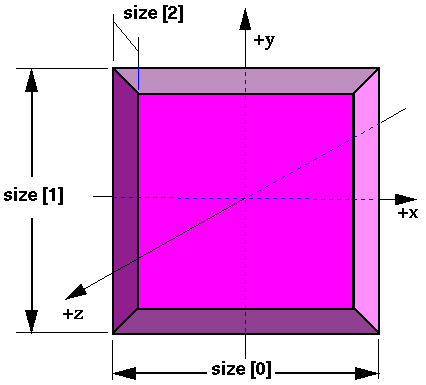

# The Virtual Reality Modeling Language

# 6\. Node Reference

### ISO/IEC DIS 14772-1

#### 4 April 1997

## 

##  6.1 Introduction

This clause provides a detailed definition of the syntax and semantics
of each node in VRML. Table 6.1 lists the topics in this clause.

#### Table 6.1: Table of contents: Node Reference

[6.1 Introduction](#6.1)

[6.2 Anchor](#Anchor)

[6.3 Appearance](#Appearance)

[6.4 AudioClip](#AudioClip)

[6.5 Background](#Background)

[6.6 Billboard](#Billboard)

[6.7 Box](#Box)

[6.8 Collision](#Collision)

[6.9 Color](#Color)

[6.10 ColorInterpolator](#ColorInterpolator)

[6.11 Cone](#Cone)

[6.12 Coordinate](#Coordinate)

[6.13 \
 CoordinateInterpolator](#CoordinateInterpolator)

[6.14 Cylinder](#Cylinder)

[6.15 CylinderSensor](#CylinderSensor)

[6.16 DirectionalLight](#DirectionalLight)

[6.17 ElevationGrid](#ElevationGrid)

[6.18 Extrusion](#Extrusion)

[6.19 Fog](#Fog)[6.20 FontStyle](#FontStyle)

[6.21 Group](#Group)

[6.22 ImageTexture](#ImageTexture)

[6.23 IndexedFaceSet](#IndexedFaceSet)

[6.24 IndexedLineSet](#IndexedLineSet)

[6.25 Inline](#Inline)

[6.26 LOD](#LOD)

[6.27 Material](#Material)

[6.28 MovieTexture](#MovieTexture)

[6.29 NavigationInfo](#NavigationInfo)

[6.30 Normal](#Normal)

[6.31 NormalInterpolator](#NormalInterpolator)

[6.32 \
 OrientationInterpolator](#OrientationInterpolator)

[6.33 PixelTexture](#PixelTexture)

[6.34 PlaneSensor](#PlaneSensor)

[6.35 PointLight](#PointLight)

[6.36 PointSet](#PointSet)

[6.37 PositionInterpolator](#PositionInterpolator)

[6.38 ProximitySensor](#ProximitySensor)[6.39 \
 ScalarInterpolator](#ScalarInterpolator)

[6.40 Script](#Script)

[6.41 Shape](#Shape)

[6.42 Sound](#Sound)

[6.43 Sphere](#Sphere)

[6.44 SphereSensor](#SphereSensor)

[6.45 SpotLight](#SpotLight)

[6.46 Switch](#Switch)

[6.47 Text](#Text)

[6.48 TextureCoordinate](#TextureCoordinate)

[6.49 TextureTransform](#TextureTransform)

[6.50 TimeSensor](#TimeSensor)

[6.51 TouchSensor](#TouchSensor)

[6.52 Transform](#Transform)

[6.53 Viewpoint](#Viewpoint)

[6.54 VisibilitySensor](#VisibilitySensor)

[6.55 WorldInfo](#WorldInfo)

In this clause, the first item in each subclause is the public
interface specification for the node. This interface defines the names
and types of the fields and events for the node, as well as the default
values for the fields of the node. Note that this syntax is not
the actual file format syntax. However, the parts of the interface
that are identical to the file syntax are in **bold**. For example,
the following defines the Collision node's public interface and file
format:

```
   Collision {
      eventIn      MFNode   addChildren
      eventIn      MFNode   removeChildren
      exposedField MFNode   children    []
      exposedField SFBool   collide     TRUE
      field        SFVec3f  bboxCenter  0 0 0     # (-,)
      field        SFVec3f  bboxSize    -1 -1 -1  # (0,) or -1,-1,-1
      field        SFNode   proxy       NULL
      eventOut     SFTime   collideTime
    }

```

Note that the interface specification also includes the value ranges
for the node's fields and exposedFields (where appropriate).
Parentheses imply that the range bound is exclusive, while brackets
imply that the range value is inclusive. For example, a range of (-,1\]
defines the lower bound as -
exclusively and the upper bound as 1 inclusively.

The fields and events contained within the public interface of node
types are ordered as follows:

1. eventIns, in alphabetical order;

2. exposedFields, in alphabetical order;

3. fields, in alphabetical order;

4. eventOuts, in alphabetical order.


## 6.2  Anchor

```
Anchor {
  eventIn      MFNode   addChildren
  eventIn      MFNode   removeChildren
  exposedField MFNode   children        []
  exposedField SFString description     ""
  exposedField MFString parameter       []
  exposedField MFString url             []
  field        SFVec3f  bboxCenter      0 0 0     # (-,)
  field        SFVec3f  bboxSize        -1 -1 -1  # (0,) or -1,-1,-1
}

```

The Anchor grouping node retrieves the content of a URL when the user
activates (e.g., clicks) some geometry contained within the Anchor
node's children. If the URL points to a valid VRML file, that world
replaces the world of which the Anchor node is a part (except when the _parameter_
field, described below, alters this behaviour). If non-VRML data is
retrieved, the browser shall determine how to handle that data;
typically, it will be passed to an appropriate non-VRML browser.

Exactly how a user activates geometry contained by the Anchor node
depends on the pointing device and is determined by the VRML browser.
Typically, clicking with the pointing device will result in the new
scene replacing the current scene. An Anchor node with an empty _url_
does nothing when its children are chosen. A description of how
multiple Anchors and pointing-device sensors are resolved on activation
is contained in " [4.6.7 Sensor \
nodes](concepts.html#4.6.7)."

A description of _children_, _addChildren_, and _removeChildren_
fields and eventIns may be found in ["4.6.5 \
Grouping and children nodes](concepts.html#4.6.5)."

The _description_ field in the Anchor node specifies a textual
description of the Anchor node. This may be used by browser-specific
user interfaces that wish to present users with more detailed
information about the Anchor.

The _parameter_ exposed field may be used to supply any additional
information to be interpreted by the VRML or HTML browser. Each string
shall consist of "keyword=value" pairs. For example, some
browsers allow the specification of a 'target' for a link to display a
link in another part of the HTML document. The _parameter_ field
is then:

```
Anchor {
  parameter [ "target=name_of_frame" ]
  ...
}

```

An Anchor node may be used to bind the initial [Viewpoint](#Viewpoint)
node in a world by specifying a URL ending with
"#ViewpointName" where "ViewpointName" is the name
of a viewpoint defined in the file. For example:

```
Anchor {
  url "http://www.school.edu/vrml/someScene.wrl#OverView"
  children  Shape { geometry Box {} }
}

```

specifies an anchor that loads the file "someScene.wrl" and
binds the initial user view to the [Viewpoint](#Viewpoint)
node named "OverView" when the Anchor node's geometry (Box)
is activated. If the named Viewpoint node is not found in the file, the
file is loaded using the default Viewpoint node binding stack rules
(see " [6.53 Viewpoint](#Viewpoint)").

If the _url_ field only contains a "#ViewpointName" (i.e. no
file name), the Viewpoint node named "ViewpointName" in the
current world shall be bound ( _set\_bind_ TRUE). See " [6.53 Viewpoint](#Viewpoint)" for the Viewpoint
transition rules that specify how browsers shall interpret the
transition from the old Viewpoint node to the new one. For example:

```
Anchor {
  url "#Doorway"
  children Shape { geometry Sphere {} }
}

```

binds the viewer to the viewpoint defined by the "Doorway"
viewpoint in the current world when the sphere is activated. In this
case, if the Viewpoint is not found, nothing is done on activation.

More details on the _url_ field are contained in " [4.5 VRML and the World Wide Web](concepts.html#4.5)."

The _bboxCenter_ and _bboxSize_ fields specify a bounding box
that encloses the Anchor's children. This is a hint that may be used
for optimization purposes. If the specified bounding box is smaller
than the actual bounding box of the children at any time, the results
are undefined. The default _bboxSize_ value, (-1, -1, -1),
implies that the bounding box is not specified and if needed must be
calculated by the browser. A description of _bboxCenter_ and _bboxSize_
fields may be found in " [4.6.4 \
Bounding boxes](concepts.html#4.6.4)."


## 6.3  Appearance

```
Appearance {
  exposedField SFNode material          NULL
  exposedField SFNode texture           NULL
  exposedField SFNode textureTransform  NULL
}

```

The Appearance node specifies the visual properties of geometry by
defining the Material and texture nodes. The value for each of the
fields in this node can be NULL. However, if the field is non-NULL, it
shall contain one node of the appropriate type.

The _material_ field, if specified, shall contain a [Material](#Material) node. If the _material_ field is
NULL or unspecified, lighting is off (all lights are ignored during
rendering of the object that references this Appearance) and the unlit
object colour is (1, 1, 1). Details of the VRML lighting
model are in " [4.14 Lighting model](concepts.html#4.14)."

The _texture_ field, if specified, shall contain one of the
various types of texture nodes ( [ImageTexture](#ImageTexture), [MovieTexture](#MovieTexture), or [PixelTexture](#PixelTexture)).
If the texture node is NULL or the _texture_ field is unspecified,
the object that references this Appearance is not textured.

The _textureTransform_ field, if specified, shall contain a [TextureTransform](#TextureTransform) node. If the _texture_
field is NULL or unspecified, or if the _textureTransform_ is
NULL or unspecified, the _textureTransform_ field has no effect.


## 6.4  AudioClip

```
AudioClip {
  exposedField   SFString description      ""
  exposedField   SFBool   loop             FALSE
  exposedField   SFFloat  pitch            1.0        # (0,)
  exposedField   SFTime   startTime        0          # (-,)
  exposedField   SFTime   stopTime         0          # (-,)
  exposedField   MFString url              []
  eventOut       SFTime   duration_changed
  eventOut       SFBool   isActive
}

```

An AudioClip node specifies audio data that can be referenced by other
nodes that require an audio source.

The _description_ field specifies a textual description of the
audio source. A browser is not required to display the _description_
field but may choose to do so in addition to playing the sound.

The _url_ field specifies the URL from which the sound is loaded.
Browsers shall support at least the _wavefile_ format in
uncompressed PCM format (see [E.\[WAVE\]](bibliography.html#[WAVE])),
It is recommended that browsers also support the MIDI file type 1 sound
format (see [2.\[MIDI\]](references.html#[MIDI])), MIDI files
are presumed to use the General MIDI patch set. Subclause " [4.5 VRML and the World Wide Web](concepts.html#4.5)"
contains details on the _url_ field. Results are not defined when
the URL references unsupported data types.

The _loop, startTime,_ and _stopTime_ exposedFields and the _isActive_
eventOut, and their effects on the AudioClip node, are discussed in
detail in " [4.6.9 Time-dependent \
nodes](concepts.html#4.6.9)." The " _cycle"_ of an AudioClip is the
length of time in seconds for one playing of the audio at the specified _pitch_.

The _pitch_ field specifies a multiplier for the rate at which
sampled sound is played. Only positive values shall be valid for _pitch._
A value of zero or less will produce undefined results. Changing the _pitch_
field affects both the pitch and playback speed of a sound. A _set\_pitch_
event to an active AudioClip is ignored and no _pitch\_changed_
eventOut is generated. If _pitch_ is set to 2.0, the sound shall
be played one octave higher than normal and played twice as fast. For a
sampled sound, the _pitch_ field alters the sampling rate at which
the sound is played. The proper implementation of pitch control for
MIDI (or other note sequence sound clips) is to multiply the tempo of
the playback by the _pitch_ value and adjust the MIDI Coarse Tune
and Fine Tune controls to achieve the proper pitch change.

A _duration\_changed_ event is sent whenever there is a new value
for the "normal" duration of the clip. Typically, this will
only occur when the current _url_ in use changes and the sound
data has been loaded, indicating that the clip is playing a different
sound source. The duration is the length of time in seconds for one
cycle of the audio for a _pitch_ set to 1.0. Changing the _pitch_
field will not trigger a _duration\_changed_ event. A duration
value of "-1" implies that the sound data has not yet loaded
or the value is unavailable for some reason.

The _isActive_ eventOut can be used by other nodes to determine if
the clip is currently active. If an AudioClip is active, it shall be
playing the sound corresponding to the sound time (i.e., in the
sound's local time system with sample 0 at time 0):

```
    t = (now - startTime) modulo (duration / pitch)

```


## 6.5  Background

```
Background {
  eventIn      SFBool   set_bind
  exposedField MFFloat  groundAngle  []            # [0,/2]
  exposedfield MFColor  groundColor  []            # [0,1]
  exposedField MFString backUrl      []
  exposedField MFString bottomUrl    []
  exposedField MFString frontUrl     []
  exposedField MFString leftUrl      []
  exposedField MFString rightUrl     []
  exposedField MFString topUrl       []
  exposedField MFFloat  skyAngle     []            # [0,]
  exposedField MFColor  skyColor     [ 0 0 0 ]     # [0,1]
  eventOut     SFBool   isBound
}

```

The Background node is used to specify a colour backdrop that simulates
ground and sky, as well as a background texture, or _panorama_,
that is placed behind all geometry in the scene and in front of the
ground and sky. Background nodes are specified in the local coordinate
system and are affected by the accumulated rotation of their ancestors
as described below.

Background nodes are bindable nodes as described in " [4.6.10 Bindable children nodes](concepts.html#4.5.7)."
There exists a Background stack, in which the top-most Background on
the stack is the currently active Background. To move a Background to
the top of the stack, a TRUE value is sent to the _set\_bind_
eventIn. Once active, the Background is then bound to the browsers
view. A FALSE value sent to _set\_bind_ removes the Background from
the stack and unbinds it from the browser's view. More details on the
bind stack may be found in " [4.6.10 Bindable \
children nodes](concepts.html#4.5.7)."

The backdrop is conceptually a partial sphere (the ground) enclosed
inside of a full sphere (the sky) in the local coordinate system with
the viewer placed at the centre of the spheres. Both spheres have
infinite radius (one epsilon apart) and each is painted with concentric
circles of interpolated colour perpendicular to the local Y-axis of the
sphere. The Background node is subject to the accumulated rotations of
its ancestors' transformations. Scaling and translation transformations
are ignored. The sky sphere is always slightly farther away from the
viewer than the ground sphere causing the ground to appear in front of
the sky in cases where they overlap.

The _skyColor_ field specifies the colour of the sky at various
angles on the sky sphere. The first value of the _skyColor_ field
specifies the colour of the sky at 0.0 radians representing the zenith
(i.e., straight up from the viewer). The _skyAngle_ field
specifies the angles from the zenith in which concentric circles of
colour appear. The zenith of the sphere is implicitly defined to be 0.0
radians, the natural horizon is at  /2 radians,
and the nadir (i.e., straight down from the viewer) is at  radians. _skyAngle_
is restricted to non-decreasing values in the range \[0.0,  \]. There must
be one more _skyColor_ value than there are _skyAngle_
values. The first colour value is the colour at the zenith, which is
not specified in the _skyAngle_ field. If the last _skyAngle_
is less than _pi_, then the colour band between the last _skyAngle_
and the nadir is clamped to the last _skyColor_. The sky colour
is linearly interpolated between the specified _skyColor_ values.

The _groundColor_ field specifies the colour of the ground at the
various angles on the ground hemisphere. The first value of the _groundColor_
field specifies the colour of the ground at 0.0 radians representing
the nadir (i.e., straight down from the user). The _groundAngle_
field specifies the angles from the nadir that the concentric circles
of colour appear. The nadir of the sphere is implicitly defined at 0.0
radians. _groundAngle_ is restricted to non-decreasing values in
the range \[0.0, /2\]. There must
be one more _groundColor_ value than there are _groundAngle_
values. The first colour value is for the nadir which is not specified
in the _groundAngle_ field. If the last _groundAngle_ is less
than _/2_(usual),
the region between the last _groundAngle_ and the equator is
invisible. The ground colour is linearly interpolated between the
specified _groundColor_ values.

The _backUrl_, _bottomUrl_, _frontUrl_, _leftUrl_, _rightUrl_,
and _topUrl_ fields specify a set of images that define a
background panorama between the ground/sky backdrop and the scene's
geometry. The panorama consists of six images, each of which is mapped
onto a face of an infinitely large cube contained within the backdrop
spheres and centred in the local coordinate system. The images are
applied individually to each face of the cube. On the front, back,
right, and left faces of the cube, when viewed from the origin looking
down the negative Z-axis with the Y-axis as the view up direction, each
image is mapped onto the corresponding face with the same orientation
as if the image were displayed normally in 2D ( _backUrl_ to back
face, _frontUrl_ to front face, _leftUrl_ to left face, and _rightUrl_
to right face _)_. On the top face of the cube, when viewed from
the origin looking along the +Y-axis with the +Z-axis as the view up
direction, the _topUrl_ image is mapped onto the face with the
same orientation as if the image were displayed normally in 2D. On the
bottom face of the box, when viewed from the origin along the negative
Y-axis with the negative Z-axis as the view up direction, the _bottomUrl_
image is mapped onto the face with the same orientation as if the
image were displayed normally in 2D.

Figure 6.1 illustrates the Background node backdrop and background
textures.

Alpha values in the panorama images (i.e., two or four component
images) specify that the panorama is semi-transparent or transparent in
regions, allowing the _groundColor_ and _skyColor_ to be
visible.

See " [4.6.11 Texture maps](concepts.html#4.6.11)"
for a general description of texture maps.

Often, the _bottomUrl_ and _topUrl_ images will not be
specified, to allow sky and ground to show. The other four images may
depict surrounding mountains or other distant scenery. Browsers shall
support the JPEG (see [2.\[JPEG\]](references.html#[JPEG]))
and PNG (see [2.\[PNG\]](references.html#[PNG])) image file
formats, and in addition, may support any other image format (e.g. CGM)
that can be rendered into a 2D image (see Clause 2). Support for the
GIF (see [E.\[GIF\]](bibliography.html#[GIF])) format is
recommended (including transparency) . Details on the _url_ fields
may be found in " [4.5 VRML and the World Wide Web](concepts.html#4.5)."


#### Figure 6.1: Background node

Panorama images may be one component (greyscale), two component
(greyscale plus alpha), three component (full RGB colour), or
four-component (full RGB colour plus alpha).

Ground colours, sky colours, and panoramic images do not translate with
respect to the viewer, though they do rotate with respect to the
viewer. That is, the viewer can never get any closer to the background,
but can turn to examine all sides of the panorama cube, and can look up
and down to see the concentric rings of ground and sky (if visible).

Background is not affected by [Fog](#Fog) nodes. Therefore,
if a Background node is active (i.e., bound) while a Fog node is
active, then the Background node will be displayed with no fogging
effects. It is the author's responsibility to set the Background values
to match the Fog values (e.g., ground colours fade to fog colour
with distance and panorama images tinted with fog colour).

The first Background node found during reading of the world is
automatically bound (receives _set\_bind_ TRUE) and is used as the
initial background when the world is loaded.


## 6.6  Billboard

```
Billboard {
  eventIn      MFNode   addChildren
  eventIn      MFNode   removeChildren
  exposedField SFVec3f  axisOfRotation  0 1 0      # (-,)
  exposedField MFNode   children        []
  field        SFVec3f  bboxCenter      0 0 0      # (-,)
  field        SFVec3f  bboxSize        -1 -1 -1   # (0,) or -1,-1,-1
}

```

The Billboard node is a grouping node which modifies its coordinate
system so that the Billboard node's local Z-axis turns to point at the
viewer. The Billboard node has children which may be other children
nodes.

The _axisOfRotation_ field specifies which axis to use to perform
the rotation. This axis is defined in the local coordinate system.

In general, the following steps described how to rotate the billboard
to face the viewer:

1. Compute the vector from the Billboard node's origin to the viewer's
    position. This line is called the _billboard-to-viewer_
    vector.

2. Compute the plane defined by the _axisOfRotation_ and the
    billboard-to-viewer line.

3. Rotate the local Z-axis of the billboard into the plane from b.,
    pivoting around the _axisOfRotation_.


A special case of billboarding is _viewer-alignment_. In this
case, the object rotates to keep the billboard's local Y-axis parallel
with the viewer's up vector. This special case is distinguished by
setting the _axisOfRotation_ to (0, 0, 0). The following steps
describe how to align the billboard's Y-axis to the viewer's up vector:

4. Compute the billboard-to-viewervector.

5. Rotate the Z-axis of the billboard to be collinear with the
    billboard-to-viewer vector and pointing towards the viewer's position.

6. Rotate the Y-axis of the billboard to be parallel and oriented in the
    same direction as the up vector of the viewer.


When the _axisOfRotation_ and the billboard-to-viewer line are
coincident, the plane cannot be established and the resulting rotation
of the billboard is undefined. For example, if the _axisOfRotation_
is set to (0,1,0) (Y-axis) and the viewer flies over the billboard and
peers directly down the Y-axis, the results are undefined **.**

Multiple instances of Billboard nodes (DEF/USE) operate as expected:
each instance rotates in its unique coordinate system to face the
viewer.

Subclause " [4.6.5 Grouping and \
children node _s_](concepts.html#4.6.5)" provides a description of the _children_, _addChildren_,
and _removeChildren_ fields and eventIns.

The _bboxCenter_ and _bboxSize_ fields specify a bounding box
that encloses the Billboard node's children. This is a hint that may be
used for optimization purposes. If the specified bounding box is
smaller than the actual bounding box of the children at any time, the
results are undefined. A default _bboxSize_ value, (-1, -1, -1),
implies that the bounding box is not specified and if needed must be
calculated by the browser. A description of the _bboxCenter_ and _bboxSize_
fields is contained in " [4.6.4 \
Bounding boxes](concepts.html#4.6.4)."


## 6.7 Box

```
Box {
  field    SFVec3f size  2 2 2        # (0, )
}

```

The Box node specifies a rectangular parallelepiped box centred at (0, 0, 0)
in the local coordinate system and aligned with the local coordinate
axes. By default, the box measures 2 units in each dimension, from -1
to +1. The Box node's _size_ field specifies the extents of the
box along the X-, Y-, and Z-axes respectively and each component value
must be greater than 0.0. Figure 6.2 illustrates the Box node.



#### Figure 6.2: Box node

Textures are applied individually to each face of the box. On the front
(+Z), back (-Z), right (+X), and left (-X) faces of the box, when
viewed from the outside with the +Y-axis up, the texture is mapped onto
each face with the same orientation as if the image were displayed
normally in 2D. On the top face of the box (+Y), when viewed from above
and looking down the Y-axis toward the origin with the -Z-axis as the
view up direction, the texture is mapped onto the face with the same
orientation as if the image were displayed normally in 2D. On the
bottom face of the box (-Y), when viewed from below looking up the
Y-axis toward the origin with the +Z-axis as the view up direction, the
texture is mapped onto the face with the same orientation as if the
image were displayed normally in 2D. [TextureTransform](#TextureTransform)
affects the texture coordinates of the Box.

The Box node's geometry requires outside faces only. When viewed from
the inside the results are undefined.


## 6.8  Collision

```
Collision {
  eventIn      MFNode   addChildren
  eventIn      MFNode   removeChildren
  exposedField MFNode   children        []
  exposedField SFBool   collide         TRUE
  field        SFVec3f  bboxCenter      0 0 0      # (-,)
  field        SFVec3f  bboxSize        -1 -1 -1   # (0,) or -1,-1,-1
  field        SFNode   proxy           NULL
  eventOut     SFTime   collideTime
}

```

The Collision node is a grouping node that specifies the collision
detection properties for its children (and their descendants),
specifies surrogate objects that replace its children during collision
detection, and sends events signaling that a collision has occurred
between the user's avatar and the Collision node's geometry or
surrogate. By default, **all geometric nodes in the scene are**
**collidable with the viewer except IndexedLineSet, PointSet, and Text**.
Browsers shall detect geometric collisions between the user's avatar
(see [NavigationInfo](#NavigationInfo)) and the scene's
geometry, and prevent the avatar from 'entering' the geometry.

If there are no Collision nodes specified in a scene, browsers shall
detect collision with all objects during navigation.

Subclause " [4.6.5 Grouping and \
children node _s_](concepts.html#4.6.5)" contains a description of the _children_, _addChildren_,
and _removeChildren_ fields and eventIns.

The Collision node's _collide_ field enables and disables
collision detection. If _collide_ is set to FALSE, the children
and all descendants of the Collision node shall not be checked
for collision, even though they are drawn. This includes any descendent
Collision nodes that have _collide_ set to TRUE (i.e., setting _collide_
to FALSE turns collision off for every node below it).

Collision nodes with the _collide_ field set to TRUE detect the
nearest collision with their descendent geometry (or proxies). Not all
geometry is collidable. Each geometry node specifies its own collision
characteristics. When the nearest collision is detected, the collided
Collision node sends the time of the collision through its _collideTime_
eventOut. This behaviour is recursive. If a Collision node contains a
child, descendant, or proxy (see below) that is a Collision node, and
both Collision nodes detect that a collision has occurred, both send a _collideTime_
event at the same time.

The _bboxCenter_ and _bboxSize_ fields specify a bounding box
that encloses the Collision node's children. This is a hint that may be
used for optimization purposes. If the specified bounding box is
smaller than the actual bounding box of the children at any time, the
results are undefined. A default _bboxSize_ value, (-1, -1, -1),
implies that the bounding box is not specified and if needed must be
calculated by the browser. A description of the _bboxCenter_ and _bboxSize_
fields may be found in " [4.6.4 \
Bounding boxes](concepts.html#4.6.4)".

The collision proxy, defined in the _proxy_ field, is any legal
children node as described in " [4.6.5 \
Grouping and children nodes](concepts.html#4.6.5)" that is used as a substitute for
the Collision node's children during collision detection. The proxy is
used strictly for collision detection; it is not drawn.

If the value of the _collide_ field is FALSE, collision detection
is not performed with the children or proxy descendent nodes. If
the root node of a scene is a Collision node with the _collide_
field set to FALSE, collision detection is disabled for the entire
scene regardless of whether descendent Collision nodes have set _collide_
TRUE.

If the value of the _collide_ field is TRUE and the _proxy_
field is non-NULL, the _proxy_ field defines the scene on which
collision detection is performed. If the _proxy_ value is NULL,
collision detection is performed against the _children_ of the
Collision node.

If _proxy_ is specified, any descendent children of the Collision
node are ignored during collision detection. If _children_ is
empty, _collide_ is TRUE, and _proxy_ is specified, collision
detection is performed against the proxy but nothing is displayed. In
this manner, invisible collision objects may be supported.

The _collideTime_ eventOut generates an event specifying the time
when the user's avatar (see [NavigationInfo](#NavigationInfo))
intersects the collidable children or proxy of the Collision node. An
ideal implementation computes the exact time of intersection.
Implementations may approximate the ideal by sampling the positions of
collidable objects and the user. The [NavigationInfo](#NavigationInfo)
node contains additional information for parameters that control the
user's size.

There is no support for object/object collision in ISO/IEC 14772-1.


## 6.9 Color

```
Color {
  exposedField MFColor color  []         # [0,1]
}

```

This node defines a set of RGB colours to be used in the fields of
another node.

Color nodes are only used to specify multiple colours for a
single geometric shape, such as a colours for the faces or vertices of
an IndexedFaceSet. A Material node is used to specify the overall
material parameters of lit geometry. If both a Material and a Color
node are specified for a geometric shape, the colours shall replace the
diffuse component of the material.

Textures take precedence over colours; specifying both a Texture and a
Color node for geometric shape will result in the Color node being
ignored. Details on lighting equations are described in " [4.14 Lighting model](concepts.html#4.14)."


##  6.10 ColorInterpolator

```
ColorInterpolator {
  eventIn      SFFloat set_fraction        # (-,)
  exposedField MFFloat key           []    # (-,)
  exposedField MFColor keyValue      []    # [0,1]
  eventOut     SFColor value_changed
}

```

This node interpolates among a set of MFColor key values to produce an
SFColor (RGB) _value\_changed_ event. The number of colours in the _keyValue_
field shall be equal to the number of keyframes in the _key_
field. The _keyValue_ field and _value\_changed_ events are
defined in RGB colour space. A linear interpolation using the value of _set\_fraction_
as input is performed in HSV space (see [\[FOLE\]](bibliography.html#FOLE) for description of RGB and
HSV colour spaces). Results are undefined when interpolating between
two consecutive keys with complementary hues.

Subclause " [4.6.8 Interpolators](concepts.html#4.6.8)"
contains a detailed discussion of interpolators.


## 6.11 Cone

```
Cone {
  field     SFFloat   bottomRadius 1        # (0,)
  field     SFFloat   height       2        # (0,)
  field     SFBool    side         TRUE
  field     SFBool    bottom       TRUE
}

```

The Cone node specifies a cone which is centred in the local coordinate
system and whose central axis is aligned with the local Y-axis. The _bottomRadius_
field specifies the radius of the cone's base, and the _height_
field specifies the height of the cone from the centre of the base to
the apex. By default, the cone has a radius of 1.0 at the bottom and a
height of 2.0, with its apex at y = _height_/2 and its bottom at y
= - _height_/2\. Both _bottomRadius_ and _height_ must be
greater than 0.0. Figure 6.3 illustrates the Cone node.


#### Figure 6.3: Cone node

The _side_ field specifies whether sides of the cone are created
and the _bottom_ field specifies whether the bottom cap of the
cone is created. A value of TRUE specifies that this part of the cone
exists, while a value of FALSE specifies that this part does not exist
(not rendered or eligible for collision or sensor intersection tests).

When a texture is applied to the sides of the cone, the texture wraps
counterclockwise (from above) starting at the back of the cone. The
texture has a vertical seam at the back in the X=0 plane, from the
apex (0, _height_/2, 0) to the point (0, - _height_/2, - _bottomRadius_).
For the bottom cap, a circle is cut out of the texture square centred
at (0, - _height_/2, 0) with dimensions (2 × _bottomRadius)_
by (2 × _bottomRadius)_. The bottom cap texture
appears right side up when the top of the cone is rotated towards the
-Z-axis. [TextureTransform](#TextureTransform) affects the
texture coordinates of the Cone.

The Cone geometry requires outside faces only. When viewed from the
inside the results are undefined.


## 6.12  Coordinate

```
Coordinate {
  exposedField MFVec3f point  []      # (-,)
}

```

This node defines a set of 3D coordinates to be used in the _coord_
field of vertex-based geometry nodes including IndexedFaceSet,
IndexedLineSet, and PointSet.


## 6.13 CoordinateInterpolator

```
CoordinateInterpolator {
  eventIn      SFFloat set_fraction        # (-,)
  exposedField MFFloat key           []    # (-,)
  exposedField MFVec3f keyValue      []    # (-,)
  eventOut     MFVec3f value_changed
}

```

This node linearly interpolates among a set of MFVec3f values. The
number of coordinates in the _keyValue_ field shall be an integer
multiple of the number of keyframes in the _key_ field. That
integer multiple defines how many coordinates will be contained in the _value\_changed_ events.

Subclause " [4.6.8 Interpolators](concepts.html#4.6.8)"
contains a more detailed discussion of interpolators.


## 6.14  Cylinder

```
Cylinder {
  field    SFBool    bottom  TRUE
  field    SFFloat   height  2         # (0,)
  field    SFFloat   radius  1         # (0,)
  field    SFBool    side    TRUE
  field    SFBool    top     TRUE
}

```

The Cylinder node specifies a capped cylinder centred at (0,0,0) in the
local coordinate system and with a central axis oriented along the
local Y-axis. By default, the cylinder is sized at "-1" to
"+1" in all three dimensions. The _radius_ field
specifies the radius of the cylinder and the _height_ field
specifies the height of the cylinder along the central axis. Both _radius_
and _height_ shall be greater than 0.0. Figure 6.4 illustrates
the Cylinder node.

The cylinder has three _parts_: the _side_, the _top_ (Y = +height/2)
and the _bottom_ (Y = -height/2). Each part has an
associated SFBool field that indicates whether the part exists (TRUE)
or does not exist (FALSE). Parts which do not exist are not rendered
and not eligible for intersection tests (e.g., collision detection
or sensor activation).


#### Figure 6.4: Cylinder node

When a texture is applied to a cylinder, it is applied differently to
the sides, top, and bottom. On the sides, the texture wraps
counterclockwise (from above) starting at the back of the cylinder. The
texture has a vertical seam at the back, intersecting the X=0 plane.
For the top and bottom caps, a circle is cut out of the unit texture
squares centred at (0, +/- _height/2_, 0) with dimensions 2 × _radius_
by 2 × _radius_. The top texture appears right
side up when the top of the cylinder is tilted toward the +Z-axis, and
the bottom texture appears right side up when the top of the cylinder
is tilted toward the -Z-axis. [TextureTransform](#TextureTransform)
affects the texture coordinates of the Cylinder node.

The Cylinder node's geometry requires outside faces only. When viewed
from the inside the results are undefined.


## 6.15  CylinderSensor

```
CylinderSensor {
  exposedField SFBool     autoOffset TRUE
  exposedField SFFloat    diskAngle  0.262       # (0,/2)
  exposedField SFBool     enabled    TRUE
  exposedField SFFloat    maxAngle   -1          # [-2,2]
  exposedField SFFloat    minAngle   0           # [-2,2]
  exposedField SFFloat    offset     0           # (-,)
  eventOut     SFBool     isActive
  eventOut     SFRotation rotation_changed
  eventOut     SFVec3f    trackPoint_changed
}

```

The CylinderSensor node maps pointer motion (e.g., a mouse or
wand) into a rotation on an invisible cylinder that is aligned with the
Y-axis of the local coordinate system. The CylinderSensor uses the
descendent geometry of its parent node to determine whether it is
liable to generate events.

The _enabled_ exposed field enables and disables the
CylinderSensor node. If TRUE, the sensor reacts appropriately to user
events. If FALSE, the sensor does not track user input or send events.
If _enabled_ receives a FALSE event and _isActive_ is TRUE,
the sensor becomes disabled and deactivated, and outputs an _isActive_
FALSE event. If _enabled_ receives a TRUE event the sensor is
enabled and ready for user activation.

A CylinderSensor node generates events when the pointing device is
activated while the pointer is indicating any descendent geometry nodes
of the sensor's parent group. See " [4.6.7.5 \
Activating and manipulating sensors](concepts.html#4.6.7.5)" for more details on using
the pointing device to activate the CylinderSensor.

Upon activation of the pointing device while indicating the sensor's
geometry, an _isActive_ TRUE event is sent. The initial acute
angle between the bearing vector and the local Y-axis of the
CylinderSensor node determines whether the sides of the invisible
cylinder or the caps (disks) are used for manipulation. If the initial
angle is less than the _diskAngle_, the geometry is treated as an
infinitely large disk lying in the local Y=0 plane and coincident with
the initial intersection point. Dragging motion is mapped into a
rotation around the local +Y-axis vector of the sensor's coordinate
system. The perpendicular vector from the initial intersection point to
the Y-axis defines zero rotation about the Y-axis. For each subsequent
position of the bearing, a _rotation\_changed_ event is sent that
equals the sum of the rotation about the +Y-axis vector (from the
initial intersection to the new intersection) plus the _offset_
value. _trackPoint\_changed_ events reflect the unclamped drag
position on the surface of this disk. When the pointing device is
deactivated and _autoOffset_ is TRUE, _offset_ is set to the
last value of _rotation\_changed_ and an _offset\_changed_
event is generated. Subclause " [4.6.7.4 \
Drag sensors](concepts.html#4.6.7.4)" provides a more general description of _autoOffset_
and _offset\_changed_.

If the initial acute angle between the bearing vector and the local
Y-axis of the CylinderSensor node is greater than or equal to _diskAngle_,
then the sensor behaves like a cylinder. The shortest distance between
the point of intersection (between the bearing and the sensor's
geometry) and the Y-axis of the parent group's local coordinate system
determines the radius of an invisible cylinder used to map pointing
device motion and marks the zero rotation value. For each subsequent
position of the bearing, a _rotation\_changed_ event is sent that
equals the sum of the right-handed rotation from the original
intersection about the +Y-axis vector plus the _offset_ value. _trackPoint\_changed_
events reflect the unclamped drag position on the surface of the
invisible cylinder. When the pointing device is deactivated and _autoOffset_
is TRUE, _offset_ is set to the last rotation angle and an _offset\_changed_
event is generated. More details are available in " [4.6.7.4 Drag sensors](concepts.html#4.6.7.4)."

When the sensor generates an _isActive_ TRUE event, it grabs all
further motion events from the pointing device until it is released and
generates an _isActive_ FALSE event (other pointing-device sensors cannot
generate events during this time). Motion of the pointing device while _isActive_
is TRUE is referred to as a "drag." If a 2D pointing device
is in use, _isActive_ events will typically reflect the state of
the primary button associated with the device (i.e., _isActive_
is TRUE when the primary button is pressed and FALSE when it is
released). If a 3D pointing device (e.g., a wand) is in use, _isActive_
events will typically reflect whether the pointer is within or in
contact with the sensor's geometry.

While the pointing device is activated, _trackPoint\_changed_ and _rotation\_changed_
events are output and are interpreted from pointing device motion
based on the sensor's local coordinate system at the time of
activation. _trackPoint\_changed_ events represent the unclamped
intersection points on the surface of the invisible cylinder or disk.
If the initial angle results in cylinder rotation (as opposed to disk
behaviour) and if the pointing device is dragged off the cylinder while
activated, browsers may interpret this in a variety of ways (e.g. clamp
all values to the cylinder and continuing to rotate as the point is
dragged away from the cylinder). Each movement of the pointing device
while _isActive_ is TRUE generates _trackPoint\_changed_ and _rotation\_changed_
events.

The _minAngle_ and _maxAngle_ fields clamp _rotation\_changed_
events to a range of values. If _minAngle_ is greater than _maxAngle_, _rotation\_changed_
events are not clamped. The _minAngle_ and _maxAngle_ fields
are restricted to the range \[-2, 2\].

Further information about this behaviour may be found in " [4.6.7.3 Pointing-device sensors](concepts.html#4.6.7.3)",
" [4.6.7.4 Drag sensors](concepts.html#4.6.7.4)",
and " [4.6.7.5 Activating and \
manipulating sensors](concepts.html#4.6.7.5)."


## 6.16 DirectionalLight

```
DirectionalLight {
  exposedField SFFloat ambientIntensity  0        # [0,1]
  exposedField SFColor color             1 1 1    # [0,1]
  exposedField SFVec3f direction         0 0 -1   # (-,)
  exposedField SFFloat intensity         1        # [0,1]
  exposedField SFBool  on                TRUE
}

```

The DirectionalLight node defines a directional light source that
illuminates along rays parallel to a given 3-dimensional vector. A
description of the _ambientIntensity_, _color_, _intensity_,
and _on_ fields is in " [4.6.6 \
Light sources](concepts.html#4.6.6)".

The _direction_ field specifies the direction vector of the
illumination emanating from the light source in the local coordinate
system. Light is emitted along parallel rays from an infinite distance
away. A directional light source illuminates only the objects in its
enclosing parent group. The light may illuminate everything within this
coordinate system, including all children and descendants of its parent
group. The accumulated transformations of the parent nodes affect the
light.

DirectionalLight nodes do not attenuate with distance. A precise
description of VRML's lighting equations is contained in " [4.14 Lighting model](concepts.html#4.14)."


## 6.17  ElevationGrid

```
ElevationGrid {
  eventIn      MFFloat  set_height
  exposedField SFNode   color             NULL
  exposedField SFNode   normal            NULL
  exposedField SFNode   texCoord          NULL
  field        MFFloat  height            []      # (-,)
  field        SFBool   ccw               TRUE
  field        SFBool   colorPerVertex    TRUE
  field        SFFloat  creaseAngle       0       # [0,]
  field        SFBool   normalPerVertex   TRUE
  field        SFBool   solid             TRUE
  field        SFInt32  xDimension        0       # [0,)
  field        SFFloat  xSpacing          1.0     # (0,)
  field        SFInt32  zDimension        0       # [0,)
  field        SFFloat  zSpacing          1.0     # (0,)
}

```

The ElevationGrid node specifies a uniform rectangular grid of varying
height in the Y=0 plane of the local coordinate system. The geometry is
described by a scalar array of height values that specify the height of
a surface above each point of the grid.

The _xDimension_ and _zDimension_ fields indicate the number
of elements of the grid _height_ array in the X and Z directions.
Both _xDimension_ and _zDimension_ must be greater than or
equal to zero. The vertex locations for the rectangles are defined by
the _height_ field and the _xSpacing_ and _zSpacing_
fields:

- The _height_ field is an _xDimension_ by _zDimension_
   array of scalar values representing the height above the grid for each
   vertex.

- The _xSpacing_ and _zSpacing_ fields indicates the
   distance between vertices in the X and Z directions respectively, and
   shall be > 0.


Thus, the vertex corresponding to the point P\[i, j\] on the grid is
placed at:

```
    P[i,j].x = xSpacing × i
    P[i,j].y = height[ i + j × xDimension]
    P[i,j].z = zSpacing × j

    where 0 <= i < xDimension and 0 <= j < zDimension,
    and P[0,0] is height[0] units above/below the origin of the local
    coordinate system

```

The _set\_height_ eventIn allows the height MFFloat field to be
changed to support animated ElevationGrid nodes.

The _color_ field specifies per-vertex or per-quadrilateral
colours for the ElevationGrid node depending on the value of _colorPerVertex_.
If the _color_ field is NULL, the ElevationGrid node is rendered
with the overall attributes of the Shape node enclosing the
ElevationGrid node (see " [4.14 Lighting model](concepts.html#4.14)").

The _colorPerVertex_ field determines whether colours specified in
the _colour_ field are applied to each vertex or each
quadrilateral of the ElevationGrid node. If _colorPerVertex_ is
FALSE and the _color_ field is not NULL, the _color_ field
shall specify a Color node containing at least ( _xDimension-1)_ ×( _zDimension-1)_
colours; one for each quadrilateral, ordered as follows:

```
    QuadColor[i,j] = Color[ i + j × (xDimension-1)]

    where 0 <= i < xDimension-1 and 0 <= j < zDimension-1,
    and QuadColor[i,j] is the colour for the quadrilateral defined
        by height[i+j×xDimension], height[(i+1)+j×xDimension],
        height[(i+1)+(j+1)×xDimension] and height[i+(j+1)×xDimension]

```

If _colorPerVertex_ is TRUE and the _color_ field is not
NULL, the _color_ field shall specify a Color node containing at
least _xDimension_ × _zDimension_ colours, one
for each vertex, ordered as follows:

```
    VertexColor[i,j] = Color[ i + j × xDimension]

    where 0 <= i < xDimension and 0 <= j < zDimension,
    and VertexColor[i,j] is the colour for the vertex defined by
        height[i+j×xDimension]

```

The _normal_ field specifies per-vertex or per-quadrilateral
normals for the ElevationGrid node. If the _normal_ field is NULL,
the browser shall automatically generate normals, using the _creaseAngle_
field to determine if and how normals are smoothed across the surface
(see " [4.6.3.5 Crease angle field](concepts.html#4.6.3.5)").

The _normalPerVertex_ field determines whether normals are applied
to each vertex or each quadrilateral of the ElevationGrid node
depending on the value of _normalPerVertex_. If _normalPerVertex_
is FALSE and the _normal_ node is not NULL, the _normal_
field shall specify a Normal node containing at least ( _xDimension-1)_ ×( _zDimension-1)_ normals;
one for each quadrilateral, ordered as follows:

```
    QuadNormal[i,j] = Normal[ i + j × (xDimension-1)]

    where 0 <= i < xDimension-1 and 0 <= j < zDimension-1,
    and QuadNormal[i,j] is the normal for the quadrilateral defined
        by height[i+j×xDimension], height[(i+1)+j×xDimension],
        height[(i+1)+(j+1)×xDimension] and height[i+(j+1)×xDimension]

```

If _normalPerVertex_ is TRUE and the _normal_ field is not
NULL, the _normal_ field shall specify a Normal node containing at
least _xDimension_ × _zDimension_ normals; one
for each vertex, ordered as follows:

```
    VertexNormal[i,j] = Normal[ i + j × xDimension]

    where 0 <= i < xDimension and 0 <= j < zDimension,
    and VertexNormal[i,j] is the normal for the vertex defined
        by height[i+j×xDimension]

```

The _texCoord_ field specifies per-vertex texture coordinates for
the ElevationGrid node. If _texCoord_ is NULL, default texture
coordinates are applied to the geometry. The default texture
coordinates range from (0,0) at the first vertex to (1,1) at the last
vertex. The S texture coordinate is aligned with the positive X-axis,
and the T texture coordinate with positive Z-axis. If _texCoord_
is not NULL, it shall specify a TextureCoordinate node containing at
least ( _xDimension)_ ×( _zDimension)_ texture coordinates;
one for each vertex, ordered as follows:

```
    VertexTexCoord[i,j] = TextureCoordinate[ i + j × xDimension]

    where 0 <= i < xDimension and 0 <= j < zDimension,
    and VertexTexCoord[i,j] is the texture coordinate for the vertex
        defined by height[i+j×xDimension]

```

The _ccw_, _solid_, and _creaseAngle_ fields are
described in " [4.6.3 Shapes and \
geometry](concepts.html#4.6.3)."

By default, the quadrilaterals are defined with a counterclockwise
ordering. Hence, the Y-component of the normal is positive. Setting the _ccw_
field to FALSE reverses the normal direction. Backface culling is
enabled when the _solid_ field is TRUE.

See Figure 6.5 for a depiction of the ElevationGrid node.


#### Figure 6.5: ElevationGrid node


## 6.18  Extrusion

```
Extrusion {
  eventIn MFVec2f    set_crossSection
  eventIn MFRotation set_orientation
  eventIn MFVec2f    set_scale
  eventIn MFVec3f    set_spine
  field   SFBool     beginCap         TRUE
  field   SFBool     ccw              TRUE
  field   SFBool     convex           TRUE
  field   SFFloat    creaseAngle      0                # [0,)
  field   MFVec2f    crossSection     [ 1 1, 1 -1, -1 -1,
                                       -1 1, 1  1 ]    # (-,)
  field   SFBool     endCap           TRUE
  field   MFRotation orientation      0 0 1 0          # [-1,1],(-,)
  field   MFVec2f    scale            1 1              # (0,)
  field   SFBool     solid            TRUE
  field   MFVec3f    spine            [ 0 0 0, 0 1 0 ] # (-,)
}

```

#### 6.18.1 Introduction

The Extrusion node specifies geometric shapes based on a two
dimensional cross-section extruded along a three dimensional spine in
the local coordinate system. The cross-section can be scaled and
rotated at each spine point to produce a wide variety of shapes.

An Extrusion node is defined by:

1. a 2D _crossSection_ piecewise linear curve (described as a
    series of connected vertices)

2. a 3D _spine_ piecewise linear curve (also described as a
    series of connected vertices)

3. a list of 2D _scale_ parameters

4. a list of 3D _orientation_ parameters


#### 6.18.2 Algorithmic description

Shapes are constructed as follows. The cross-section curve, which
starts as a curve in the Y=0 plane, is first scaled about the origin by
the first _scale_ parameter (first value scales in X, second value
scales in Z). It is then translated by the first spine point and
oriented using the first _orientation_ parameter (as explained
later). The same procedure is followed to place a cross-section at the
second spine point, using the second scale and orientation values.
Corresponding vertices of the first and second cross-sections are then
connected, forming a quadrilateral polygon between each pair of
vertices. This same procedure is then repeated for the rest of the
spine points, resulting in a surface extrusion along the spine.

The final orientation of each cross-section is computed by first
orienting it relative to the spine segments on either side of point at
which the cross-section is placed. This is known as the _spine-aligned_
_cross-section plane_ (SCP), and is designed to provide a smooth
transition from one spine segment to the next (see Figure 6.6). The SCP
is then rotated by the corresponding _orientation_ value. This
rotation is performed relative to the SCP. For example, to impart twist
in the cross-section, a rotation about the Y-axis (0 1 0) would be
used. Other orientations are valid and rotate the cross-section out of
the SCP.


#### Figure 6.6: Spine-aligned cross-section plane at a spine point.

The SCP is computed by first computing its Y-axis and Z-axis, then
taking the cross product of these to determine the X-axis. These three
axes are then used to determine the rotation value needed to rotate the
Y=0 plane to the SCP. This results in a plane that is the approximate
tangent of the spine at each point, as shown in Figure 6.6. First the
Y-axis is determined, as follows:

1. _For all points other than the first or last:_ The Y-axis for _spine_\[i\]
    is found by normalizing the vector defined by ( _spine_\[i+1\] - _spine_\[i-1\]).

2. _If the spine curve is closed:_ The SCP for the first and last
    points is the same and is found using ( _spine_\[1\] - _spine_\[n-2\])
    to compute the Y-axis.

3. _If the spine curve is not closed:_ The Y-axis used for the
    first point is the vector from _spine_\[0\] to _spine_\[1\],
    and for the last it is the vector from _spine_\[ _n_-2\] to _spine_\[ _n_-1\].


The Z-axis is determined as follows:

4. _For all points other than the first or last:_ Take the
    following cross-product:


   ```
       Z = (spine[i+1] - spine[i]) X (spine[i-1] - spine[i])

   ```

5. _If the spine curve is closed:_ The SCP for the first and last
    points is the same and is found by taking the following cross-product:


   ```
       Z = (spine[1] - spine[0]) X (spine[n-2] - spine[0])

   ```

6. _If the spine curve is not closed:_ The Z-axis used for the
    first spine point is the same as the Z-axis for spine\[1\]. The Z-axis
    used for the last spine point is the same as the Z-axis for spine\[n-2\].

7. After determining the Z-axis, its dot product with the Z-axis of the
    previous spine point is computed. If this value is negative, the Z-axis
    is flipped (multiplied by -1). In most cases, this prevents small
    changes in the spine segment angles from flipping the cross-section 180
    degrees.


Once the Y- and Z-axes have been computed, the X-axis can be calculated
as their cross-product.

#### 6.18.3 Special cases

If the number of _scale_ or _orientation_ values is greater
than the number of spine points, the excess values are ignored. If they
contain one value, it is applied at all spine points. If the number of
scale or orientation values is greater than one but less than the
number of spine points, the results are undefined. The _scale_
values shall be positive.

If the three points used in computing the Z-axis are collinear, the
cross-product is zero so the value from the previous point is used
instead.

If the Z-axis of the first point is undefined (because the spine is not
closed and the first two spine segments are collinear) then the Z-axis
for the first spine point with a defined Z-axis is used.

If the entire spine is collinear, the SCP is computed by finding the
rotation of a vector along the positive Y-axis ( `v1`) to the
vector formed by the spine points ( `v2`). The Y=0 plane is then
rotated by this value.

If two points are coincident, they both have the same SCP. If each
point has a different orientation value, then the surface is
constructed by connecting edges of the cross-sections as normal. This
is useful in creating revolved surfaces.

_Note: combining coincident and non-coincident spine segments, as_
_well as other combinations, can lead to interpenetrating surfaces which_
_the extrusion algorithm makes no attempt to avoid._

#### 6.18.4 Common cases

The following common cases are among the effects which are supported by
the Extrusion node:

_Surfaces of revolution:_
 If the cross-section is an approximation of a circle and the spine is
 straight, the Extrusion is equivalent to a surface of revolution, where
 the _scale_ parameters define the size of the cross-section
 along the spine.
 _Uniform extrusions:_
 If the _scale_ is (1, 1) and the spine is straight, the
 cross-section is extruded uniformly without twisting or scaling along
 the spine. The result is a cylindrical shape with a uniform cross
 section.
 _Bend/twist/taper objects:_
 These shapes are the result of using all fields. The spine curve bends
 the extruded shape defined by the cross-section, the orientation
 parameters (given as rotations about the Y-axis) twist it around the
 spine, and the scale parameters taper it (by scaling about the spine).

#### 6.18.5 Other fields

Extrusion has three _parts_: the sides, the _beginCap_ (the
surface at the initial end of the spine) and the _endCap_ (the
surface at the final end of the spine). The caps have an associated
SFBool field that indicates whether each exists (TRUE) or doesn't exist
(FALSE).

When the _beginCap_ or _endCap_ fields are specified as TRUE,
planar cap surfaces will be generated regardless of whether the _crossSection_
is a closed curve. If _crossSection_ is not a closed curve, the
caps are generated by adding a final point to _crossSection_ that
is equal to the initial point. An open surface can still have a cap,
resulting (for a simple case) in a shape analogous to a soda can sliced
in half vertically. These surfaces are generated even if _spine_
is also a closed curve. If a field value is FALSE, the corresponding
cap is not generated.

Texture coordinates are automatically generated by Extrusion nodes.
Textures are mapped so that the coordinates range in the U direction
from 0 to 1 along the _crossSection_ curve (with 0 corresponding
to the first point in _crossSection_ and 1 to the last) and in the
V direction from 0 to 1 along the _spine_ curve (with 0
corresponding to the first listed _spine_ point and 1 to the
last). If either the _endCap_ or _beginCap_ exists, the _crossSection_
curve is uniformly scaled and translated so that the larger dimension
of the cross-section (X or Z) produces texture coordinates that range
from 0.0 to 1.0. The _beginCap_ and _endCap_ textures' S and
T directions correspond to the X and Z directions in which the _crossSection_
coordinates are defined.

The browser shall automatically generate normals for the Extrusion
node,using the _creaseAngle_ field to determine if and how normals
are smoothed across the surface. Normals for the caps are generated
along the Y-axis of the SCP, with the ordering determined by viewing
the cross-section from above (looking along the negative Y-axis of the
SCP). By default, a _beginCap_ with a counterclockwise ordering
shall have a normal along the negative Y-axis. An _endCap_ with a
counterclockwise ordering shall have a normal along the positive Y-axis.

Each quadrilateral making up the sides of the extrusion are ordered
from the bottom cross-section (the one at the earlier spine point) to
the top. So, one quadrilateral has the points:

```
    spine[0](crossSection[0], crossSection[1])
    spine[1](crossSection[1], crossSection[0])

```

in that order. By default, normals for the sides are generated as
described in " [4.6.3 Shapes and \
geometry](concepts.html#4.6.3)."

For instance, a circular crossSection with counter-clockwise ordering
and the default spine form a cylinder. With _solid_ TRUE and _ccw_
TRUE, the cylinder is visible from the outside. Changing _ccw_ to
FALSE makes it visible from the inside.

The _ccw_, _solid_, _convex_, and _creaseAngle_
fields are described in " [4.6.3 \
Shapes and geometry](concepts.html#4.6.3)."


## 6.19 Fog

```
Fog {
  exposedField SFColor  color            1 1 1      # [0,1]
  exposedField SFString fogType          "LINEAR"
  exposedField SFFloat  visibilityRange  0          # [0,)
  eventIn      SFBool   set_bind
  eventOut     SFBool   isBound
}

```

The Fog node provides a way to simulate atmospheric effects by blending
objects with the colour specified by the _color_ field based on
the distances of the various objects from the viewer. The distances are
calculated in the coordinate space of the Fog node. The _visibilityRange_
specifies the distance (in the local coordinate system) at which
objects are totally obscured by the fog. Objects located _visibilityRange_
meters or more away from the viewer are drawn with a constant colour
of _color_. Objects very close to the viewer are blended very
little with the fog _color_. A _visibilityRange_ of 0.0
disables the Fog node. The _visibilityRange_ is affected by the
scaling transformations of the Fog node's parents; translations and
rotations have no affect on _visibilityRange_. values of the _visibilityRange_
field shall be in the range \[0, ).

Since Fog nodes are bindable children nodes (see " [4.6.10 Bindable children nodes](concepts.html#4.5.7)"),
a Fog node stack exists, in which the top-most Fog node on the stack is
currently active. To push a Fog node onto the top of the stack, a TRUE
value is sent to the _set\_bind_ eventIn. Once active, the Fog node
is bound to the browser view. A FALSE value sent to _set\_bind_,
pops the Fog node from the stack and unbinds it from the browser
viewer. More details on the Fog node stack may be found in " [4.6.10 Bindable children nodes](concepts.html#4.5.7)."

The _fogType_ field controls how much of the fog colour is blended
with the object as a function of distance. If _fogType_ is
"LINEAR" (the default), the amount of blending is a linear
function of the distance, resulting in a depth cuing effect. If _fogType_
is "EXPONENTIAL," an exponential increase in blending is
used, resulting in a more natural fog appearance.

The impact of fog support on lighting calculations is described in
" [4.14 Lighting model](concepts.html#4.14)."


## 6.20  FontStyle

```
FontStyle {
  field MFString family       ["SERIF"]
  field SFBool   horizontal   TRUE
  field MFString justify      "BEGIN"
  field SFString language     ""
  field SFBool   leftToRight  TRUE
  field SFFloat  size         1.0          # (0,)
  field SFFloat  spacing      1.0          # [0,)
  field SFString style        "PLAIN"
  field SFBool   topToBottom  TRUE
}

```

#### 6.20.1 Introduction

The FontStyle node defines the size, family, and style used for Text
nodes, as well as the direction of the text strings and any
language-specific rendering techniques that must be used for
non-English text. See " [6.47 Text](#Text)"
for a description of the Text node.

The _size_ field specifies the nominal height, in the local
coordinate system of the Text node, of glyphs rendered and determines
the spacing of adjacent lines of text. Values of the _size_ field
shall be > 0.0.

The _spacing_ field determines the line spacing between adjacent
lines of text. The distance between the baseline of each line of text
is ( _spacing_ × _size)_ in the appropriate
direction (depending on other fields described below). The affects of
the _size_ and _spacing_ field are depicted in Figure 6.7 ( _spacing_ > _size_).
Values of the _spacing_ field shall be >= 0.0.


#### Figure 6.7: Text _size_ and _spacing_ fields

#### 6.20.2 Font family and style

Font attributes are defined with the _family_ and _style_
fields. The browser shall map the specified font attributes to an
appropriate available font as described below.

The _family_ field contains a case-sensitive MFString value that
specifies a sequence of font family names in preference order. The
browser shall search the MFString value for the first font family name
matching a supported font family. If none of the string values matches
a supported font family, the default font family **"SERIF"**
shall be used. All browsers shall support at least **"SERIF"**
(the default) for a serif font such as Times Roman; **"SANS"**
for a sans-serif font such as Helvetica; and **"TYPEWRITER"**
for a fixed-pitch font such as Courier. An empty _family_ value
is identical to **\["SERIF"\]**.

The _style_ field specifies a case-sensitive SFString value that
may be **"PLAIN"** (the default) for default plain type; **"BOLD"**
for boldface type; **"ITALIC"** for italic type; or **"BOLDITALIC"**
for bold and italic type. A _style_ value of empty quotes **""**
is identical to **"PLAIN"**.

#### 6.20.3 Direction and justification

The _horizontal_, _leftToRight_, and _topToBottom_
fields indicate the direction of the text. The _horizontal_ field
indicates whether the text advances horizontally in its major direction
( _horizontal_ = TRUE, the default) or vertically in its major
direction ( _horizontal_ = FALSE). The _leftToRight_ and _topToBottom_
fields indicate direction of text advance in the major (characters
within a single string) and minor (successive strings) axes of layout.
Which field is used for the major direction and which is used for the
minor direction is determined by the _horizontal_ field.

For horizontal text ( _horizontal_ = TRUE), characters on each line
of text advance in the positive X direction if _leftToRight_ is
TRUE or in the negative X direction if _leftToRight_ is FALSE.
Characters are advanced according to their natural advance width. Each
line of characters is advanced in the negative Y direction if _topToBottom_
is TRUE or in the positive Y direction if _topToBottom_ is FALSE.
Lines are advanced by the amount of _size_ × _spacing_.

For vertical text ( _horizontal_ = FALSE), characters on each line
of text advance in the negative Y direction if _topToBottom_ is
TRUE or in the positive Y direction if _topToBottom_ is FALSE.
Characters are advanced according to their natural advance height. Each
line of characters is advanced in the positive X direction if _leftToRight_
is TRUE or in the negative X direction if _leftToRight_ is FALSE.
Lines are advanced by the amount of _size_ × _spacing_.

The _justify_ field determines alignment of the above text layout
relative to the origin of the object coordinate system. The _justify_
field is an MFString which can contain 2 values. The first value
specifies alignment along the major axis and the second value specifies
alignment along the minor axis, as determined by the _horizontal_
field. A _justify_ value of **""** is equivalent to
the default value. If the second string, minor alignment, is not
specified, minor alignment defaults to the value **"FIRST".**
Thus, _justify_ values of **""**, **"BEGIN"**,
and **\["BEGIN" "FIRST"\]** are equivalent.

The major alignment is along the X-axis when _horizontal_ is TRUE
and along the Y-axis when _horizontal is_ FALSE. The minor
alignment is along the Y-axis when _horizontal_ is TRUE and along
the X-axis when _horizontal is_ FALSE. The possible values for
each enumerant of the _justify_ field are **"FIRST"**, **"BEGIN"**, **"MIDDLE"**,
and **"END"**. For major alignment, each line of text is
positioned individually according to the major alignment enumerant. For
minor alignment, the block of text representing all lines together is
positioned according to the minor alignment enumerant. Tables 6.2-6.5
describe the behaviour in terms of which portion of the text is at the
origin

#### Table 6.2: Major Alignment, _horizontal_ = TRUE

**_justify_ Enumerant****_leftToRight_ = TRUE****_leftToRight_ = FALSE** FIRST Left edge of each line  Right edge of each line  BEGIN Left edge of each line Right edge of each line  MIDDLE Centred about X-axis  Centred about X-axis  END Right edge of each line  Left edge of each line

#### Table 6.3: Major Alignment, _horizontal_ = FALSE

**_justify_ Enumerant****_topToBottom_ = TRUE****_topToBottom_ = FALSE** FIRST Top edge of each line Bottom edge of each line  BEGIN Top edge of each line Bottom edge of each line  MIDDLE Centred about Y-axis  Centre about Y-axis  END Bottom edge of each line  Top edge of each line

#### **Table 6.4: Minor Alignment, _horizontal_ = TRUE**

**_justify_ Enumerant****_topToBottom_ = TRUE****_topToBottom_ = FALSE** FIRST Baseline of first line Baseline of first line BEGIN Top edge of first line Bottom edge of first line  MIDDLE Centred about Y-axis Centred about Y-axis END Bottom edge of last line   Top edge of last line

#### **Table 6.5: Minor Alignment, _horizontal_ = FALSE**

**_justify_ Enumerant****_leftToRight_ = TRUE****_leftToRight_ = FALSE** FIRST Left edge of first line Right edge of first line  BEGIN Left edge of first line Right edge of first line  MIDDLE Centred about X-axis  Centred about X-axis  END Right edge of last line  Left edge of last line

The default minor alignment is **"FIRST"**. This is a
special case of minor alignment when _horizontal_ is TRUE. Text
starts at the baseline at the Y-axis. In all other cases, **"FIRST"**
is identical to **"BEGIN"**. In tables 6.6 and 6.7, each
colour-coded cross-hair indicates where the X-axis and Y-axis shall be
in relation to the text. Figure 6.8 describes the symbols used in
Tables 6.6 and 6.7.

####     Figure 6.8: Key for Tables 6.6 and 6.7        Table 6.6: _horizontal_ = TRUE

#### 

#### Table 6.7: _horizontal = FALSE_

#### 

#### 6.20.4 Language

The _language_ field specifies the context of the language for the
text string. Due to the multilingual nature of the ISO 10646-1:1993,
the _language_ field is needed to provide a proper language
attribute of the text string. The format is based on RFC 1766:
language\[\_territory\]. The value for the language tag is based on ISO
639:1988 (e.g., 'zh' for Chinese, 'jp' for Japanese, and 'sc' for
Swedish.) The territory tag is based on ISO 3166:1993 country codes
(e.g., 'TW' for Taiwan and 'CN' for China for the 'zh' Chinese
language tag). If the _language_ field is set to empty
"", local language bindings are used.

See " [2\. Normative References](references.html)"
for more information on ISO/IEC 10646:1993 [2.\[UTF8\]](references.html#[UTF8]), ISO/IEC 639:1998 [2.\[I639\]](references.html#[I639]), and ISO 3166:1993 [2.\[I3166\]](references.html#[I3166]).


## 6.21 Group

```
Group {
  eventIn      MFNode  addChildren
  eventIn      MFNode  removeChildren
  exposedField MFNode  children       []
  field        SFVec3f bboxCenter     0 0 0     # (-,)
  field        SFVec3f bboxSize       -1 -1 -1  # (0,) or -1,-1,-1
}

```

A Group node contains children nodes without introducing a new
transformation. It is equivalent to a Transform node without the
transformation fields.

A description of the _children_, _addChildren_, and _removeChildren_
fields and eventIns may be found in " [4.6.5 Grouping and children nodes](concepts.html#4.6.5)."

The _bboxCenter_ and _bboxSize_ fields specify a bounding box
that encloses the Group node's children. This is a hint that may be
used for optimization purposes. If the specified bounding box is
smaller than the actual bounding box of the children at any time, the
results are undefined. A default _bboxSize_ value, (-1, -1, -1),
implies that the bounding box is not specified and, if needed, is
calculated by the browser. A description of the _bboxCenter_ and _bboxSize_
fields is contained in " [4.6.4 \
Bounding boxes](concepts.html#4.6.4)."


## 6.22  ImageTexture

```
ImageTexture {
  exposedField MFString url     []
  field        SFBool   repeatS TRUE
  field        SFBool   repeatT TRUE
}

```

The ImageTexture node defines a texture map by specifying an image file
and general parameters for mapping to geometry. Texture maps are
defined in a 2D coordinate system (s, t) that ranges from \[0.0,
1.0\] in both directions. The bottom edge of the image corresponds to
the S-axis of the texture map, and left edge of the image corresponds
to the T-axis of the texture map. The lower-left pixel of the image
corresponds to s=0, t=0, and the top-right pixel of the image
corresponds to s=1, t=1. These relationships are depicted in Figure 6.9.


#### Figure 6.9: Texture map coordinate system

The texture is read from the URL specified by the _url_ field.
When the _url_ field contains no values (\[\]), texturing is
disabled. Browsers shall support the JPEG (see [2. \[JPEG\]](references.html#[JPEG])) and PNG (see [2. \[PNG\]](references.html#[PNG])) image file formats. In
addition, browsers may support other image formats (e.g. CGM, see [2. \[CGM\]](references.html#[CGM])) which can be rendered
into a 2D image (see Clause 2). Support for the GIF format (see [E. \[GIF\]](bibliography.html#[GIF])) is also recommended
(including transparency). Details on the _url_ field are described
in " [4.5 VRML and the World Wide Web](concepts.html#4.5)."

See " [4.6.11 Texture maps](concepts.html#4.6.11)"
for a general description of texture maps.

See " [4.14 Lighting model](concepts.html#4.14)"
for a description of lighting equations and the interaction between
textures, materials, and geometry appearance.

The _repeatS_ and _repeatT_ fields specify how the texture
wraps in the S and T directions. If _repeatS_ is TRUE (the
default), the texture map is repeated outside the \[0.0, 1.0\]
texture coordinate range in the S direction so that it fills the shape.
If _repeatS_ is FALSE, the texture coordinates are clamped in the
S direction to lie within the \[0.0, 1.0\] range. The _repeatT_
field is analogous to the _repeatS_ field.


## 6.23  IndexedFaceSet

```
IndexedFaceSet {
  eventIn       MFInt32 set_colorIndex
  eventIn       MFInt32 set_coordIndex
  eventIn       MFInt32 set_normalIndex
  eventIn       MFInt32 set_texCoordIndex
  exposedField  SFNode  color             NULL
  exposedField  SFNode  coord             NULL
  exposedField  SFNode  normal            NULL
  exposedField  SFNode  texCoord          NULL
  field         SFBool  ccw               TRUE
  field         MFInt32 colorIndex        []        # [-1,)
  field         SFBool  colorPerVertex    TRUE
  field         SFBool  convex            TRUE
  field         MFInt32 coordIndex        []        # [-1,)
  field         SFFloat creaseAngle       0         # [0,)
  field         MFInt32 normalIndex       []        # [-1,)
  field         SFBool  normalPerVertex   TRUE
  field         SFBool  solid             TRUE
  field         MFInt32 texCoordIndex     []        # [-1,)
}

```

The IndexedFaceSet node represents a 3D shape formed by constructing
faces (polygons) from vertices listed in the _coord_ field. The _coord_
field contains a Coordinate node that defines the 3D vertices
referenced by the _coordIndex_ field. IndexedFaceSet uses the
indices in its _coordIndex_ field to specify the polygonal faces
by indexing into the coordinates in the Coordinate node. An index of
"-1" indicates that the current face has ended and the next
one begins. The last face may be (but does not have to be) followed by
a "-1" index. If the greatest index in the _coordIndex_
field is N, the Coordinate node shall contain N+1 coordinates (indexed
as 0 to N). Each face of the IndexedFaceSet shall have:

1. at least three non-coincident vertices,

2. vertices that define a planar polygon,

3. vertices that define a non-self-intersecting polygon.


Otherwise, results are undefined.

The IndexedFaceSet node is specified in the local coordinate system and
is affected by ancestors' transformations.

Descriptions of the _coord_, _normal_, and _texCoord_
fields are provided in the [Coordinate](#Coordinate), [Normal](#Normal), and [TextureCoordinate](#TextureCoordinate)
nodes, respectively.

Details on lighting equations and the interaction between _color_
field, _normal_ field, textures, materials, and geometries are
provided in " [4.14 Lighting model](concepts.html#4.14)".

If the _color_ field is not NULL, it must contain a Color node
whose colours are applied to the vertices or faces of the
IndexedFaceSet as follows:

4. If _colorPerVertex_ is FALSE, colours are applied to each
    face, as follows:

   1. If the _colorIndex_ field is not empty, then one colour is
       used for each face of the IndexedFaceSet. There must be at least as
       many indices in the _colorIndex_ field as there are faces
       in the IndexedFaceSet. If the greatest index in the _colorIndex_
       field is N, then there must be N+1 colours in the Color node. The _colorIndex_
       field must not contain any negative entries.

   2. If the _colorIndex_ field is empty, then the colours in
       the Color node are applied to each face of the IndexedFaceSet in order.
       There must be at least as many colours in the Color node as there are
       faces.
5. If _colorPerVertex_ is TRUE, colours are applied to each
    vertex, as follows:

   1. If the _colorIndex_ field is not empty, then colours are
       applied to each vertex of the IndexedFaceSet in exactly the same manner
       that the _coordIndex_ field is used to choose coordinates
       for each vertex from the Coordinate node. The _colorIndex_
       field must contain at least as many indices as the _coordIndex_
       field, and must contain end-of-face markers (-1) in exactly the same
       places as the _coordIndex_ field. If the greatest index in
       the _colorIndex_ field is N, then there must be N+1
       colours in the Color node.

   2. If the _colorIndex_ field is empty, then the _coordIndex_
       field is used to choose colours from the Color node. If the greatest
       index in the _coordIndex_ field is N, then there must be
       N+1 colours in the Color node.

If the _color_ field is NULL, the geometry shall be rendered
normally using the Material and texture defined in the Appearance node
(see " [4.14 Lighting model](concepts.html#4.14)"
for details).

If the _normal_ field is not NULL, it must contain a Normal node
whose normals are applied to the vertices or faces of the
IndexedFaceSet in a manner exactly equivalent to that described above
for applying colours to vertices/faces (where _normalPerVertex_
corresponds to _colorPerVertex_ and _normalIndex_
corresponds to _colorIndex_). If the _normal_ field is NULL,
the browser shall automatically generate normals, using _creaseAngle_
to determine if and how normals are smoothed across shared vertices
(see " [4.6.3.5 Crease angle field](concepts.html#4.6.3.5)").

If the _texCoord_ field is not NULL, it must contain a [TextureCoordinate](#TextureCoordinate) node. The texture
coordinates in that node are applied to the vertices of the
IndexedFaceSet as follows:

6. If the _texCoordIndex_ field is not empty, then it is used to
    choose texture coordinates for each vertex of the IndexedFaceSet in
    exactly the same manner that the _coordIndex_ field is used to
    choose coordinates for each vertex from the Coordinate node. The _texCoordIndex_
    field must contain at least as many indices as the _coordIndex_
    field, and must contain end-of-face markers (-1) in exactly the same
    places as the _coordIndex_ field. If the greatest index in the _texCoordIndex_
    field is N, then there must be N+1 texture coordinates in the
    TextureCoordinate node.

7. If the _texCoordIndex_ field is empty, then the _coordIndex_
    array is used to choose texture coordinates from the TextureCoordinate
    node. If the greatest index in the _coordIndex_ field is N,
    then there must be N+1 texture coordinates in the TextureCoordinate
    node.


If the _texCoord_ field is NULL, a default texture coordinate
mapping is calculated using the local coordinate system bounding box of
the shape. The longest dimension of the bounding box defines the S
coordinates, and the next longest defines the T coordinates. If two or
all three dimensions of the bounding box are equal, ties shall be
broken by choosing the X, Y, or Z dimension in that order of
preference. The value of the S coordinate ranges from 0 to 1, from one
end of the bounding box to the other. The T coordinate ranges between 0
and the ratio of the second greatest dimension of the bounding box to
the greatest dimension. Figure 6.10
illustrates the default texture coordinates for a simple box shaped
IndexedFaceSet with an X dimension twice as large as the Z dimension
and four times as large as the Y dimension. Figure 6.11 illustrates the
original texture image used on the IndexedFaceSet used in Figure 6.10.

####     Figure 6.10: IndexedFaceSet texture default mapping

####     Figure 6.11: ImageTexture for IndexedFaceSet in Figure 6.10

Subclause " [4.6.3 Shapes and geometry](concepts.html#4.6.3)"
provides a description of the _ccw_, _solid_, _convex_,
and _creaseAngle_ fields.


## 6.24  IndexedLineSet

```
IndexedLineSet {
  eventIn       MFInt32 set_colorIndex
  eventIn       MFInt32 set_coordIndex
  exposedField  SFNode  color             NULL
  exposedField  SFNode  coord             NULL
  field         MFInt32 colorIndex        []     # [-1,)
  field         SFBool  colorPerVertex    TRUE
  field         MFInt32 coordIndex        []     # [-1,)
}

```

The IndexedLineSet node represents a 3D geometry formed by constructing
polylines from 3D vertices specified in the _coord_ field.
IndexedLineSet uses the indices in its _coordIndex_ field to
specify the polylines by connecting vertices from the _coord_
field. An index of "-1" indicates that the current polyline
has ended and the next one begins. The last polyline may be (but does
not have to be) followed by a "-1". IndexedLineSet is
specified in the local coordinate system and is affected by ancestors'
transformations.

The _coord_ field specifies the 3D vertices of the line set and
contains a [Coordinate](#Coordinate) node.

Lines are not lit, are not texture-mapped, and do not participate in
collision detection. The width of lines is implementation dependent and
each line segment is solid (i.e., not dashed).

If the _color_ field is not NULL, it shall contain a Color node,
and the colours are applied to the line(s) as follows:

1. If _colorPerVertex_ is FALSE:

   1. If the _colorIndex_ field is not empty, then one colour is
       used for each polyline of the IndexedLineSet. There must be at least as
       many indices in the _colorIndex_ field as there are
       polylines in the IndexedLineSet. If the greatest index in the _colorIndex_
       field is N, then there must be N+1 colours in the Color node. The _colorIndex_
       field must not contain any negative entries.

   2. If the _colorIndex_ field is empty, then the colours from
       the Color node are applied to each polyline of the IndexedLineSet in
       order. There must be at least as many colours in the Color node as
       there are polylines.
2. If _colorPerVertex_ is TRUE:

   1. If the _colorIndex_ field is not empty, then colours are
       applied to each vertex of the IndexedLineSet in exactly the same manner
       that the _coordIndex_ field is used to supply coordinates
       for each vertex from the Coordinate node. The _colorIndex_
       field must contain at least as many indices as the _coordIndex_
       field and must contain end-of-polyline markers (-1) in exactly the
       same places as the _coordIndex_ field. If the greatest
       index in the _colorIndex_ field is N, then there must be
       N+1 colours in the Color node.

   2. If the _colorIndex_ field is empty, then the _coordIndex_
       field is used to choose colours from the Color node. If the greatest
       index in the _coordIndex_ field is N, then there must be
       N+1 colours in the Color node.

If the _color_ field is NULL and there is a Material defined for
the Appearance affecting this IndexedLineSet, the _emissiveColor_
of the Material shall be used to draw the lines. Details on lighting
equations as they affect IndexedLineSet nodes are described in " [4.14 Lighting model](concepts.html#4.14)."


## 6.25  Inline

```
Inline {
  exposedField MFString url        []
  field        SFVec3f  bboxCenter 0 0 0     # (-,)
  field        SFVec3f  bboxSize   -1 -1 -1  # (0,) or -1,-1,-1
}

```

The Inline node is a grouping node that reads its children data from a
location in the World Wide Web. Exactly when its children are read and
displayed is not defined (e.g. reading the children may be delayed
until the Inline node's bounding box is visible to the viewer). The _url_
field specifies the URL containing the children. An Inline node with
an empty URL does nothing.

Each specified URL shall refer to a valid VRML file that contains a
list of children nodes, prototypes, and routes at the top level as
described in " [4.6.5 Grouping and \
children nodes](concepts.html#4.6.5)." The results are undefined if the URL refers
to a file that is not VRML or if the file contains non-children nodes
at the top level.

If multiple URLs are specified, the browser may display a URL of a
lower preference file while it is obtaining, or if it is unable to
obtain, the higher preference file. Details on the _url_ field and
preference order may be found in " [4.5 VRML and the World Wide Web](concepts.html#4.5)."

Results are undefined if the contents of the URL change after it has
been loaded.

The _bboxCenter_ and _bboxSize_ fields specify a bounding box
that encloses the Inline node's children. This is a hint that may be
used for optimization purposes. If the specified bounding box is
smaller than the actual bounding box of the children at any time, the
results are undefined. A default _bboxSize_ value, (-1, -1, -1),
implies that the bounding box is not specified and if needed must be
calculated by the browser. A description of the _bboxCenter_ and _bboxSize_
fields is in " [4.6.4 Bounding boxes](concepts.html#4.6.4)."


## 6.26 LOD

```
LOD {
  exposedField MFNode  level    []
  field        SFVec3f center   0 0 0    # (-,)
  field        MFFloat range    []       # (0,)
}

```

The LOD node specifies various levels of detail or complexity for a
given object, and provides hints allowing browsers to automatically
choose the appropriate version of the object based on the distance from
the user. The _level_ field contains a list of nodes that
represent the same object or objects at varying levels of detail,
ordered from highest level of detail to the lowest level of detail. The _range_
field specifies the ideal distances at which to switch between the
levels. The " [4.6.5 Grouping and children nodes](concepts.html#4.6.5)"
subclause contains details on the types of nodes that are legal values
for _level_.

The _center_ field is a translation offset in the local coordinate
system that specifies the centre of the LOD node for distance
calculations.

The number of nodes in the _level_ field shall exceed the number
of values in the _range_ field by one (i.e., N+1 _level_
values for N _range_ values). The _range_ field contains
monotonic increasing values that shall be greater than 0. In order to
calculate which level to display, first the distance is calculated from
the viewer's location, transformed into the local coordinate system of
the LOD node (including any scaling transformations), to the _center_
point of the LOD node. The LOD node evaluates the step function _L(d)_
to choose a level for a given value of _d_ (where _d_ is the
distance from the viewer position to the centre of the LOD node).

Let _n_ ranges, _R_ _0_, _R_ _1_, _R_ _2_,
..., _R_ _n_-1, partition the domain (0, + _infinity_)
into _n_ +1 subintervals given by (0, _R_ _0_),
\[ _R_ _0_, _R_ _1_... , \[ _R_ _n_-1, + _infinity_).
Also, let _n_ +1 levels _L_ _0_, _L_ _1_, _L_ _2_,
..., _L_ _n_-1 be the values of the step function
function _L(d)_. The level node, _L(d),_ for a given distance _d_
is defined as follows:

```
    L(d) = L0,   if d < R0,
         = Li+1, if Ri <= d < Ri+1, for -1 < i < n-1,
         = Ln-1, if d >= Rn-1.

```

Specifying too few levels will result in the last level being used
repeatedly for the lowest levels of detail. If more levels than ranges
are specified, the extra levels are ignored. An empty range field is an
exception to this rule. This case is a hint to the browser that it may
choose a level automatically to maintain a constant display rate. Each
value in the _range_ field shall be greater than the previous
value; otherwise results are undefined.

LOD nodes are evaluated top-down in the scene graph. Only the
descendants of the currently selected level are rendered. All nodes
under an LOD node continue to receive and send events regardless of
which LOD node's _level_ is active. For example, if an active
TimeSensor node is contained within an inactive level of an LOD node,
the TimeSensor node sends events regardless of the LOD node's state.


## 6.27  Material

```
Material {
  exposedField SFFloat ambientIntensity  0.2         # [0,1]
  exposedField SFColor diffuseColor      0.8 0.8 0.8 # [0,1]
  exposedField SFColor emissiveColor     0 0 0       # [0,1]
  exposedField SFFloat shininess         0.2         # [0,1]
  exposedField SFColor specularColor     0 0 0       # [0,1]
  exposedField SFFloat transparency      0           # [0,1]
}

```

The Material node specifies surface material properties for associated
geometry nodes and is used by the VRML lighting equations during
rendering. Subclause " [4.14 Lighting \
model](concepts.html#4.14)" contains a detailed description of the VRML lighting
model equations.

All of the fields in the Material node range from 0.0 to 1.0.

The fields in the Material node determine how light reflects off an
object to create colour:

1. The _ambientIntensity_ field specifies how much ambient light
    from light sources this surface shall reflect. Ambient light is
    omnidirectional and depends only on the number of light sources, not
    their positions with respect to the surface. Ambient colour is
    calculated as _ambientIntensity_ × _diffuseColor_.

2. The _diffuseColor_ field reflects all VRML light sources
    depending on the angle of the surface with respect to the light source.
    The more directly the surface faces the light, the more diffuse light
    reflects.

3. The _emissiveColor_ field models "glowing" objects.
    This can be useful for displaying pre-lit models (where the light
    energy of the room is computed explicitly), or for displaying
    scientific data.

4. The _specularColor_ and _shininess_ fields determine the
    specular highlights (i.e., the shiny spots on an apple). When
    the angle from the light to the surface is close to the angle from the
    surface to the viewer, the _specularColor_ is added to the
    diffuse and ambient colour calculations. Lower shininess values produce
    soft glows, while higher values result in sharper, smaller highlights.

5. The _transparency_ field specifies how "clear" an
    object is, with 1.0 being completely transparent, and 0.0 completely
    opaque.


## 6.28  MovieTexture

```
MovieTexture {
  exposedField SFBool   loop             FALSE
  exposedField SFFloat  speed            1.0      # (-,)
  exposedField SFTime   startTime        0        # (-,)
  exposedField SFTime   stopTime         0        # (-,)
  exposedField MFString url              []
  field        SFBool   repeatS          TRUE
  field        SFBool   repeatT          TRUE
  eventOut     SFTime   duration_changed
  eventOut     SFBool   isActive
}

```

The MovieTexture node defines a time dependent texture map (contained
in a movie file) and parameters for controlling the movie and the
texture mapping. A MovieTexture node can also be used as the source of
sound data for a [Sound](#Sound) node. In this special case,
the MovieTexture node is not used for rendering.

Texture maps are defined in a 2D coordinate system (s, t) that
ranges from 0.0 to 1.0 in both directions. The bottom edge of the image
corresponds to the S-axis of the texture map, and left edge of the
image corresponds to the T-axis of the texture map. The lower-left
pixel of the image corresponds to s=0.0, t=0.0, and the top-right pixel
of the image corresponds to s=1.0, t=1.0. Figure 6.12 depicts one frame
of the movie texture.


#### Figure 6.12: Movie texture

The _url_ field that defines the movie data shall support
MPEG1-Systems (audio and video) or MPEG1-Video (video-only) movie file
formats [\[MPEG\]](references.html#[MPEG]). Details on the _url_
field may be found in " [4.5 VRML and the World Wide Web](concepts.html#4.5)."

See " [4.6.11 Texture maps](concepts.html#4.6.11)"
for a general description of texture maps.

Subclause " [4.14 Lighting model](concepts.html#4.14)"
contains details on lighting equations and the interaction between
textures, materials, and geometries.

As soon as the movie is loaded, a _duration\_changed_ eventOut is
sent. This indicates the duration of the movie in seconds. This
eventOut value can be read (for instance, by a Script node) to
determine the duration of a movie. A value of "-1" implies
the movie has not yet loaded or the value is unavailable for some
reason.

The _loop, startTime,_ and _stopTime_ exposedFields and the _isActive_
eventOut, and their effects on the MovieTexture node, are discussed in
detail in the " [4.6.9 Time \
dependent nodes](concepts.html#4.6.9)" section. The cycleof a MovieTexture
node is the length of time in seconds for one playing of the movie at
the specified _speed_.

The _speed_ exposedField indicates how fast the movie shall be
played. A _speed_ of 2 indicates the movie plays twice as fast.
The _duration\_changed_ output is not affected by the _speed_
exposedField. _set\_speed_ events are ignored while the movie is
playing. A negative _speed_ implies that the movie will play
backwards.

If a MovieTexture node is inactive when the movie is first loaded,
frame 0 of the movie texture is displayed if _speed_ is
non-negative or the last frame of the movie texture is shown if _speed_
is negative (see " [4.11.3 Discrete and \
continuous changes](concepts#4.11.3)"). A MovieTexture node shall display frame
0 if _speed_ = 0\. For positive values of _speed_, an active
MovieTexture node displays the frame at movie time _t_ as follows
(i.e., in the movie's local time system with frame 0 at time 0
with _speed_ = 1):

```
    t = (now - startTime) modulo (duration/speed)

```

If _speed_ is negative, the MovieTexture node displays the frame
at movie time:

```
    t = duration - ((now - startTime) modulo ABS(duration/speed))

```

When a MovieTexture node becomes inactive, the frame corresponding to
the time at which the MovieTexture became inactive will remain as the
texture.

MovieTexture nodes can be referenced by an Appearance node's _texture_
field (as a movie texture) and by a Sound node's _source_ field
(as an audio source only).


## 6.29  NavigationInfo

```
NavigationInfo {
  eventIn      SFBool   set_bind
  exposedField MFFloat  avatarSize      [0.25, 1.6, 0.75] # [0,)
  exposedField SFBool   headlight       TRUE
  exposedField SFFloat  speed           1.0               # [0,)
  exposedField MFString type            ["WALK", "ANY"]
  exposedField SFFloat  visibilityLimit 0.0               # [0,)
  eventOut     SFBool   isBound
}

```

The NavigationInfo node contains information describing the physical
characteristics of the viewer's avatar and viewing model.
NavigationInfo node is a bindable node (see " [4.6.10 Bindable children nodes](concepts.html#4.5.7)" _)_
and thus there exists a NavigationInfo node stack in which the
top-most NavigationInfo node on the stack is the currently bound
NavigationInfo node. The current NavigationInfo node is considered to
be a child of the current Viewpoint node regardless of where it is
initially located in the file. Whenever the current Viewpoint nodes
changes, the current NavigationInfo node must be re-parented to it by
the browser. Whenever the current NavigationInfo node changes, the new
NavigationInfo node must be re-parented to the current Viewpoint node
by the browser.

If a TRUE value is sent to the _set\_bind_ eventIn of a
NavigationInfo node, the node is pushed onto the top of the
NavigationInfo node stack. When a NavigationInfo node is bound, the
browser uses the fields of the NavigationInfo node to set the
navigation controls of its user interface and the NavigationInfo node
is conceptually re-parented under the currently bound Viewpoint node.
All subsequent scaling changes to the current [Viewpoint](#Viewpoint)
node's coordinate system automatically change aspects (see below) of
the NavigationInfo node values used in the browser (e.g., scale
changes to any ancestors' transformations). A FALSE value sent to _set\_bind_
pops the NavigationInfo node from the stack, results in an _isBound_ FALSE
event, and pops to the next entry in the stack which must be
re-parented to the current Viewpoint node. Subclause " [4.6.10 Bindable children nodes](concepts.html#4.5.7)"
has more details on the the binding stacks.

The _type_ field specifies an ordered list of navigation paradigms
that specify a combination of navigation types and the initial
navigation type. The navigation type(s) of the currently bound
NavigationInfo determines the user interface capabilities of the
browser. For example, if the currently bound NavigationInfo's _type_
is "WALK", the browser shall present a WALK navigation user
interface paradigm (see below for description of WALK). Browsers shall
recognize and support at least the following navigation types:
"ANY", "WALK", "EXAMINE",
"FLY", and "NONE".

If "ANY" does not appear in the _type_ field list of the
currently bound NavigationInfo, the browser's navigation user interface
shall be restricted to the recognized navigation types specified in the
list. In this case, browsers shall not present user interface that
allows the navigation type to be changed to a type not specified in the
list. However, if any one of the values in the _type_ field are
"ANY", the browser may provide any type of navigation
interface, and allow the user to change the navigation type
dynamically. Furthermore, the first recognized type in the list shall
be the initial navigation type presented by the browser's user
interface.

ANY navigation specifies that the browser may choose the navigation
paradigm that best suits the content and provide user interface to
allow the user to change the navigation paradigm dynamically. When the
currently bound NavigationInfo's _type_ value is "ANY",
Viewpoint transitions (see " [6.53 Viewpoint](#Viewpoint)")
triggered by the Anchor node (see " [6.2 Anchor](#Anchor)")
or the `loadURL()` scripting method (see " [4.12.10 Browser script interface](concepts.html#4.12.10)")
are undefined.

WALK navigation is used for exploring a virtual world on foot or in a
vehicle that rests on or hovers above the ground. It is strongly
recommended that WALK navigation define the up vector in the +Y
direction and provide some form of terrain following and gravity in
order to produce a walking or driving experience. If the bound
NavigationInfo's _type_ is "WALK", the browser shall
strictly support collision detection (see " [6.8 Collision](#Collision)").

FLY navigation is similar to WALK except that terrain following and
gravity may be disabled or ignored. There shall still be some notion of
"up" however. If the bound NavigationInfo's _type_ is
"FLY", the browser shall strictly support collision detection
(see " [6.8 Collision](#Collision)").

EXAMINE navigation is used for viewing individual objects and often
includes (but does not require) the ability to spin around the object
and move the viewer closer or further away.

NONE navigation disables or removes all browser-specific navigation
user interface forcing the user to navigate using only mechanisms
provided in the scene, such as Anchor nodes or scripts that include `loadURL()`.

If the NavigationInfo type is "WALK", "FLY",
"EXAMINE", or "NONE" or a combination of these
types (i.e. "ANY" is not in the list), Viewpoint
transitions (see " [6.53 Viewpoint](#Viewpoint)")
triggered by the Anchor node (see " [6.2 Anchor](#Anchor)")
or the `loadURL()` scripting method (see " [4.12.10 Browser script interface](concepts.html#4.12.10)")
shall be implemented as a jump cut from the old Viewpoint to the new
Viewpoint with transition effects that shall not trigger events besides
the exit and enter events caused by the jump.

Browsers may create browser-specific navigation type extensions. It is
recommended that extended _type_ names include a unique suffix
(e.g., HELICOPTER\_mydomain.com) to prevent conflicts. Viewpoint
transitions (see " [6.53 Viewpoint](#Viewpoint)")
triggered by the Anchor node (see " [6.2 Anchor](#Anchor)")
or the `loadURL()` scripting method (see " [4.12.10 Browser script interface](concepts.html#4.12.10)")
are undefined for extended navigation types. If none of the types are
recognized by the browser, the default "ANY" is used. These
strings values are case sensitive ("any" is not equal to
"ANY").

The _speed_ field specifies the rate at which the viewer travels
through a scene in meters per second. Since browsers may provide
mechanisms to travel faster or slower, this field specifies the
default, average speed of the viewer when the NavigationInfo node is
bound. If the NavigationInfo _type_ is EXAMINE, _speed_ shall
not affect the viewer's rotational speed. Scaling in the transformation
hierarchy of the currently bound [Viewpoint](#Viewpoint)
node (see above) scales the _speed_; parent translation and
rotation transformations have no effect on _speed_. Speed shall be
non-negative. Zero speed indicates that the avatar's position is
stationary, but its orientation and field of view may still change. If
the navigation _type_ is "NONE", the _speed_ field
has no effect.

The _avatarSize_ field specifies the user's physical dimensions in
the world for the purpose of collision detection and terrain following.
It is a multi-value field allowing several dimensions to be specified.
The first value shall be the allowable distance between the user's
position and any collision geometry (as specified by a [Collision](#CollideStyle) node ) before a collision is
detected. The second shall be the height above the terrain at which the
browser shall maintain the viewer. The third shall be the height of the
tallest object over which the viewer can "step." This allows
staircases to be built with dimensions that can be ascended by viewers
in all browsers. The transformation hierarchy of the currently bound [Viewpoint](#Viewpoint) node scales the _avatarSize_.
Translations and rotations have no effect on _avatarSize_.

For purposes of terrain following, the browser maintains a notion of
the _down_ direction (down vector), since gravity is applied in
the direction of the down vector. This down vector shall be along the
negative Y-axis in the local coordinate system of the currently bound
Viewpoint node (i.e., the accumulation of the Viewpoint node's
ancestors' transformations, not including the Viewpoint node's _orientation_
field).

The _visibilityLimit_ field sets the furthest distance the user is
able to see. Geometry beyond this distance may not be rendered. A value
of 0.0 (the default) indicates an infinite visibility limit. The _visibilityLimit_
field is restricted to be >= 0.0.

The _speed_, _avatarSize_ and _visibilityLimit_ values
are all scaled by the transformation being applied to the currently
bound [Viewpoint](#Viewpoint) node. If there is no currently
bound Viewpoint node, the values are interpreted in the world
coordinate system. This allows these values to be automatically
adjusted when binding to a Viewpoint node that has a scaling
transformation applied to it without requiring a new NavigationInfo
node to be bound as well. If the scale applied to the Viewpoint node is
nonuniform, the behaviour is undefined.

The _headlight_ field specifies whether a browser shall turn on a
headlight. A headlight is a directional light that always points in the
direction the user is looking. Setting this field to TRUE allows the
browser to provide a headlight, possibly with user interface controls
to turn it on and off. Scenes that enlist precomputed lighting (e.g., radiosity
solutions) can turn the headlight off. The headlight shall have _intensity_ = 1, _color_
= (1 1 1), _ambientIntensity_ = 0.0, and _direction_ = (0 0 -1).

It is recommended that the near clipping plane be set to one-half of
the collision radius as specified in the _avatarSize_ field
(setting the near plane to this value prevents excessive clipping of
objects just above the collision volume, and also provides a region
inside the collision volume for content authors to include geometry
intended to remain fixed relative to the viewer). Such geometry shall
not be occluded by geometry outside of the collision volume.

The first NavigationInfo node found during reading of the world is
automatically bound (receives a _set\_bind_ TRUE event) and
supplies the initial navigation parameters.


## 6.30  Normal

```
Normal {
  exposedField MFVec3f vector  []   # (-,)
}

```

This node defines a set of 3D surface normal vectors to be used in the _vector_
field of some geometry nodes (e.g., IndexedFaceSet and
ElevationGrid). This node contains one multiple-valued field that
contains the normal vectors. Normals shall be of unit length or results
are undefined.


## 6.31 NormalInterpolator

```
NormalInterpolator {
  eventIn      SFFloat set_fraction       # (-,)
  exposedField MFFloat key           []   # (-,)
  exposedField MFVec3f keyValue      []   # (-,)
  eventOut     MFVec3f value_changed
}

```

The NormalInterpolator node interpolates among a list of normal vector
sets specified by the _keyValue_ field. The output vector, _value\_changed_,
shall be a set of normalized vectors.

The number of normals in the _keyValue_ field shall be an integer
multiple of the number of keyframes in the _key_ field. That
integer multiple defines how many normals will be contained in the _value\_changed_ events.

Normal interpolation shall be performed on the surface of the unit
sphere. That is, the output values for a linear interpolation from a
point P on the unit sphere to a point Q also on the unit sphere shall
lie along the shortest arc (on the unit sphere) connecting points P and
Q. Also, equally spaced input fractions shall result in arcs of equal
length. If P and Q are diagonally opposite, results are undefined.

A more detailed discussion of interpolators is provided in " [4.6.8 Interpolators](concepts.html#4.6.8)".


## 6.32 OrientationInterpolator

```
OrientationInterpolator {
  eventIn      SFFloat    set_fraction      # (-,)
  exposedField MFFloat    key           []  # (-,)
  exposedField MFRotation keyValue      []  # [-1,1],(-,)
  eventOut     SFRotation value_changed
}

```

The OrientationInterpolator node interpolates among a set of rotation
values specified in the _keyValue_ field. These rotations are
absolute in object space and therefore are not cumulative. The _keyValue_
field shall contain exactly as many rotations as there are keyframes
in the _key_ field.

An orientation represents the final position of an object after a
rotation has been applied. An OrientationInterpolator interpolates
between two orientations by computing the shortest path on the unit
sphere between the two orientations. The interpolation is linear in arc
length along this path. If the two orientations are diagonally opposite
results are undefined.

If two consecutive _keyValue_ values exist such that the arc
length between them is greater than , the
interpolation will take place on the arc complement. For example, the
interpolation between the orientations (0, 1, 0, 0) and (0, 1, 0, 5.0)
is equivalent to the rotation between the orientations (0, 1, 0, 2) and (0, 1, 0,
5.0).

A more detailed discussion of interpolators is contained in " [4.6.8 Interpolators](concepts.html#4.6.8)."


## 6.33  PixelTexture

```
PixelTexture {
  exposedField SFImage  image      0 0 0    # see "5.5 SFImage"
  field        SFBool   repeatS    TRUE
  field        SFBool   repeatT    TRUE
}

```

The PixelTexture node defines a 2D image-based texture map as an
explicit array of pixel values ( _image_ field) and parameters
controlling tiling repetition of the texture onto geometry.

Texture maps are defined in a 2D coordinate system (s, t) that
ranges from 0.0 to 1.0 in both directions. The bottom edge of the pixel
image corresponds to the S-axis of the texture map, and left edge of
the pixel image corresponds to the T-axis of the texture map. The
lower-left pixel of the pixel image corresponds to s=0.0, t=0.0, and
the top-right pixel of the image corresponds to s = 1.0, t = 1.0.

See " [4.6.11 Texture maps](concepts.html#4.6.11)"
for a general description of texture maps. Figure 6.13 depicts an
example PixelTexture.

####     Figure 6.13: PixelTexture node

See " [4.14 Lighting model](concepts.html#4.14)"
for a description of how the texture values interact with the
appearance of the geometry. Subclause " [5.5 SFImage](fieldsRef.html#SFImage)" describes the
specification of an image.

The _repeatS_ and _repeatT_ fields specify how the texture
wraps in the S and T directions. If _repeatS_ is TRUE (the
default), the texture map is repeated outside the 0-to-1 texture
coordinate range in the S direction so that it fills the shape. If _repeatS_
is FALSE, the texture coordinates are clamped in the S direction to
lie within the 0.0 to 1.0 range. The _repeatT_ field is analogous
to the _repeatS_ field.


## 6.34  PlaneSensor

```
PlaneSensor {
  exposedField SFBool  autoOffset          TRUE
  exposedField SFBool  enabled             TRUE
  exposedField SFVec2f maxPosition         -1 -1     # (-,)
  exposedField SFVec2f minPosition         0 0       # (-,)
  exposedField SFVec3f offset              0 0 0     # (-,)
  eventOut     SFBool  isActive
  eventOut     SFVec3f trackPoint_changed
  eventOut     SFVec3f translation_changed
}

```

The PlaneSensor node maps pointing device motion into two-dimensional
translation in a plane parallel to the Z=0 plane of the local
coordinate system. The PlaneSensor node uses the descendent geometry of
its parent node to determine whether it is liable to generate events.

The _enabled_ exposedField enables and disables the PlaneSensor.
If _enabled_ is TRUE, the sensor reacts appropriately to user
events. If _enabled_ is FALSE, the sensor does not track user
input or send events. If _enabled_ receives a FALSE event and _isActive_
is TRUE, the sensor becomes disabled and deactivated, and outputs an _isActive_
FALSE event. If _enabled_ receives a TRUE event, the sensor is
enabled and made ready for user activation.

The PlaneSensor node generates events when the pointing device is
activated while the pointer is indicating any descendent geometry nodes
of the sensor's parent group. See " [4.6.7.5 \
Activating and manipulating sensors](concepts.html#4.6.7.5)" for details on using the
pointing device to activate the PlaneSensor.

Upon activation of the pointing device (e.g., mouse button down)
while indicating the sensor's geometry, an _isActive_ TRUE event
is sent. Pointer motion is mapped into relative translation in a plane
parallel to the sensor's local Z=0 plane and coincident with the
initial point of intersection. For each subsequent movement of the
bearing, a _translation\_changed_ event is output which corresponds
to the sum of the relative translation from the original intersection
point to the intersection point of the new bearing in the plane plus
the _offset_ value. The sign of the translation is defined by the
Z=0 plane of the sensor's coordinate system. _trackPoint\_changed_
events reflect the unclamped drag position on the surface of this
plane. When the pointing device is deactivated and _autoOffset_ is
TRUE, _offset_ is set to the last _translation\_changed_ value
and an _offset\_changed_ event is generated. More details are
provided in " [4.6.7.4 Drag sensors](concepts.html#4.6.7.4)."

When the sensor generates an _isActive_ TRUE event, it grabs all
further motion events from the pointing device until it is deactivated
and generates an _isActive_ FALSE event. Other pointing-device
sensors cannot generate events during this time. Motion of the
pointing device while _isActive_ is TRUE is referred to as a
"drag." If a 2D pointing device is in use, _isActive_
events typically reflect the state of the primary button associated
with the device (i.e., _isActive_ is TRUE when the primary
button is pressed, and is FALSE when it is released). If a 3D pointing
device (e.g., wand) is in use, _isActive_ events typically
reflect whether the pointer is within or in contact with the sensor's
geometry.

_minPosition_ and _maxPosition_ may be set to clamp _translation\_changed_
events to a range of values as measured from the origin of the Z=0
plane. If the X or Y component of _minPosition_ is greater than
the corresponding component of _maxPosition_, _translation\_changed_
events are not clamped in that dimension. If the X or Y component of _minPosition_
is equal to the corresponding component of _maxPosition_, that
component is constrained to the given value. This technique provides a
way to implement a line sensor that maps dragging motion into a
translation in one dimension.

While the pointing device is activated and moved, _trackPoint\_changed_
and _translation\_changed_ events are sent. _trackPoint\_changed_
events represent the unclamped intersection points on the surface of
the local Z=0 plane. If the pointing device is dragged off of the Z=0
plane while activated (e.g., above horizon line), browsers may
interpret this in a variety ways (e.g. clamp all values to the
horizon). Each movement of the pointing device, while _isActive_
is TRUE, generates _trackPoint\_changed_ and _translation\_changed_
events.

Further information about this behaviour may be found in " [4.6.7.3 Pointing-device sensors](concepts.html#4.6.7.3)",
" [4.6.7.4 Drag sensors](concepts.html#4.6.7.4)",
and " [4.6.7.5 Activating and \
manipulating sensors](concepts.html#4.6.7.5)."


## 6.35  PointLight

```
PointLight {
  exposedField SFFloat ambientIntensity  0       # [0,1]
  exposedField SFVec3f attenuation       1 0 0   # [0,)
  exposedField SFColor color             1 1 1   # [0,1]
  exposedField SFFloat intensity         1       # [0,1]
  exposedField SFVec3f location          0 0 0   # (-,)
  exposedField SFBool  on                TRUE
  exposedField SFFloat radius            100     # [0,)
}

```

The PointLight node specifies a point light source at a 3D location in
the local coordinate system. A point source emits light equally in all
directions; that is, it is omnidirectional. PointLight nodes are
specified in the local coordinate system and are affected by ancestor
transformations.

Subclause " [4.6.6 Light sources](concepts.html#4.6.6)"
contains a detailed description of the _ambientIntensity_, _color_,
and _intensity_ fields.

A PointLight node illuminates geometry within _radius_ meters of
its _location_. Both radius and location are affected by
ancestors' transformations (scales affect _radius_ and
transformations affect _location_). The _radius_ field shall
be >= 0.0.

PointLight node's illumination falls off with distance as specified by
three _attenuation_ coefficients. The attenuation factor is _1/max(attenuation\[0\] + attenuation\[1\]_ × _r + attenuation\[2\]_ × _r_ _2_ _, 1)_,
where _r_ is the distance from the light to the surface being
illuminated. The default is no attenuation. An _attenuation_ value
of (0, 0, 0) is identical to (1, 0, 0). Attenuation values must be
>= 0.0. A detailed description of VRML's lighting equations is
contained in " [4.14 Lighting model](concepts.html#4.14)."


## 6.36  PointSet

```
PointSet {
  exposedField  SFNode  color      NULL
  exposedField  SFNode  coord      NULL
}

```

The PointSet node specifies a set of 3D points, in the local coordinate
system, with associated colours at each point. The _coord_ field
specifies a [Coordinate](#Coordinate) node (or instance of a
Coordinate node). Results are undefined if the _coord_ field
specifies any other type of node. PointSet uses the coordinates in
order. If the _coord_ field is NULL, the point set is considered
empty.

PointSet nodes are not lit, not texture-mapped, nor do they participate
in collision detection. The size of each point is
implementation-dependent.

If the _color_ field is not NULL, it shall specify a [Color](#Color) node that contains at least the number of
points contained in the _coord_ node. Results are undefined if the _color_
field specifies any other type of node. Colours shall be applied to
each point in order. The results are undefined if the number of values
in the Color node is less than the number of values specified in the
Coordinate node.

If the _color_ field is NULL and there is a Material node defined
for the Appearance node affecting this PointSet node, the _emissiveColor_
of the Material node shall be used to draw the points. More details on
lighting equations can be found in " [4.14 \
Lighting model](concepts.html#4.14)."


## 6.37 PositionInterpolator

```
PositionInterpolator {
  eventIn      SFFloat set_fraction        # (-,)
  exposedField MFFloat key           []    # (-,)
  exposedField MFVec3f keyValue      []    # (-,)
  eventOut     SFVec3f value_changed
}

```

The PositionInterpolator node linearly interpolates among a list of 3D
vectors. The _keyValue_ field shall contain exactly as many values
as in the _key_ field.

" [4.6.8 Interpolators](concepts.html#4.6.8)"
contains a more detailed discussion of interpolators.


## 6.38  ProximitySensor

```
ProximitySensor {
  exposedField SFVec3f    center      0 0 0    # (-,)
  exposedField SFVec3f    size        0 0 0    # [0,)
  exposedField SFBool     enabled     TRUE
  eventOut     SFBool     isActive
  eventOut     SFVec3f    position_changed
  eventOut     SFRotation orientation_changed
  eventOut     SFTime     enterTime
  eventOut     SFTime     exitTime
}

```

The ProximitySensor node generates events when the viewer enters,
exits, and moves within a region in space (defined by a box). A
proximity sensor is enabled or disabled by sending it an _enabled_
event with a value of TRUE or FALSE. A disabled sensor does not send
events.

A ProximitySensor node generates _isActive_ TRUE/FALSE events as
the viewer enters and exits the rectangular box defined by its _center_
and _size_ fields. Browsers shall interpolate viewer positions
and timestamp the _isActive_ events with the exact time the viewer
first intersected the proximity region. The _center_ field defines
the centre point of the proximity region in object space. The _size_
field specifies a vector which defines the width (x), height (y), and
depth (z) of the box bounding the region. The components of the _size_
field shall be >= 0.0. ProximitySensor nodes are affected by
the hierarchical transformations of their parents.

The _enterTime_ event is generated whenever the _isActive_
TRUE event is generated (user enters the box), and _exitTime_
events are generated whenever an _isActive_ FALSE event is
generated (user exits the box).

The _position\_changed_ and _orientation\_changed_ eventOuts
send events whenever the user is contained within the proximity region
and the position and orientation of the viewer changes with respect to
the ProximitySensor node's coordinate system including enter and exit
times. The viewer movement may be a result of a variety of
circumstances resulting from browser navigation, ProximitySensor node's
coordinate system changes, or bound Viewpoint node's position or
orientation changes.

Each ProximitySensor node behaves independently of all other
ProximitySensor nodes. Every enabled ProximitySensor node that is
affected by the viewer's movement receives and sends events, possibly
resulting in multiple ProximitySensor nodes receiving and sending
events simultaneously. Unlike TouchSensor nodes, there is no notion of
a ProximitySensor node lower in the scene graph "grabbing"
events.

Instanced (DEF/USE) ProximitySensor nodes use the union of all
the boxes to check for enter and exit. A multiply instanced
ProximitySensor node will detect enter and exit for all instances of
the box and send set of enter/exit events appropriately. However, if
the any of the boxes of a multiply instanced ProximitySensor node
overlap, results are undefined.

A ProximitySensor node that surrounds the entire world has an _enterTime_
equal to the time that the world was entered and can be used to start
up animations or behaviours as soon as a world is loaded. A
ProximitySensor node with a box containing zero volume (i.e., any _size_
field element of 0.0) cannot generate events. This is equivalent to
setting the _enabled_ field to FALSE.


## 6.39 ScalarInterpolator

```
ScalarInterpolator {
  eventIn      SFFloat set_fraction         # (-,)
  exposedField MFFloat key           []     # (-,)
  exposedField MFFloat keyValue      []     # (-,)
  eventOut     SFFloat value_changed
}

```

This node linearly interpolates among a set of SFFloat values. This
interpolator is appropriate for any parameter defined using a single
floating point value. Examples include width, radius, and intensity
fields. The _keyValue_ field shall contain exactly as many numbers
as there are keyframes in the _key_ field.

A more detailed discussion of interpolators is available in " [4.6.8 Interpolators](concepts.html#4.6.8)."


## 6.40  Script

```
Script {
  exposedField MFString url           []
  field        SFBool   directOutput  FALSE
  field        SFBool   mustEvaluate  FALSE
  # And any number of:
  eventIn      eventType eventName
  field        fieldType fieldName initialValue
  eventOut     eventType eventName
}

```

The Script node is used to program behaviour in a scene. Script nodes
typically

1. signify a change or user action;

2. receive events from other nodes;

3. contain a program module that performs some computation;

4. effect change somewhere else in the scene by sending events.


Each Script node has associated programming language code, referenced
by the _url_ field, that is executed to carry out the Script
node's function. That code is referred to as the "script" in
the rest of this description. Details on the _url_ field are
described in " [4.5 VRML and the World Wide Web](concepts.html#4.5)."

Browsers are not required to support any specific language. Detailed
information on scripting languages may be found in " [4.12 Scripting](concepts.html#4.12)." Browsers
supporting a scripting language for which a language binding is
specified shall adhere to that language binding.

Sometime before a script receives the first event it shall be
initialized (any language-dependent or user-defined `initialize()`
is performed). The script is able to receive and process events that
are sent to it. Each event that can be received shall be declared in
the Script node using the same syntax as is used in a prototype
definition:

```
    eventIn type name

```

The _type_ can be any of the standard VRML fields (as defined in
" [5\. Field and Event Reference](fieldsRef.html)"). _Name_
shall be an identifier that is unique for this Script node.

The Script node is able to generate events in response to the incoming
events. Each event that may be generated shall be declared in the
Script node using the following syntax:

```
    eventOut type name

```

With the exception of the _url_ field _,_ exposedFields are
not allowed in Script nodes.

If the Script node's _mustEvaluate_ field is FALSE, the browser
may delay sending input events to the script until its outputs are
needed by the browser. If the _mustEvaluate_ field is TRUE, the
browser shall send input events to the script as soon as possible,
regardless of whether the outputs are needed. The _mustEvaluate_
field shall be set to TRUE only if the Script node has effects that
are not known to the browser (such as sending information across the
network). Otherwise, poor performance may result.

Once the script has access to a VRML node (via an SFNode or MFNode
value either in one of the Script node's fields or passed in as an
eventIn), the script is able to read the contents of that node's
exposed fields. If the Script node's _directOutput_ field is TRUE,
the script may also send events directly to any node to which it has
access, and may dynamically establish or break routes. If _directOutput_
is FALSE (the default), the script may only affect the rest of the
world via events sent through its eventOuts. If _directOutput_ is
FALSE and the script sends events directly to a node to which it has
access, the results are undefined.

A script is able to communicate directly with the VRML browser to get
information such as the current time and the current world URL. This is
strictly defined by the API for the specific scripting language being
used.

The location of the Script node in the scene graph has no affect on its
operation. For example, if a parent of a Script node is a Switch node
with _whichChoice_ set to "-1" (i.e., ignore its
children), the Script continues to operate as specified (i.e., it
receives and sends events).


## 6.41 Shape

**Shape {**

```
  exposedField SFNode appearance NULL
  exposedField SFNode geometry   NULL
}

```

The Shape node has two fields, _appearance_ and _geometry,_
which are used to create rendered objects in the world. The _appearance_
field contains an [Appearance](#Appearance) node that
specifies the visual attributes (e.g., material and texture) to be
applied to the geometry. The _geometry_ field contains a [geometry node](#Geometry). The specified geometry node is
rendered with the specified appearance nodes applied.

" [4.14 Lighting model](concepts.html#4.14)"
contains details of the VRML lighting model and the interaction between
Appearance and [geometry nodes](concepts.html#GeometryNodes).

If the _geometry_ field is NULL, the object is not drawn.


## 6.42 Sound

```
Sound {
  exposedField SFVec3f  direction     0 0 1   # (-,)
  exposedField SFFloat  intensity     1       # [0,1]
  exposedField SFVec3f  location      0 0 0   # (-,)
  exposedField SFFloat  maxBack       10      # [0,)
  exposedField SFFloat  maxFront      10      # [0,)
  exposedField SFFloat  minBack       1       # [0,)
  exposedField SFFloat  minFront      1       # [0,)
  exposedField SFFloat  priority      0       # [0,1]
  exposedField SFNode   source        NULL
  field        SFBool   spatialize    TRUE
}

```

The Sound node specifies the spatial presentation of a sound in a VRML
scene. The sound is located at a point in the local coordinate system
and emits sound in an elliptical pattern (defined by two ellipsoids).
The ellipsoids are oriented in a direction specified by the _direction_
field. The shape of the ellipsoids may be modified to provide more or
less directional focus from the location of the sound.

The _source_ field specifies the sound source for the Sound node.
If the _source_ field is not specified, the Sound node will not
emit audio. The _source_ field shall specify either an AudioClip
node or a MovieTexture node. If a MovieTexture node is specified as the
sound source, the MovieTexture shall refer to a movie format that
supports sound ( _e.g._, MPEG1-Systems, see [2.\[MPEG\]](references.html#[MPEG])).

The _intensity_ field adjusts the loudness (decibels) of the sound
emitted by the Sound node (note: this is different from the
traditional definition of intensity with respect to sound; see [E.\[SNDA\]](bibliography.html#[SNDA])). The _intensity_
field has a value that ranges from 0.0 to 1.0 and specifies a factor
which shall be used to scale the normalized sample data of the sound
source during playback. A Sound node with an intensity of 1.0 shall
emit audio at its maximum loudness (before attenuation), and a Sound
node with an intensity of 0.0 shall emit no audio. Between these
values, the loudness should increase linearly from a -20 dB change
approaching an _intensity_ of 0.0 to a 0 dB change at an _intensity_
of 1.0.

The _priority_ field provides a hint for the browser to choose
which sounds to play when there are more active Sound nodes than can be
played at once due to either limited system resources or system load.
Section " [7.3.4 Sound priority, \
attenuation, and spatialization](conformance.html#7.3.4)" describes a recommended
algorithm for determining which sounds to play under such
circumstances. The _priority_ field ranges from 0.0 to 1.0, with
1.0 being the highest priority and 0.0 the lowest priority.

The _location_ field determines the location of the sound emitter
in the local coordinate system. A Sound node's output is audible only
if it is part of the traversed scene. Sound nodes that are descended
from LOD, Switch, or any grouping or prototype node that disables
traversal ( _i. e.,_ drawing) of its children are not
audible unless they are traversed. If a Sound node is disabled by a
Switch or LOD node, and later it becomes part of the traversal again,
the sound shall resume where it would have been had it been playing
continuously.

The Sound node has an inner ellipsoid that defines a volume of space in
which the maximum level of the sound is audible. Within this ellipsoid,
the normalized sample data is scaled by the _intensity_ field and
there is no attenuation. The inner ellipsoid is defined by extending
the _direction_ vector through the _location_. The _minBack_
and _minFront_ fields specify distances behind and in front of
the _location_ along the _direction_ vector respectively. The
inner ellipsoid has one of its foci at _location_ (the second
focus is implicit) and intersects the _direction_ vector at _minBack_
and _minFront_.

The Sound node has an outer ellipsoid that defines a volume of space
that bounds the audibility of the sound. No sound can be heard outside
of this outer ellipsoid. The outer ellipsoid is defined by extending
the _direction_ vector through the _location_. The _maxBack_
and _maxFront_ fields specify distances behind and in front of
the _location_ along the _direction_ vector respectively. The
outer ellipsoid has one of its foci at _location_ (the second
focus is implicit) and intersects the _direction_ vector at _maxBack_
and _maxFront_.

The _minFront_, _maxFront_, _minBack_, and _maxBack_
fields are defined in local coordinates, and shall be >= 0.0.
The _minBack_ field shall be <= _maxBack_, and _minFront_
shall be <= _maxFront._ The ellipsoid parameters are
specified in the local coordinate system but the ellipsoids' geometry
is affected by ancestors' transformations.

Between the two ellipsoids, there shall be a linear attenuation ramp in
loudness, from 0 dB at the minimum ellipsoid to -20 dB at the maximum
ellipsoid:

```
    attenuation = -20 × (d' / d")

```

where d'is the distance along the location-to-viewer vector, measured
from the transformed minimum ellipsoid boundary to the viewer, and
d" is the distance along the location-to-viewer vector from the
transformed minimum ellipsoid boundary to the transformed maximum
ellipsoid boundary (see Figure 6.14).


**Figure 6.14: Sound Node Geometry**

The _spatialize_ field specifies if the sound is perceived as
being directionally located relative to the viewer. If the _spatialize_ field
is TRUE and the viewer is located between the transformed inner and
outer ellipsoids, the viewer's direction and the relative location of
the Sound node should be taken into account during playback. Details
outlining the minimum required spatialization functionality can be
found in " [7.3.4 Sound priority, \
attenuation, and spatialization](conformance.html#7.3.4)." If the _spatialize_
field is FALSE, then directional effects are ignored, but the
ellipsoid dimensions and _intensity_ will still affect the
loudness of the sound. If the sound source is multi-channel (e.g., stereo),
then the source should retain its channel separation during playback.


## 6.43  Sphere

```
Sphere {
  field SFFloat radius  1    # (0,)
}

```

The Sphere node specifies a sphere centred at (0, 0, 0) in the local
coordinate system. The _radius_ field specifies the radius of the
sphere and shall be > 0.0. Figure 6.15 depicts the fields of the
Sphere node.


#### Figure 6.15: Sphere node

When a texture is applied to a sphere, the texture covers the entire
surface, wrapping counterclockwise from the back of the sphere (i.e.,
longitudinal arc intersecting the -Z-axis) when viewed from the top of
the sphere. The texture has a seam at the back where the X=0 plane
intersects the sphere and Z values are negative. [TextureTransform](#TextureTransform) affects the texture
coordinates of the Sphere.

The Sphere node's geometry requires outside faces only. When viewed
from the inside the results are undefined.


## 6.44  SphereSensor

```
SphereSensor {
  exposedField SFBool     autoOffset        TRUE
  exposedField SFBool     enabled           TRUE
  exposedField SFRotation offset            0 1 0 0  # [-1,1],(-,)
  eventOut     SFBool     isActive
  eventOut     SFRotation rotation_changed
  eventOut     SFVec3f    trackPoint_changed
}

```

The SphereSensor node maps pointing device motion into spherical
rotation about the origin of the local coordinate system. The
SphereSensor node uses the descendent geometry of its parent node to
determine whether it is liable to generate events.

The _enabled_ exposed field enables and disables the SphereSensor
node. If _enabled_ is TRUE, the sensor reacts appropriately to
user events. If _enabled_ is FALSE, the sensor does not track user
input or send events. If _enabled_ receives a FALSE event and _isActive_
is TRUE, the sensor becomes disabled and deactivated, and outputs an _isActive_
FALSE event. If _enabled_ receives a TRUE event the sensor is
enabled and ready for user activation.

The SphereSensor node generates events when the pointing device is
activated while the pointer is indicating any descendent geometry nodes
of the sensor's parent group. See " [4.6.7.5 \
Activating and manipulating sensors](concepts.html#4.6.7.5)" for details on using the
pointing device to activate the SphereSensor.

Upon activation of the pointing device (e.g., mouse button down)
over the sensor's geometry, an _isActive_ TRUE event is sent. The
vector defined by the initial point of intersection on the
SphereSensor's geometry and the local origin determines the radius of
the sphere that is used to map subsequent pointing device motion while
dragging. The virtual sphere defined by this radius and the local
origin at the time of activation is used to interpret subsequent
pointing device motion and is not affected by any changes to the
sensor's coordinate system while the sensor is active. For each
position of the bearing, a _rotation\_changed_ event is sent which
corresponds to the sum of the relative rotation from the original
intersection point plus the _offset_ value. _trackPoint\_changed_
events reflect the unclamped drag position on the surface of this
sphere. When the pointing device is deactivated and _autoOffset_
is TRUE, _offset_ is set to the last _rotation\_changed_
value and an _offset\_changed_ event is generated. " [4.6.7.4 Drag sensors](concepts.html#4.6.7.4)" provides
more details.

When the sensor generates an _isActive_ TRUE event, it grabs all
further motion events from the pointing device until it is released and
generates an _isActive_ FALSE event (other pointing-device sensors cannot
generate events during this time). Motion of the pointing device while _isActive_
is TRUE is termed a "drag". If a 2D pointing device is in
use, _isActive_ events will typically reflect the state of the
primary button associated with the device (i.e., _isActive_
is TRUE when the primary button is pressed and FALSE when it is
released). If a 3D pointing device (e.g., wand) is in use, _isActive_
events will typically reflect whether the pointer is within (or in
contact with) the sensor's geometry.

While the pointing device is activated, _trackPoint\_changed_ and _rotation\_changed_
events are output. _trackPoint\_changed_ events represent the
unclamped intersection points on the surface of the invisible sphere.
If the pointing device is dragged off the sphere while activated,
browsers may interpret this in a variety of ways (e.g., clamp all
values to the sphere or continue to rotate as the point is dragged away
from the sphere). Each movement of the pointing device while _isActive_
is TRUE generates _trackPoint\_changed_ and _rotation\_changed_
events.

Further information about this behaviour may be found in " [4.6.7.3 Pointing-device sensors](concepts.html#4.6.7.3)",
" [4.6.7.4 Drag sensors](concepts.html#4.6.7.4)",
and " [4.6.7.5 Activating and \
manipulating sensors](concepts.html#4.6.7.5)."


## 6.45  SpotLight

```
SpotLight {
  exposedField SFFloat ambientIntensity  0         # [0,1]
  exposedField SFVec3f attenuation       1 0 0     # [0,)
  exposedField SFFloat beamWidth         1.570796  # (0,/2]
  exposedField SFColor color             1 1 1     # [0,1]
  exposedField SFFloat cutOffAngle       0.785398  # (0,/2]
  exposedField SFVec3f direction         0 0 -1    # (-,)
  exposedField SFFloat intensity         1         # [0,1]
  exposedField SFVec3f location          0 0 0     # (-,)
  exposedField SFBool  on                TRUE
  exposedField SFFloat radius            100       # [0,)
}

```

The SpotLight node defines a light source that emits light from a
specific point along a specific direction vector and constrained within
a solid angle. Spotlights may illuminate geometry nodes that respond to
light sources and intersect the solid angle defined by the SpotLight.
Spotlight nodes are specified in the local coordinate system and are
affected by ancestors' transformations.

A detailed description of _ambientIntensity,_ _color_, _intensity_,
and VRML's lighting equations is provided in " [4.6.6 Light sources](concepts.html#4.6.6)." More
information on lighting concepts can be found in " [4.14 Lighting model](concepts.html#4.14)" including a
detailed description of the VRML lighting equations.

The _location_ field specifies a translation offset of the centre
point of the light source from the light's local coordinate system
origin. This point is the apex of the solid angle which bounds light
emission from the given light source. The _direction_ field
specifies the direction vector of the light's central axis defined in
the local coordinate system.

The _on_ field specifies whether the light source emits light. If _on_
is TRUE, the light source is emitting light and may illuminate
geometry in the scene. If _on_ is FALSE, the light source does not
emit light and does not illuminate any geometry.

The _radius_ field specifies the radial extent of the solid angle
and the maximum distance from _location_ that may be illuminated
by the light source. The light source does not emit light outside this
radius. The _radius_ shall be >= 0.0.

Both radius and location are affected by ancestors' transformations
(scales affect _radius_ and transformations affect _location_).

The _cutOffAngle_ field specifies the outer bound of the solid
angle. The light source does not emit light outside of this solid
angle. The _beamWidth_ field specifies an inner solid angle in
which the light source emits light at uniform full intensity. The light
source's emission intensity drops off from the inner solid angle ( _beamWidth_)
to the outer solid angle ( _cutOffAngle_) as described in the
following equations:

```
    angle = the angle between the Spotlight's direction vector
            and the vector from the Spotlight location to the point
            to be illuminated

    if (angle >= cutOffAngle):
        multiplier = 0
    else if (angle <= beamWidth):
        multiplier = 1
    else:
        multiplier = (angle - cutOffAngle) / (beamWidth - cutOffAngle)

    intensity(angle) = SpotLight.intensity × multiplier

```

If the _beamWidth_ is greater than the _cutOffAngle_, _beamWidth_
is defined to be equal to the _cutOffAngle_ and the light source
emits full intensity within the entire solid angle defined by _cutOffAngle_.
Both _beamWidth_ and _cutOffAngle_ shall be greater than 0.0
and less than or equal to /2\. Figure 6.16
depicts the _beamWidth_, _cutOffAngle_, _direction_, _location_,
and _radius_ fields of the SpotLight node.

#### 

#### Figure 6.16: SpotLight node

SpotLight illumination falls off with distance as specified by three _attenuation_
coefficients. The attenuation factor is _1/max(attenuation\[0\] + attenuation\[1\]_ × _r + attenuation\[2\]_ × _r_ _2_, 1 _)_,
where _r_ is the distance from the light to the surface being
illuminated. The default is no attenuation. An _attenuation_ value
of (0, 0, 0) is identical to (1, 0, 0). Attenuation values must be
>= 0.0. A detailed description of VRML's lighting equations is
contained in " [4.14 Lighting model](concepts.html#4.14)."


## 6.46  Switch

```
Switch {
  exposedField    MFNode  choice      []
  exposedField    SFInt32 whichChoice -1    # [-1,)
}

```

The Switch grouping node traverses zero or one of the nodes specified
in the _choice_ field.

["4.6.5 Grouping and children \
nodes"](concepts.html#4.6.5) and [Table 4.6: \
"Node types which can be children nodes"](concepts.html#Table:4.6) describes
details on the types of nodes that are legal values for _choice_.

The _whichChoice_ field specifies the index of the child to
traverse, with the first child having index 0. If _whichChoice_ is
less than zero or greater than the number of nodes in the _choice_
field, nothing is chosen.

All nodes under a Switch continue to receive and send events regardless
of the value of _whichChoice_. For example, if an active
TimeSensor is contained within an inactive choice of an Switch, the
TimeSensor sends events regardless of the Switch's state.


## 6.47 Text

```
Text {
  exposedField  MFString string    []
  exposedField  SFNode   fontStyle NULL
  exposedField  MFFloat  length    []      # [0,)
  exposedField  SFFloat  maxExtent 0.0     # [0,)
}

```

### 6.47.1 Introduction

The Text node specifies a two-sided, flat text string object positioned
in the Z=0 plane of the local coordinate system based on values defined
in the fontStyle field (see [FontStyle](#FontStyle) node).
Text nodes may contain multiple text strings specified using the UTF-8
encoding as specified by [ISO 10646-1:1993](references#[UTF8]).
The text strings are stored in the order in which the text mode
characters are to be produced as defined by the parameters in the
FontStyle node.

The text strings are contained in the _string_ field. The _fontStyle_
field contains one [FontStyle](#FontStyle) node that
specifies the font size, font family and style, direction of the text
strings, and any specific language rendering techniques that must be
used for the text.

The _maxExtent_ field limits and compresses all of the text
strings if the length of the maximum string is longer than the maximum
extent, as measured in the local coordinate system. If the text string
with the maximum length is shorter than the _maxExtent_, then
there is no compressing. The maximum extent is measured horizontally
for horizontal text ( [FontStyle](#FontStyle) node: _horizontal_ =TRUE)
and vertically for vertical text ( [FontStyle](#FontStyle)
node: _horizontal_ =FALSE). The _maxExtent_ field shall be
>= 0.0.

The _length_ field contains an MFFloat value that specifies the
length of each text string in the local coordinate system. If the
string is too short, it is stretched (either by scaling the text or by
adding space between the characters). If the string is too long, it is
compressed (either by scaling the text or by subtracting space between
the characters). If a length value is missing (for example, if there
are four strings but only three length values), the missing values are
considered to be 0. The _length_ field shall be >= 0.0.

Specifying a value of 0 for both the _maxExtent_ and _length_
fields indicates that the string may be any length.

### 6.47.2 ISO 10646-1:1993 Character Encodings

Characters in [ISO 10646](http://www.iso.ch/welcome.html) are
encoded in multiple octets. Code space is divided into four units, as
follows:

```
+-------------+-------------+-----------+------------+
| Group-octet | Plane-octet | Row-octet | Cell-octet |
+-------------+-------------+-----------+------------+

```

ISO 10646-1:1993 allows two basic forms for characters:

1. UCS-2 (Universal Coded Character Set-2). This form is also known as the
    Basic Multilingual Plane (BMP). Characters are encoded in the lower two
    octets (row and cell).

2. UCS-4 (Universal Coded Character Set-4). Characters are encoded in the
    full four octets.


In addition, three transformation formats (UCS Transformation Format or
UTF) are accepted: UTF-7, UTF-8, and UTF-16. Each represents the nature
of the transformation: 7-bit, 8-bit, or 16-bit. UTF-7 and UTF-16 are
referenced in [2. \[UTF8\]](references.html#[UTF8]).

UTF-8 maintains transparency for all ASCII code values (0...127). It
allows ASCII text (0x0..0x7F) to appear without any changes and encodes
all characters from 0x80.. 0x7FFFFFFF into a series of six or fewer
bytes.

If the most significant bit of the first character is 0, the remaining
seven bits are interpreted as an ASCII character. Otherwise, the number
of leading 1 bits indicates the number of bytes following. There is
always a zero bit between the count bits and any data.

The first byte is one of the following. The X indicates bits available
to encode the character:

```
 0XXXXXXX only one byte   0..0x7F (ASCII)
 110XXXXX two bytes       Maximum character value is 0x7FF
 1110XXXX three bytes     Maximum character value is 0xFFFF
 11110XXX four bytes      Maximum character value is 0x1FFFFF
 111110XX five bytes      Maximum character value is 0x3FFFFFF
 1111110X six bytes       Maximum character value is 0x7FFFFFFF

```

All following bytes have the format 10XXXXXX.

As a two byte example, the symbol for a register trade mark is ®
or 174 in ISO/Latin-1 (8859/1). It is encoded as 0x00AE in UCS-2 of ISO
10646\. In UTF-8, it has the following two byte encoding: 0xC2, 0xAE.

### 6.47.3 Appearance

Textures are applied to text as follows. The texture origin is at the
origin of the first string, as determined by the justification. The
texture is scaled equally in both S and T dimensions, with the font
height representing 1 unit. S increases to the right, and T increases
up.

" [4.14 Lighting model](concepts.html#4.14)" has
details on VRML lighting equations and how Appearance, Material and
textures interact with lighting.

The Text node does not participate in collision detection.


## 6.48 TextureCoordinate

```
TextureCoordinate {
  exposedField MFVec2f point  []      # (-,)
}

```

The TextureCoordinate node specifies a set of 2D texture coordinates
used by vertex-based geometry nodes (e.g., [IndexedFaceSet](#IndexedFaceSet) and [ElevationGrid](#ElevationGrid))
to map textures to vertices. Textures are two dimensional colour
functions that, given an _(s, t)_ coordinate, return a colour
value _colour(s, t)_. Texture map values ( [ImageTexture](#ImageTexture), [MovieTexture](#MovieTexture),
and [PixelTexture](#PixelTexture)) range from \[0.0, 1.0\]
along the S-axis and T-axis. However, TextureCoordinate values,
specified by the _point_ field, may be in the range (- _,_).
Texture coordinates identify a location (and thus a colour value) in
the texture map. The horizontal coordinate _s_ is specified first,
followed by the vertical coordinate _t_.

If the texture map is repeated in a given direction (S-axis or T-axis),
a texture coordinate C (s or t) is mapped into a texture map that has N
pixels in the given direction as follows:

```
    Texture map location = (C - floor(C)) × N

```

If the texture map is not repeated, the texture coordinates are clamped
to the 0.0 to 1.0 range as follows:

```
    Texture map location = N,     if C > 1.0,
                         = 0.0,   if C < 0.0,
                         = C × N, if 0.0 <= C <= 1.0.

```

Details on repeating textures are specific to texture map node types
described in [6.22 ImageTexture](#ImageTexture), [6.28 MovieTexture](#MovieTexture), and [6.33 PixelTexture](#PixelTexture).


## 6.49 TextureTransform

```
TextureTransform {
  exposedField SFVec2f center      0 0     # (-,)
  exposedField SFFloat rotation    0       # (-,)
  exposedField SFVec2f scale       1 1     # (-,)
  exposedField SFVec2f translation 0 0     # (-,)
}

```

The TextureTransform node defines a 2D transformation that is applied
to texture coordinates (see [6.48 TextureCoordinate](#TextureCoordinate)).
This node affects the way textures coordinates are applied to the
geometric surface. The transformation consists of (in order):

1. a translation,

2. a rotation about the centre point,

3. a non-uniform scale about the centre point.


These parameters support changes to the size, orientation, and position
of textures on shapes. Note that these operations appear reversed
when viewed on the surface of geometry. For example, a _scale_
value of (2 2) will scale the texture coordinates and have the net
effect of shrinking the texture size by a factor of 2 (texture
coordinates are twice as large and thus cause the texture to repeat). A
translation of (0.5 0.0)translates the texture coordinates +.5
units along the S-axis and has the net effect of translating the
texture -0.5 along the S-axis on the geometry's surface. A rotation of /2 of the
texture coordinates results in a -/2 rotation of
the texture on the geometry.

The _center_ field specifies a translation offset in texture
coordinate space about which the _rotation_ and _scale_
fields are applied. The _scale_ field specifies a scaling factor
in S and T of the texture coordinates about the _center_ point. _scale_
values shall be in the range (-, _)_.
The _rotation_ field specifies a rotation in radians of the
texture coordinates about the _center_ point after the scale has
been applied. A positive rotation value makes the texture coordinates
rotate counterclockwise about the centre, thereby rotating the
appearance of the texture itself clockwise. The _translation_
field specifies a translation of the texture coordinates.

In matrix transformation notation, where _Tc_ is the untransformed
texture coordinate, _Tc'_ is the transformed texture coordinate, _C_
( _center_), _T_ ( _translation_), _R_ ( _rotation_),
and _S_ ( _scale_) are the intermediate transformation
matrices,

```
    Tc' = -C × S × R × C × T × Tc

```

Note that this transformation order is the reverse of the Transform
node transformation order since the texture coordinates, not the
texture, are being transformed (i.e., the texture coordinate
system).


## 6.50  TimeSensor

```
TimeSensor {
  exposedField SFTime   cycleInterval 1       # (0,)
  exposedField SFBool   enabled       TRUE
  exposedField SFBool   loop          FALSE
  exposedField SFTime   startTime     0       # (-,)
  exposedField SFTime   stopTime      0       # (-,)
  eventOut     SFTime   cycleTime
  eventOut     SFFloat  fraction_changed
  eventOut     SFBool   isActive
  eventOut     SFTime   time
}

```

TimeSensor nodes generate events as time passes. TimeSensor nodes can
be used for many purposes including:

1. driving continuous simulations and animations

2. controlling periodic activities ( _e.g._, one per minute)

3. initiating single occurrence events such as an alarm clock


The TimeSensor node contains two discrete eventOuts: _isActive_
and _cycleTime_. The _isActive_ eventOut sends TRUE when the
TimeSensor node begins running, and FALSE when it stops running. The _cycleTime_
eventOut sends a time event at _startTime_ and at the beginning
of each new cycle (useful for synchronization with other time-based
objects). The remaining eventOuts generate continuous events. The _fraction\_changed_
eventOut, an SFFloat in the closed interval \[0,1\], sends the completed
fraction of the current cycle. The _time_ eventOut sends the
absolute time for a given _simulation tick_.

If the _enabled_ exposedField is TRUE, the TimeSensor node is
enabled and may be running. If a _set\_enabled_ FALSE event is
received while the TimeSensor node is running, the sensor performs the
following actions:

4. evaluates and sends all relevant outputs

5. sends a FALSE value for _isActive_
6. disables itself.


Events on the exposedFields of the TimeSensor node (e.g., _set\_startTime)_ are
processed and their corresponding eventOuts (e.g., _startTime\_changed)_
are sent regardless of the state of the _enabled_ field. The
remaining discussion assumes _enabled_ is TRUE.

The _loop, startTime,_ and _stopTime_ exposedFields and the _isActive_
eventOut and their effects on the TimeSensor node are discussed in
detail in " [4.6.9 Time dependent \
nodes](concepts.html#4.6.9)". The "cycle _"_ of a TimeSensor node
lasts for _cycleInterval_ seconds. The value of _cycleInterval_
must be > 0. A value <= 0 produces undefined results.

A _cycleTime_ eventOut can be used for synchronization purposes
such as sound with animation. The value of a _cycleTime_ eventOut
will be equal to the time at the beginning of the current cycle. A _cycleTime_ eventOut
is generated at the beginning of every cycle, including the cycle
starting at _startTime_. The first _cycleTime_ eventOut for a
TimeSensor node can be used as an alarm (single pulse at a specified
time).

When a TimeSensor node becomes active, it generates an _isActive =_ TRUE
event andbegins generating _time,_ _fraction\_changed,_
and _cycleTime_ events which may be routed to other nodes to
drive animation or simulated behaviours. The behaviour at read time is
described below. The _time_ event sends the absolute time for a
given tick of the TimeSensor node ( [time](fieldsRef.html#SFTime)
fields and events represent the number of seconds since midnight GMT
January 1, 1970).

_fraction\_changed_ events output a floating point value in the
closed interval \[0, 1\]. At _startTime_ the value of _fraction\_changed_
is 0. After _startTime,_ the value of _fraction\_changed_ in
any cycle will progress through the range (0.0, 1.0\]. At _startTime +_ N × _cycleInterval,_ for
N = 1, 2, ..., that is, at the end of every cycle, the value of _fraction\_changed_
is 1.

Let _now_ represent the time at the current simulation tick. Then
the _time_ and _fraction\_changed_ eventOutscan then
be computed as:

```
    time = now
    temp = (now - startTime) / cycleInterval
    f    = fractionalPart(temp)
    if (f == 0.0 && now > startTime) fraction_changed = 1.0
    else fraction_changed = f

```

where ` fractionalPart(x) ` is a function that returns the
fractional part, that is, the digits to the right of the decimal point,
of a nonnegative floating point number.

A TimeSensor node can be set up to be active at read time by specifying _loop_
TRUE (not the default) and _stopTime <= startTime_
(satisfied by the default values). The _time_ events output
absolute times for each tick of the TimeSensor node simulation. The _time_
events must start at the first simulation tick greater than or equal
to _startTime._ _time_ events end at _stopTime_, or at _startTime_ + _N_ × _cycleInterval_
for some positive integer value of _N_, or loop forever depending
on the values of the other fields. An active TimeSensor node shall stop
at the first simulation tick when _now_ >= _stopTime > startTime_.

No guarantees are made with respect to how often a TimeSensor node
generates time events, but a TimeSensor node shall generate events at
least at every simulation tick. TimeSensor nodes are guaranteed to
generate final _time_ and _fraction\_changed_ events. If loop
is FALSE at the end of the _N_ th cycleInterval and was TRUE at _startTime + M_ × _cycleInterval_
for all _0 < M < N_, then the final _time_
event will be generated with a value of ( _startTime + N_ × _cycleInterval_)
or _stopTime (_ if _stopTime_ > _startTime),_ whichever
value is less. If _loop_ is TRUE at the completion of every cycle,
the final event is generated as evaluated at _stopTime_ (if _stopTime_ > _startTime)_
or never _._

An active TimeSensor node ignores _set\_cycleInterval_ and _set\_startTime_
events. An active TimeSensor node also ignores _set\_stopTime_
events for _set\_stopTime <= startTime_. For example,
if a _set\_startTime_ event is received while a TimeSensor node is
active, that _set\_startTime_ event is ignored (the _startTime_
field is not changed, and a _startTime\_changed_ eventOut is not
generated). If an active TimeSensor node receives a _set\_stopTime_
event that is less than the current time, and greater than _startTime_,
it behaves as if the _stopTime_ requested is the current time and
sends the final events based on the current time (note that _stopTime_ is
set as specified in the eventIn).


## 6.51  TouchSensor

```
TouchSensor {
  exposedField SFBool  enabled TRUE
  eventOut     SFVec3f hitNormal_changed
  eventOut     SFVec3f hitPoint_changed
  eventOut     SFVec2f hitTexCoord_changed
  eventOut     SFBool  isActive
  eventOut     SFBool  isOver
  eventOut     SFTime  touchTime
}

```

A TouchSensor node tracks the location and state of the pointing device
and detects when the user points at geometry contained by the
TouchSensor node's parent group. A TouchSensor node can be enabled or
disabled by sending it an _enabled_ event with a value of TRUE or
FALSE. If the TouchSensor node is disabled, it does not track user
input or send events.

The TouchSensor generates events when the pointing device points toward
any geometry nodes that are descendants of the TouchSensor's parent
group. See " [4.6.7.5 Activating and \
manipulating sensors](concepts.html#4.6.7.5)" for more details on using the pointing
device to activate the TouchSensor.

The _isOver_ eventOut reflects the state of the pointing device
with regard to whether it is pointing towards the TouchSensor node's
geometry or not. When the pointing device changes state from a position
such that its bearing doesnot intersect any of the
TouchSensor node's geometry to one in which it does intersect geometry,
an _isOver_ TRUE event is generated. When the pointing device
moves from a position such that its bearing intersects geometry to one
in which it no longer intersects the geometry, or some other geometry
is obstructing the TouchSensor node's geometry, an _isOver_ FALSE
event is generated. These events are generated only when the pointing
device has moved and changed \`over' state. Events are not generated if
the geometry itself is animating and moving underneath the pointing
device.

As the user moves the bearing over the TouchSensor node's geometry, the
point of intersection (if any) between the bearing and the geometry is
determined. Each movement of the pointing device, while _isOver_
is TRUE, generates _hitPoint\_changed_, _hitNormal\_changed_
and _hitTexCoord\_changed_ events. _hitPoint\_changed_ events
contain the 3D point on the surface of the underlying geometry, given
in the TouchSensor node's coordinate system. _hitNormal\_changed_
events contain the surface normal vector at the _hitPoint_. _hitTexCoord\_changed_
events contain the texture coordinates of that surface at the _hitPoint_.

If _isOver_ is TRUE, the user may activate the pointing device to
cause the TouchSensor node to generate _isActive_ events (e.g., by
pressing the primary mouse button). When the TouchSensor node generates
an _isActive_ TRUE event, it grabs all further motion events from
the pointing device until it is released and generates an _isActive_
FALSE event (other pointing-device sensors will not generate
events during this time). Motion of the pointing device while _isActive_
is TRUE is termed a "drag." If a 2D pointing device is in
use, _isActive_ events reflect the state of the primary button
associated with the device (i.e., _isActive_ is TRUE when the
primary button is pressed and FALSE when it is released). If a 3D
pointing device is in use, _isActive_ events will typically
reflect whether the pointing device is within (or in contact with) the
TouchSensor node's geometry.

The eventOut field _touchTime_ is generated when all three of the
following conditions are true:

1. the pointing device was pointing towards the geometry when
    it was initiallyactivated ( _isActive_ is TRUE),

2. the pointing device is currently pointing towards the geometry
    ( _isOver_ is TRUE),

3. the pointing device is deactivated ( _isActive_ FALSE
    event is also generated).


Further information about this behaviour may be found in " [4.6.7.3 Pointing-device sensors](concepts.html#4.6.7.3)",
" [4.6.7.4 Drag sensors](concepts.html#4.6.7.4)",
and " [4.6.7.5 Activating and \
manipulating sensors](concepts.html#4.6.7.5)."


## 6.52  Transform

```
Transform {
  eventIn      MFNode      addChildren
  eventIn      MFNode      removeChildren
  exposedField SFVec3f     center           0 0 0    # (-,)
  exposedField MFNode      children         []
  exposedField SFRotation  rotation         0 0 1 0  # [-1,1],(-,)
  exposedField SFVec3f     scale            1 1 1    # (0,)
  exposedField SFRotation  scaleOrientation 0 0 1 0  # [-1,1],(-,)
  exposedField SFVec3f     translation      0 0 0    # (-,)
  field        SFVec3f     bboxCenter       0 0 0    # (-,)
  field        SFVec3f     bboxSize         -1 -1 -1 # (0,) or -1,-1,-1
}

```

The Transform node is a grouping node that defines a coordinate system
for its children that is relative to the coordinate systems of its
ancestors. See subclauses " [4.4.4 \
Transformation hierarchy](concepts.html#4.4.4)" and " [4.4.5 Standard units and coordinate system](concepts.html#4.4.5)"
for a description of coordinate systems and transformations.

" [4.6.5 Grouping and children nodes](concepts.html#4.6.5)"
provides a description of the _children_, _addChildren_, and _removeChildren_
fields and eventIns.

The _bboxCenter_ and _bboxSize_ fields specify a bounding box
that encloses the children of the Transform node. This is a hint that
may be used for optimization purposes. If the specified bounding box is
smaller than the actual bounding box of the children at any time, the
results are undefined. A default _bboxSize_ value, (-1, -1, -1),
implies that the bounding box is not specified and, if needed, must be
calculated by the browser. A description of the _bboxCenter_ and _bboxSize_
fields is provided in " [4.6.4 \
Bounding boxes](concepts.html#4.6.4)."

The _translation_, _rotation_, _scale_, _scaleOrientation_
and _center_ fields define a geometric 3D transformation
consisting of (in order):

1. a (possibly) non-uniform scale about an arbitrary point

2. a rotation about an arbitrary point and axis

3. a translation


The _center_ field specifies a translation offset from the origin
of the local coordinate system (0,0,0). The _rotation_ field
specifies a rotation of the coordinate system. The _scale_ field
specifies a non-uniform scale of the coordinate system. _scale_
values shall be > 0.0. The _scaleOrientation_ specifies a
rotation of the coordinate system before the scale (to specify scales
in arbitrary orientations). The _scaleOrientation_ applies only to
the scale operation. The _translation_ field specifies a
translation to the coordinate system.

Given a 3-dimensional point **P** and Transform node, **P** is
transformed into point **P'** in its parent's coordinate system by a
series of intermediate transformations. In matrix transformation
notation, where C ( _center_), SR ( _scaleOrientation_), T ( _translation_),
R ( _rotation_), and S ( _scale_) are the equivalent
transformation matrices,

```
    P' = T × C × R × SR × S × -SR × -C × P

```

The following Transform node:

```
Transform {
    center           C
    rotation         R
    scale            S
    scaleOrientation SR
    translation      T
    children         [...]
}

```

is equivalent to the nested sequence of:

```
Transform {
  translation T
  children Transform {
    translation C
    children Transform {
      rotation R
      children Transform {
        rotation SR
        children Transform {
          scale S
          children Transform {
            rotation -SR
            children Transform {
              translation -C
              children [...]
}}}}}}}

```


## 6.53  Viewpoint

```
Viewpoint {
  eventIn      SFBool     set_bind
  exposedField SFFloat    fieldOfView    0.785398  # (0,)
  exposedField SFBool     jump           TRUE
  exposedField SFRotation orientation    0 0 1 0   # [-1,1],(-,)
  exposedField SFVec3f    position       0 0 10    # (-,)
  field        SFString   description    ""
  eventOut     SFTime     bindTime
  eventOut     SFBool     isBound
}

```

The Viewpoint node defines a specific location in the local coordinate
system from which the user may view the scene. Viewpoint nodes are
bindable children nodes (see " [4.6.10 Bindable children nodes](concepts.html#4.5.7)")
and thus there exists a Viewpoint node stack in the browser in which
the top-most Viewpoint node on the stack is the currently active
Viewpoint node. If a TRUE value is sent to the _set\_bind_ eventIn
of a Viewpoint node, it is moved to the top of the Viewpoint node stack
and activated. When a Viewpoint node is at the top of the stack, the
user's view is conceptually re-parented as a child of the Viewpoint
node. All subsequent changes to the Viewpoint node's coordinate system
change the user's view (e.g., changes to any ancestor
transformation nodes or to the Viewpoint node's _position_ or _orientation_
fields). Sending a _set\_bind_ FALSE event removes the Viewpoint
node from the stack and produces _isBound_ FALSE and _bindTime_
events. If the popped Viewpoint node is at the top of the viewpoint
stack, the user's view is re-parented to the next entry in the stack.
More details on binding stacks can be found in " [4.6.10 Bindable children nodes](concepts.html#4.5.7)."
When a Viewpoint node is moved to the top of the stack, the existing
top of stack Viewpoint node sends an _isBound_ FALSE event and is
pushed down the stack.

An author can automatically move the user's view through the world by
binding the user to a Viewpoint node and then animating either the
Viewpoint node or the transformations above it. Browsers shall allow
the user view to be navigated relative to the coordinate system defined
by the Viewpoint node (and the transformations above it) even if the
Viewpoint node or its ancestors' transformations are being animated.

The _bindTime_ eventOut sends the time at which the Viewpoint node
is bound or unbound. This can happen:

1. during loading

2. when a _set\_bind_ event is sent to the Viewpoint node

3. when the browser binds to the Viewpoint node through its user interface
    described below


The _position_ and _orientation_ fields of the Viewpoint node
specify relative locations in the local coordinate system. _Position_
is relative to the coordinate system's origin (0,0,0), while _orientation_
specifies a rotation relative to the default orientation. In the
default position and orientation, the user is on the Z-axis looking
down the -Z-axis toward the origin with +X to the right and +Y straight
up. Viewpoint nodes are affected by the transformation hierarchy.

Navigation types (see " [6.29 \
NavigationInfo](#NavigationInfo)") that require a definition of a down vector
(e.g., terrain following) shall use the negative Y-axis of the
coordinate system of the currently bound Viewpoint node. Likewise
navigation types that require a definition of an up vector shall use
the positive Y-axis of the coordinate system of the currently bound
Viewpoint node. The _orientation_ field of the Viewpoint node does
not affect the definition of the down or up vectors. This allows the
author to separate the viewing direction from the gravity direction.

The _jump_ field specifies whether the user's view
"jumps" to the position and orientation of a bound Viewpoint
node or remains unchanged. This jump is instantaneous and discontinuous
in that no collisions are performed and no ProximitySensor nodes are
checked in between the starting and ending jump points. If the user's
position before the jump is inside a ProximitySensor the _exitTime_
of that sensor shall send the same timestamp as the bind eventIn.
Similarly, if the user's position after the jump is inside a
ProximitySensor the _enterTime_ of that sensor shall send the same
timestamp as the bind eventIn. Regardless of the value of _jump_
at bind time, the relative viewing transformation between the user's
view and the current Viewpoint node shall be stored with the current
Viewpoint node for later use when _un-jumping_ (i.e., popping
the the Viewpoint node binding stack from a Viewpoint node with _jump_
TRUE _)_. The following summarizes the the bind stack rules
(described in " [4.6.10 Bindable children nodes](concepts.html#4.5.7)")
with additional rules regarding Viewpoint nodes (displayed in boldface
type):

4. During read, the first encountered Viewpoint node is bound by pushing
    it to the top of the Viewpoint node stack. Nodes contained within [Inlines](#Inline), within the strings passed to the
    Browser.createVrmlFromString() method, or within files passed to the
    Browser.createVrmlFromURL() method (see " [4.12.10 Browser script interface](concepts.html#4.12.10)")are
    not candidates for the first encountered Viewpoint node. The first node
    within a prototype instance is a valid candidate for the first
    encountered Viewpoint node. The first encountered Viewpoint node sends
    an _isBound_ TRUEevent.

5. When a _set\_bind_ TRUE event is received by a Viewpoint node,

   1. if it is not on the top of the stack: **The relative**
      **transformation from the current top of stack Viewpoint node to the**
      **user's view is stored with the current top of stack Viewpoint node.** The
       current top of stack node sends an _isBound_ FALSE event.
       The new node is moved to the top of the stack and
       becomes the currently bound Viewpoint node. The new Viewpoint node (top
       of stack) sends an _isBound_ TRUEevent. **If _jump_**
      **is TRUE for the new Viewpoint node, the user's view is instantaneously**
      **"jumped" to match the values in the _position_**
      **and _orientation_ fields of the new Viewpoint node.**
   2. If the node is already at the top of the stack, this event has no
       affect.
6. When a _set\_bind_ FALSE event is received by a Viewpoint node
    in the stack, it is removed from the stack. If it was on the top of the
    stack,

   1. it sends an _isBound_ FALSE event,

   2. the next node in the stack becomes the currently bound Viewpoint node(i.e., pop)and issues an _isBound_ TRUEevent,

   3. **if its _jump_ field value is TRUE, the user's view is**
      **instantaneously "jumped" to the _position_ and _orientation_**
      **of the next Viewpoint node in the stack with the stored**
      **relative transformation of this next Viewpoint node applied.**
7. If a _set\_bind_ FALSE event is received by a node not in the
    stack, the event is ignored and _isBound_ events are not sent.

8. When a node replaces another node at the top of the stack, the _isBound_
    TRUE and FALSE events from the two nodes are sent simultaneously (i.e., with
    identical timestamps).

9. If a bound node is deleted, it behaves as if it received a _set\_bind_ FALSE
    event (see c.).


The _jump_ field may change after a Viewpoint node is bound. The
rules described above still apply. If _jump_ was TRUE when the
Viewpoint node is bound, but changed to FALSE before the _set\_bind_ FALSE
is sent, the Viewpoint node does not _un-jump_ during unbind. If _jump_
was FALSE when the Viewpoint node is bound, but changed to TRUE before
the _set\_bind_ FALSE is sent, the Viewpoint node does perform the _un-jump_
during unbind.

Note that there are two other mechanisms that result in the binding of
a new Viewpoint:

10. an Anchor node's _url_ field specifies a
     "#ViewpointName"

11. a script invokes the `loadURL()` method and the URL argument
     specifies a "#ViewpointName"


Both of these mechanisms override the _jump_ field value of the
specified Viewpoint node (#ViewpointName) and assume that _jump_
is TRUE when binding to the new Viewpoint. The behavior of the viewer
transition to the newly bound Viewpoint depends on the currently bound
NavigationInfo node's _type_ field value (see " [6.29 NavigationInfo](#NavigationInfo)").

The _fieldOfView_ field specifies a preferred minimum viewing
angle from this viewpoint in radians. A small field of view roughly
corresponds to a telephoto lens; a large field of view roughly
corresponds to a wide-angle lens. The field of view shall be greater
than zero and smaller than . The value of _fieldOfView_
represents the minimum viewing angle in any direction axis
perpendicular to the view. For example, a browser with a rectangular
viewing projection shall have the following relationship:

```
      display width    tan(FOVhorizontal/2)
      -------------- = -----------------
      display height   tan(FOVvertical/2)

```

where the smaller of display width or display height determines which
angle equals the _fieldOfView_ (the larger angle is computed using
the relationship described above). The larger angle shall not exceed  and may force
the smaller angle to be less than _fieldOfView_ in order to
sustain the aspect ratio.

The _description_ field specifies a textual description of the
Viewpoint node. This may be used by browser-specific user interfaces.
If a Viewpoint's _description_ field is empty it is recommended
that the browser not present this Viewpoint in its browser-specific
user interface.

The URL syntax " `.../scene.wrl#ViewpointName`"
specifies the user's initial view when loading "scene.wrl" to
be the first Viewpoint node in the file that appears as **`DEF ViewpointName Viewpoint {...}`**.
This overrides the first Viewpoint node in the file as the initial user
view, and a _set\_bind_ TRUE message is sent to the Viewpoint node
named "ViewpointName". If the Viewpoint node named
"ViewpointName" is not found, the browser shall use the first
Viewpoint node in the file (i.e. the normal default behaviour).
The URL syntax " `#ViewpointName`" (i.e. no file
name) specifies a viewpoint within the existing file. If this URL is
loaded (e.g. Anchor node's _url_ field or `loadURL()`
method is invoked by a Script node), the Viewpoint node named
"ViewpointName" is bound (a _set\_bind_ TRUE event is
sent to this Viewpoint node).

If a Viewpoint node is bound and is the child of an LOD, Switch, or any
node or prototype that disables its children, the result is undefined.
If a Viewpoint node is bound that results in collision with geometry,
the browser shall perform its self-defined navigation adjustments as if
the user navigated to this point (see [Collision](#Collision)).


## 6.54 VisibilitySensor

```
VisibilitySensor {
  exposedField SFVec3f center   0 0 0      # (-,)
  exposedField SFBool  enabled  TRUE
  exposedField SFVec3f size     0 0 0      # [0,)
  eventOut     SFTime  enterTime
  eventOut     SFTime  exitTime
  eventOut     SFBool  isActive
}

```

The VisibilitySensor node detects visibility changes of a rectangular
box as the user navigates the world. VisibilitySensor is typically used
to detect when the user can see a specific object or region in the
scene in order to activate or deactivate some behaviour or animation.
The purpose is often to attract the attention of the user or to improve
performance.

The _enabled_ field enables and disables the VisibilitySensor
node. If _enabled_ is set to FALSE, the VisibilitySensor node does
not send events. If _enabled_ is TRUE, the VisibilitySensor node
detects changes to the visibility status of the box specified and sends
events through the _isActive_ eventOut. A TRUE event is output to _isActive_
when any portion of the box impacts the rendered view. A FALSE event
is sent when the box has no effect on the view. Browsers shall
guarantee that, if _isActive_ is FALSE, the box has absolutely no
effect on the rendered view. Browsers may err liberally when _isActive_
is TRUE. For example, the box may affect the rendering.

The exposed fields _center_ and _size_ specify the object
space location of the box centre and the extents of the box (i.e., width,
height, and depth). The VisibilitySensor node's box is affected by
hierarchical transformations of its parents. The components of the _size_
field shall be >= 0.0.

The _enterTime_ event is generated whenever the _isActive_
TRUE event is generated, and _exitTime_ events are generated
whenever _isActive_ FALSE events are generated.

Each VisibilitySensor node behaves independently of all other
VisibilitySensor nodes. Every enabled VisibilitySensor node that is
affected by the user's movement receives and sends events, possibly
resulting in multiple VisibilitySensor nodes receiving and sending
events simultaneously. Unlike TouchSensor nodes, there is no notion of
a VisibilitySensor node lower in the scene graph "grabbing"
events. Multiply instanced VisibilitySensor nodes (i.e., DEF/USE)
use the union of all the boxes defined by their instances. An
instanced VisibilitySensor node shall detect visibility changes for all
instances of the box and send events appropriately.


## 6.55  WorldInfo

```
WorldInfo {
  field MFString info  []
  field SFString title ""
}

```

The WorldInfo node contains information about the world. This node is
strictly for documentation purposes and has no effect on the visual
appearance or behaviour of the world. The _title_ field is
intended to store the name or title of the world so that browsers can
present this to the user (perhaps in the window border). Any other
information about the world can be stored in the _info_ field,
such as author information, copyright, and usage instructions.


```
https://graphics.stanford.edu/courses/cs248-98-fall/Assignments/Assignment3/VRML2_Specification/spec/part1/nodesRef.html

```

